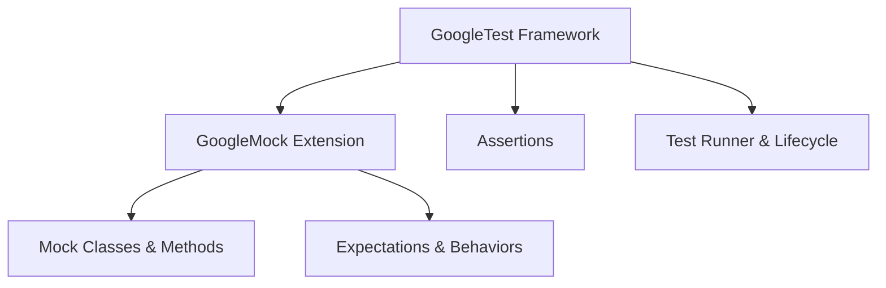

# What are GoogleTest and GoogleMock?

GoogleTest and GoogleMock are two closely related but distinct C++ frameworks that together accelerate and improve the process of writing and running automated tests in C++ projects. Understanding their differences, roles, and how they complement each other enables you to build reliable, maintainable, and expressive test suites.

---

## What is GoogleTest?

GoogleTest is an open-source C++ testing framework developed and maintained by Google. It provides a rich infrastructure to write, organize, and run automated tests with ease. GoogleTest is built on the popular xUnit architecture and supports:

- Writing simple and complex tests using intuitive macros like `TEST()`, `TEST_F()`, and parameterized test variants.
- Organizing tests into test suites and fixtures for shared setup and teardown.
- A comprehensive library of assertions for verifying conditions, equality, strings, floating-point precision, exceptions, and more.
- Detailed and informative output on test failures to assist debugging.
- Portable support across Linux, Windows, and macOS platforms.
- Fast execution with isolated tests that can run independently.

### Why use GoogleTest?

Imagine writing unit tests for your core functionality — GoogleTest lets you define those tests in a straightforward way while automatically managing registration, execution, and detailed reporting, freeing you to focus on validating your code’s logic. It makes it simple to:

- Verify individual functions and classes behave as expected.
- Group related tests logically.
- Share setup data by using test fixtures.
- Identify multiple test failures in one run thanks to non-fatal assertions.

### Example of a simple GoogleTest test:

```cpp
TEST(FactorialTest, HandlesZeroInput) {
  EXPECT_EQ(Factorial(0), 1);
}

TEST(FactorialTest, HandlesPositiveInput) {
  EXPECT_EQ(Factorial(3), 6);
  EXPECT_EQ(Factorial(5), 120);
}
```

## What is GoogleMock?

GoogleMock (often called gMock) extends GoogleTest by providing powerful mocking capabilities allowing the creation of _mock objects_. Mocks help in isolating the unit under test by simulating dependencies or collaborators, enabling you to:

- Define *mock classes* and *mock methods* declaratively using macros like `MOCK_METHOD`.
- Set *expectations* on how mocks should be called (e.g., which methods, arguments, and call counts) using `EXPECT_CALL`.
- Define default or custom *behaviors* for mock method calls with `ON_CALL`.
- Match argument expectations precisely using built-in or custom matchers.
- Control call sequences and order constraints.
- Choose mock strictness policies (NiceMock, NaggyMock, StrictMock) for managing uninteresting calls.

### Why use GoogleMock?

In real C++ systems, dependencies between classes can be complex. When testing a component, you often want to avoid dependencies on real implementations (e.g., databases, network services) to make tests fast, predictable, and focused. GoogleMock helps by letting you create mock versions of those dependencies that record how they're used and simulate responses.

This process supports Test-Driven Development (TDD) and design improvements by:

- Enabling verification of indirect outputs (i.e., interactions) rather than only outputs.
- Simplifying tests that would otherwise require complex setup.
- Clarifying expected interactions and side effects.

### Example of defining a mock method:

```cpp
class MockDatabase {
 public:
  MOCK_METHOD(bool, Connect, (const std::string& url), ());
  MOCK_METHOD(int, GetRecordCount, (), (const));
};

MockDatabase mock_db;
EXPECT_CALL(mock_db, Connect("localhost"))
    .Times(1)
    .WillOnce(Return(true));
```

## How do GoogleTest and GoogleMock relate?

While GoogleTest provides the core framework for writing and running tests with assertions, GoogleMock specializes in mocking to simulate and control dependencies within tests. GoogleMock depends on GoogleTest and integrates seamlessly, allowing you to:

- Combine GoogleTest assertions with rich mock specifications.
- Write tests for units in isolation with mock dependencies.
- Benefit from automatic mock verification after test execution.

### Typical user workflow with both:

1. Write GoogleTest tests to verify your component functionality.
2. Where your component relies on other classes or interfaces, write mocks using GoogleMock.
3. Set expectations on mocks for correct interaction patterns.
4. Run tests via GoogleTest runner.
5. Analyze rich failure reports that include mismatched mock calls and assertion failures.

## When should I use GoogleTest vs GoogleMock?

| Use Case                          | GoogleTest                         | GoogleMock                                       |
|----------------------------------|----------------------------------|-------------------------------------------------|
| Verify function or class logic   | Yes                              | Yes (in integration)                            |
| Confirm return values and states | Yes                              | Yes                                             |
| Isolate units from dependencies  | Limited                          | Full support via mocks                           |
| Specify and verify interactions  | No                               | Yes (using expectations on mocks)               |
| Simulate external services       | No                               | Yes                                             |
| Perform integration-style testing| Yes                              | Sometimes, when partial mocks are used          |

## Foundational Architecture

The fundamental architecture behind GoogleTest and GoogleMock illustrates a layered relationship:

- **GoogleTest** provides the core test runner, execution model, assertion framework, and test lifecycle management.
- **GoogleMock** builds on GoogleTest, adding mocking-specific APIs and facilities, including mock method declarations, matchers, expectations, and behavior control.



## How to get started?

1. Write tests using GoogleTest to validate your production classes.
2. When testing classes that depend on interfaces, create mock classes using GoogleMock macros.
3. Use `EXPECT_CALL` to define expectations.
4. Build and run tests via your build system (CMake, Bazel, Visual Studio).

For detailed instructions, file structure, and examples, consult the guides on:

- [Getting Started with GoogleTest](../guides/getting-started/setup-and-installation.md)
- [Writing Your First Test](../getting-started/first-test-experience/writing-your-first-test.md)
- [Building & Using Mocks](../guides/mocking-advanced-usage/building-mocks.md)

## Practical Tips

- You rarely need to write your own `main()` function; link to `gtest_main` or `gmock_main` instead.
- Use `TEST_F()` to write tests that share fixtures.
- Define mocks in public sections using `MOCK_METHOD`.
- Use matchers to precisely check function arguments.
- Monitor test failures for both assertion failures and mock expectation mismatches.

## Common Pitfalls

- Forgetting to call `InitGoogleTest()` and `InitGoogleMock()` in `main()` before running tests.
- Using mocks without setting proper expectations leads to confusing test passes or failures.
- Over-specifying expectations can result in fragile tests; balance strictness appropriately.

## Summary

- GoogleTest is a versatile C++ test framework for writing and running tests with rich assertion support.
- GoogleMock is a mocking framework built on top of GoogleTest that allows simulating dependencies via mock objects.
- Together, they offer a powerful and complementary toolset for validating C++ code robustly and efficiently.

---

For more in-depth knowledge, please explore the following references:

- [GoogleTest Primer](../docs/primer.md)
- [Mocking API - Mock Class Definition](../api-reference/mocking-apis/mock-class-definition.md)
- [GoogleMock for Dummies](../docs/gmock_for_dummies.md)
- [gMock Cookbook](../guides/mocking-advanced-usage/building-mocks.md)
- [Core Test Framework API Reference](../api-reference/core-testing-apis/test-definition-execution.md)

---

### Related FAQs

- [How do I integrate GoogleTest/GoogleMock with my project?](how-to-integrate.md)
- [Which GoogleTest/GoogleMock features should I use first?](which-features-use.md)
- [How do I debug failing tests?](dealing-with-failing-tests.md)

---