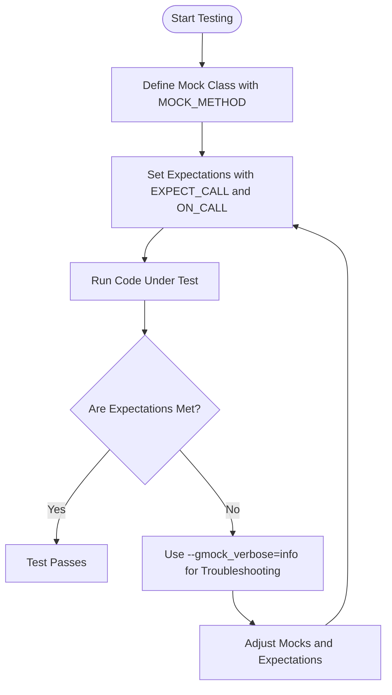

# What is GoogleTest (and GoogleMock) and how do I use it?

GoogleTest and GoogleMock form a powerful, integrated framework designed for unit testing and mocking in C++. This page provides an overview of what GoogleTest (the testing framework) and GoogleMock (the mocking framework) are, the value they bring to your C++ development workflow, and practical guidance on getting started as a first-time user.

---

## Understanding GoogleTest and GoogleMock

### What Is GoogleTest?
GoogleTest (also known as googletest) is Google's official C++ testing framework. It offers a structured way to write automated tests, verify behaviors with rich assertions, and organize your test code effectively. Its portable nature ensures your tests run consistently across many platforms and toolchains.

### What Is GoogleMock?
GoogleMock (gMock) is a complementary framework bundled with GoogleTest that helps you create **mock objects**—programmable stand-ins for real classes—notably useful for testing interactions in complex systems. It allows you to specify at runtime how mock methods behave and verify the calls they receive, including argument matching, call order, and call counts.

Together, GoogleTest and GoogleMock provide a comprehensive toolset for both **state-based** and **interaction-based** testing.

---

## Why Use GoogleTest and GoogleMock?

* Simplify unit tests by removing dependencies on real objects.
* Make tests faster, more reliable, and easier to maintain.
* Clearly specify and verify interactions between components.
* Detect bugs early by asserting calls with detailed expectations.
* Integrate seamlessly into your build and continuous integration pipeline.

### Typical User Workflow

1. **Define mock classes**: Use `MOCK_METHOD` macros to generate mock implementations.
2. **Set expectations**: Using `EXPECT_CALL()`, specify which methods will be called, with which arguments, how many times, and what they should return or do.
3. **Run tests**: Exercise your code under test; verify expectations are enforced automatically.
4. **Investigate failures**: If expectations are not met, GoogleMock provides detailed diagnostics and stack traces.

---

## Getting Started with GoogleTest and GoogleMock

### Including the Framework

```cpp
#include <gtest/gtest.h>
#include <gmock/gmock.h>
```

### Writing Your First Mock Class

Suppose you have an interface:

```cpp
class Turtle {
 public:
  virtual ~Turtle() {}
  virtual void PenUp() = 0;
  virtual void PenDown() = 0;
  virtual void Forward(int distance) = 0;
  virtual void Turn(int degrees) = 0;
  virtual int GetX() const = 0;
  virtual int GetY() const = 0;
};
```

You write a mock class by inheriting and defining mocked methods:

```cpp
#include <gmock/gmock.h>

class MockTurtle : public Turtle {
 public:
  MOCK_METHOD(void, PenUp, (), (override));
  MOCK_METHOD(void, PenDown, (), (override));
  MOCK_METHOD(void, Forward, (int distance), (override));
  MOCK_METHOD(void, Turn, (int degrees), (override));
  MOCK_METHOD(int, GetX, (), (const, override));
  MOCK_METHOD(int, GetY, (), (const, override));
};
```

Note: Always place `MOCK_METHOD` in the public section, even if the original method is `private` or `protected`.

### Using Mocks in Your Tests

Example of setting expectation and running test logic:

```cpp
using ::testing::AtLeast;
using ::testing::_;
using ::testing::Return;

TEST(PainterTest, CanDrawSomething) {
  MockTurtle turtle;  // Create mock

  EXPECT_CALL(turtle, PenDown())  // Expect PenDown to be called at least once
      .Times(AtLeast(1));

  // Code under test that exercises the turtle interface
  Painter painter(&turtle);
  EXPECT_TRUE(painter.DrawCircle(0, 0, 10));
}
```

If `PenDown()` is not called, the test fails instantly with a clear error message.

---

## Core GoogleMock Concepts

### Setting Expectations with `EXPECT_CALL`

Use `EXPECT_CALL(mock_object, Method(matchers))` to specify which method calls you expect.

* **Matchers** like `_` (wildcard) or `Eq(value)` allow flexible argument checking.
* Use `.Times()` to control how often a call is expected.
* Use `.WillOnce()` and `.WillRepeatedly()` to define the return values or side effects.

Example:

```cpp
EXPECT_CALL(turtle, Forward(Ge(10)))
    .Times(3)
    .WillRepeatedly(Return());
```

### Defining Default Behavior with `ON_CALL`

Use `ON_CALL()` to set a default action for a mock method without requiring that the method is called.

```cpp
ON_CALL(turtle, GetX()).WillByDefault(Return(42));
```

### Controlling Strictness: Nice, Naggy, and Strict Mocks

* **Default (NaggyMock)**: Warns on calls without expectations.
* **NiceMock**: Suppresses warnings for uninteresting calls.
* **StrictMock**: Treats uninteresting calls as errors.

Example:

```cpp
using ::testing::NiceMock;
NiceMock<MockTurtle> nice_turtle;
EXPECT_CALL(nice_turtle, Forward(10));
```

---

## Best Practices for First-Time Users

* Always mock interfaces or virtual methods, not concrete (non-virtual) classes.
* Use meaningful matchers to avoid brittle tests.
* Minimize over-specification — verify only what is necessary.
* Prefer `ON_CALL` to configure defaults; use `EXPECT_CALL` to verify specific interactions.
* Use sequences (`InSequence`) or `After` to control call ordering when necessary.
* Run tests with `--gmock_verbose=info` to get detailed call traces when debugging.

---

## Additional Resources & Next Steps

* **[gMock for Dummies](https://google.github.io/googletest/gmock_for_dummies.html)**: A friendly tutorial to start mocking.
* **[gMock Cookbook](https://google.github.io/googletest/gmock_cook_book.html)**: Recipes for common mocking challenges.
* **[gMock Cheat Sheet](https://google.github.io/googletest/gmock_cheat_sheet.html)**: Quick syntax guide.
* **Mock Class Definition and MOCK_METHOD Macros**: Details on writing mock class methods.
* **Setting Expectations: EXPECT_CALL and ON_CALL**: How to specify mock behavior.
* **Strict, Naggy, and Nice Mocks**: Controlling warnings and failures for uninteresting calls.

For building and running your first test, consult the Getting Started guides on installation, basic configuration, and writing your first test.

---

## Summary Diagram of User Flow



---

<Tip>
Starting with GoogleTest and GoogleMock empowers you to write precise, maintainable unit tests by focusing both on verifying outcomes and interactions. Leveraging the rich built-in tools and best practices here will accelerate your confidence and code quality.
</Tip>