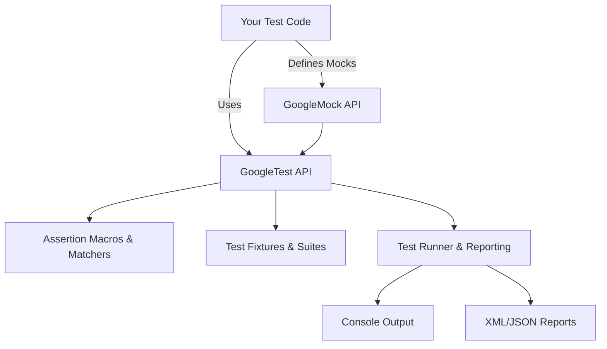

# What is GoogleTest and GoogleMock?

## Introduction

GoogleTest and GoogleMock are essential components of a unified C++ testing framework developed by Google, designed to facilitate automated testing and mock object creation for C++ projects. Together, they empower developers to write reliable, maintainable, and expressive tests across various platforms with a consistent, easy-to-use API.

This page introduces the purpose, relationship, and key value propositions of GoogleTest and GoogleMock, highlighting why this combined framework is trusted by both open-source projects and enterprise teams.

---

## What is GoogleTest?

GoogleTest is a robust, open-source C++ testing framework based on the popular xUnit architecture. It helps you write, organize, and run automated tests that verify the correctness of your C++ code.

Key aspects include:

- **Cross-platform support:** Works seamlessly on Linux, Windows, and Mac OS.
- **Rich assertions:** Offers a broad set of assertions to verify expected behaviors.
- **Test discovery:** Automatically detects and runs all your test cases without explicit enumeration.
- **Test organization:** Groups related tests into test suites and fixtures to promote clarity and maintainability.
- **Support for various test types:** Includes simple tests, test fixtures (`TEST_F`), parameterized, typed, and value-parameterized tests.
- **Detailed failure information:** When tests fail, GoogleTest provides precise location and descriptive messages to speed debugging.
- **Fast execution and resource sharing:** Supports reusing setup across tests at different levels to balance test independence and performance.

At its core, GoogleTest liberates you from repetitive housekeeping, so you can focus on writing meaningful assertions to validate your code.

## What is GoogleMock?

GoogleMock is an integrated mock object framework that complements GoogleTest by enabling you to create mock classes and define precise expectations on interactions with dependencies.

Its primary benefits include:

- **Declarative syntax for mocks:** Quickly define mock classes and methods.
- **Flexible expectations:** Specify how many times methods should be called, with what arguments, and in which order.
- **Rich set of matchers:** Validate arguments precisely using built-in and customizable matchers.
- **Automatic verification:** Ensures all expectations are met without manual verification calls.
- **Partial (hybrid) mocks:** Combine real and mock behavior easily.
- **Integration with GoogleTest:** Seamless co-usage with GoogleTest for unified test suites.

GoogleMock helps you create isolated, reliable unit tests by simulating components’ behaviors, enabling thorough testing of systems with complex dependencies.

## The Relationship Between GoogleTest and GoogleMock

Historically separate projects, GoogleTest and GoogleMock have been combined into a single repository and distribution to unify their development and usage.

- GoogleTest focuses on test execution, assertions, and test organization.
- GoogleMock extends GoogleTest by adding powerful mocking capabilities.

Together, they form a comprehensive framework that covers almost every aspect of writing, running, and managing C++ tests.

This integration means you can write tests that both verify functional correctness and check interactions between components, all with consistent API and tooling.

## Why Use GoogleTest and GoogleMock?

GoogleTest and GoogleMock offer a full-featured, mature testing environment trusted by major projects like Chromium, LLVM, Protocol Buffers, and OpenCV. Here’s what they bring to your development process:

- **Increased code quality:** Catch bugs early by verifying your code behaves as expected.
- **Maintainable tests:** Organize tests consistently with suites, fixtures, and parameterization.
- **Cross-platform reliability:** Write tests that run consistently across supported environments.
- **Fast feedback:** Reuse expensive setup efficiently while keeping tests independent.
- **Expressive mocks:** Simulate complex scenarios and integrate with dependency injection to isolate test units.
- **Robust failure reporting:** Diagnose problems quickly with detailed output and logs.
- **Flexible test execution:** Run all tests, subsets, or repeat tests automatically with filters and flags.

By adopting these tools, teams can build a culture of rigorous testing, leading to more stable and safer software.

## Example Workflow: Writing and Running Your First Test

Using GoogleTest alone:

```cpp
#include <gtest/gtest.h>

// Function to be tested
int Factorial(int n);

// Define a test suite "FactorialTest" and a test "HandlesZeroInput"
TEST(FactorialTest, HandlesZeroInput) {
  EXPECT_EQ(Factorial(0), 1);
}

// Define more tests in the same test suite
TEST(FactorialTest, HandlesPositiveInput) {
  EXPECT_EQ(Factorial(1), 1);
  EXPECT_EQ(Factorial(2), 2);
}

int main(int argc, char **argv) {
  ::testing::InitGoogleTest(&argc, argv);
  return RUN_ALL_TESTS();
}
```

Using GoogleMock to mock a dependency:

```cpp
#include <gmock/gmock.h>

// Interface for a database connection
class Database {
 public:
  virtual ~Database() = default;
  virtual bool Connect() = 0;
  virtual int GetRecordCount() = 0;
};

// Mock class
class MockDatabase : public Database {
 public:
  MOCK_METHOD(bool, Connect, (), (override));
  MOCK_METHOD(int, GetRecordCount, (), (override));
};

TEST(DatabaseTest, ConnectAndCount) {
  MockDatabase mock_db;
  EXPECT_CALL(mock_db, Connect()).WillOnce(testing::Return(true));
  EXPECT_CALL(mock_db, GetRecordCount()).WillOnce(testing::Return(42));

  EXPECT_TRUE(mock_db.Connect());
  EXPECT_EQ(mock_db.GetRecordCount(), 42);
}
```

This illustrates how GoogleTest and GoogleMock enable writing expressive and straightforward tests, including interaction verification.

## Supported Platforms

GoogleTest and GoogleMock support a broad range of C++ platforms:

- Linux
- Windows
- Mac OS

The frameworks adapt to various compilers and environments, including partial support for embedded and Arduino platforms.

## Where to Go Next

To deepen your understanding and start implementing GoogleTest and GoogleMock:

- Explore the [GoogleTest Primer](primer.md) to learn how to write simple tests and understand the core concepts.
- Review the [Testing Reference](reference/testing.md) for API details and advanced macros.
- Check out the [Getting Started with GoogleMock](guides/mocking_and_advanced_patterns/getting_started_with_googlemock) to learn mocking patterns.
- Follow the [Advanced GoogleTest Topics](advanced.md) to unlock complex test setups and patterns.

<Tip>
Start by writing simple tests with GoogleTest and progressively incorporate GoogleMock for mocking dependencies to build a comprehensive test suite.
</Tip>

<Note>
Remember to link against the `gtest_main` library or implement your own `main()` as shown in examples to run tests.
</Note>

## Additional Resources

- [GoogleTest User's Guide](index.md)
- [GoogleMock Documentation](googlemock/README.md)
- [Official GoogleTest GitHub Repository](https://github.com/google/googletest)

---

### Overview of the Architecture



This flow shows how your test code interacts with GoogleTest and GoogleMock APIs, organizing tests, assertions, and mocks, and how results are output.

---

## Frequently Asked Questions

### What is the difference between GoogleTest and GoogleMock?
- GoogleTest is for writing and running C++ tests with assertions.
- GoogleMock extends GoogleTest to provide mocking capabilities for dependencies.

### Can I use GoogleTest without GoogleMock?
- Yes, GoogleTest works standalone for most testing needs.

### Is GoogleMock compatible with GoogleTest?
- Absolutely, GoogleMock is designed to integrate seamlessly with GoogleTest.

### Which platforms does the framework support?
- Linux, Windows, and Mac OS are fully supported.

### Do I need to write my own `main()` to run tests?
- No, linking with `gtest_main` provides a ready-made `main()`. For custom behavior, you can implement your own.

### Where can I find examples?
- Check the [Googletest Samples](samples.md) for real use cases.

---

## Troubleshooting Tips

- **Test discovery fails:** Ensure that you have linked the test binaries correctly and called `RUN_ALL_TESTS()` once.
- **Mock expectations not met:** Verify that expected calls are actually made with correct arguments.
- **Platform-specific build issues:** Consult the platform and portability guide and confirm C++17 support.

<Warning>
Avoid calling `RUN_ALL_TESTS()` multiple times in one program to prevent undefined behaviors.
</Warning>


---

For detailed guidance on test writing and advanced usage patterns, explore the full GoogleTest and GoogleMock documentation set.

---

*This page serves as a concise introduction to GoogleTest and GoogleMock — your starting point for mastering modern C++ testing.*