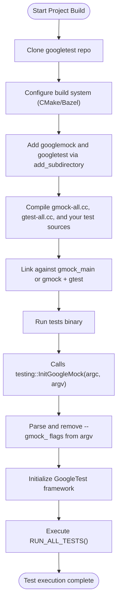

# How do I set up GoogleTest and GoogleMock for my project?

This document provides a comprehensive guide to integrating GoogleTest and GoogleMock into your C++ project from the ground up. You'll learn about the necessary files, folder structures, build configurations, and initialization steps to get GoogleTest and GoogleMock running smoothly. Whether you are using CMake or Bazel, this guide includes actionable advice and references to help you configure your environment correctly.

---

## 1. Overview of Required Components

GoogleTest and GoogleMock are designed to work together as a unified testing framework for C++. GoogleMock extends GoogleTest with powerful mocking capabilities. To set up GoogleMock, you implicitly set up GoogleTest as well.

- **Core files**: The main source files for GoogleMock include `gmock-all.cc` and `gmock_main.cc` for linking with or without a `main()` test runner.
- **Headers**: You need to include `gmock/gmock.h` in your tests to use mocking features.
- **GoogleTest dependency**: GoogleMock depends on GoogleTest, which provides the test runner and assertion framework.

When you include the GoogleMock headers and libraries, GoogleTest's headers and libraries are also included automatically.

---

## 2. Folder Structure and Source Files

The general folder layout of GoogleMock within the repository looks like this:

```plaintext
googlemock/
  ├── include/gmock/gmock.h        # Main GoogleMock header
  ├── src/gmock-all.cc              # Implementation of the GoogleMock core
  ├── src/gmock_main.cc             # Provides main() for tests with GoogleMock
  ├── CMakeLists.txt                # CMake build configuration
  └── test/                         # Example and internal tests for GoogleMock
```

When embedding GoogleMock into your project or building it standalone, ensure these key files are compiled and linked correctly.

---

## 3. Build Configuration with CMake

GoogleMock provides CMake support out-of-the-box, though maintenance is community-driven. To integrate GoogleMock with your project using CMake, follow these fundamental steps:

### 3.1 Fetch and add GoogleTest & GoogleMock

Usually, GoogleMock is included along with GoogleTest as a subdirectory.

Modify your `CMakeLists.txt`:

```cmake
# Minimum CMake version
cmake_minimum_required(VERSION 3.13)

# Add GoogleTest & GoogleMock
add_subdirectory(path/to/googletest)  # The googletest subdirectory contains both gtest and gmock.

# Add your test executable
add_executable(my_tests test/my_tests.cc)

# Link against gmock_main for a main() function that initializes GoogleMock and runs tests
target_link_libraries(my_tests gmock_main)

# Optionally set C++ standard
set_target_properties(my_tests PROPERTIES CXX_STANDARD 17 CXX_STANDARD_REQUIRED YES)
```

GoogleMock’s CMake automatically:
- Adds GoogleTest as a dependency.
- Sets include directories.
- Provides `gmock` and `gmock_main` targets.

Set `gmock_build_tests` to ON if you want to build GoogleMock’s own tests.

### 3.2 Important Notes

- If your project uses MSVC, GoogleMock configures stricter warning flags internally.
- Shared library building can be configured by setting `BUILD_SHARED_LIBS`.
- GoogleMock installs headers and libraries according to your chosen CMake install directories.

---

## 4. Alternative Build Systems: Bazel

If you use Bazel, GoogleTest and GoogleMock provide compatible BUILD files inside their repositories. You can add them as external dependencies or vendor them inside your workspace. Refer to Bazel-specific GoogleTest documentation for exact usage patterns.

---

## 5. Initializing GoogleTest and GoogleMock in Your Code

Before running any tests or mocks, you need to initialize the framework, which parses common command-line flags used to control test execution and GoogleMock behavior.

### 5.1 Initialization Functions

```cpp
#include "gmock/gmock.h"

int main(int argc, char** argv) {
    // This initializes both GoogleTest and GoogleMock.
    testing::InitGoogleMock(&argc, argv);
    return RUN_ALL_TESTS();
}
```

- Use `InitGoogleMock()` instead of just `InitGoogleTest()` when using GoogleMock; it ensures that all GoogleMock flags are parsed and set.
- There are overloads to support wide strings (Windows UNICODE) and platforms without argc/argv (embedded).

### 5.2 What Does Initialization Do?
- Parses GoogleMock-specific flags such as `--gmock_verbose` and `--gmock_default_mock_behavior`.
- Removes GoogleMock flags from the argument vector.
- Initializes GoogleTest automatically since GoogleMock depends on it.

---

## 6. Common Command-Line Flags for GoogleMock

GoogleMock recognizes several flags that control mock behavior and output verbosity:

| Flag                         | Description                                                            | Default      |
|------------------------------|------------------------------------------------------------------------|--------------|
| `--gmock_verbose=<level>`    | Controls verbosity. Options: `info`, `warning`, `error`.                | `warning`    |
| `--gmock_default_mock_behavior` | Sets default mock behavior: 0 (NiceMock), 1 (NaggyMock), 2 (StrictMock). | 1            |
| `--gmock_catch_leaked_mocks` | Whether to report leaked mocks as test failures.                        | true         |

*Example usage:*
```
./my_tests --gmock_verbose=info
```

---

## 7. Sample User Workflow

1. **Add GoogleMock and GoogleTest as dependencies** through CMake or your build system.
2. **Include `<gmock/gmock.h>`** and `<gtest/gtest.h>` in your test source files.
3. **Write your tests and mock classes** using `MOCK_METHOD` and test macros.
4. **Initialize GoogleMock in `main()`** using `InitGoogleMock`.
5. **Build and run your tests.**
6. **Control output and behavior** via GoogleMock flags.

---

## 8. Troubleshooting Tips

- **Build Errors:** Ensure all GoogleMock and GoogleTest source files are compiled and linked. Confirm C++17 standard and compatible compiler.
- **Flags Not Recognized:** Make sure you call `InitGoogleMock()` early in your executable main routine. GoogleMock processes and removes its flags.
- **Linking Issues:** Link against `gmock_main` if you want the provided `main()` testing entrypoint; otherwise, link `gmock` and supply your own `main()`.
- **Verbose Output Too Noisy:** Adjust the `--gmock_verbose` flag to the desired verbosity level.

---

## 9. Further References

- [GoogleMock README](https://github.com/google/googletest/tree/main/googlemock/README.md) — General overview and capabilities.
- [gMock Cookbook](https://google.github.io/googletest/gmock_cook_book.html) — Practical examples of mocking.
- [GoogleTest Installation Guide](https://github.com/google/googletest/blob/main/docs/installation.md) — Includes embedding GoogleTest with GoogleMock.
- [CMakeLists.txt in GoogleMock](https://github.com/google/googletest/blob/main/googlemock/CMakeLists.txt) — For detailed build configurations.

---

## 10. Visualizing Initialization and Build Integration



---

## Summary
This page has equipped you to integrate GoogleTest and GoogleMock into your project from scratch. You now understand the required files and folder layout, how to configure builds especially with CMake, initialization patterns required to run tests, command-line options peculiar to GoogleMock, and common troubleshooting advice to ensure a smooth setup.

By following these steps, your project will benefit from GoogleMock's powerful and expressive C++ mocking features alongside GoogleTest's robust unit testing capabilities.