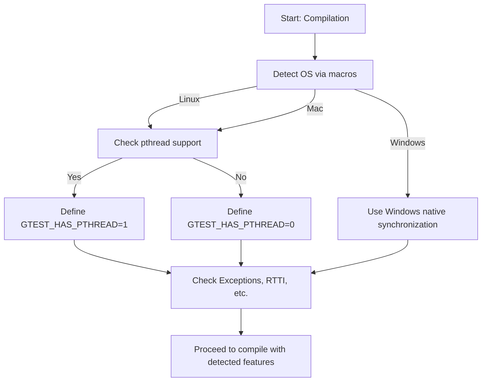

# Supported Platforms and Compilers

GoogleTest strictly adheres to Google's [Foundational C++ Support Policy](https://opensource.google/documentation/policies/cplusplus-support), ensuring broad compatibility and reliability across multiple platforms and development environments.

This page provides a clear overview of the officially supported operating systems, compilers, and toolchains, helping you verify whether your environment is compatible and how to handle cases when it is not.

---

## Officially Supported Platforms

GoogleTest supports a wide range of platforms, prioritizing those that align with Google's core C++ development standards. These typically include:

- **Linux**
- **Windows** (including Windows Desktop and MinGW)
- **Mac OS X**

For a detailed, up-to-date matrix of supported platforms and compiler versions, please refer to the [Foundational C++ Support Matrix](https://github.com/google/oss-policies-info/blob/main/foundational-cxx-support-matrix.md).

### Platform-Specific Macros

GoogleTest internally detects many platforms via predefined macros, providing tailored optimizations and feature toggles:

| Platform Macro                  | Description                   |
|-------------------------------|-------------------------------|
| `GTEST_OS_LINUX`               | Linux OS                     |
| `GTEST_OS_WINDOWS`             | Windows (Desktop, MinGW, Mobile) |
| `GTEST_OS_WINDOWS_DESKTOP`     | Windows Desktop               |
| `GTEST_OS_MAC`                 | Mac OS X                     |
| `GTEST_OS_IOS`                 | iOS                         |
| `GTEST_OS_CYGWIN`              | Cygwin                      |
| `GTEST_OS_FREEBSD`             | FreeBSD                     |
| `GTEST_OS_ANDROID`             | Android (Linux-based)        |

This mechanism ensures that GoogleTest adapts its internal behavior depending on the target platform, maintaining portability.


## Supported Compilers and Standard

GoogleTest requires a minimum of **C++17** support from the system compiler. This is explicitly enforced during compilation:

```cpp
#if !defined(GTEST_INTERNAL_CPLUSPLUS_LANG) || \
    GTEST_INTERNAL_CPLUSPLUS_LANG < 201703L
#error C++ versions less than C++17 are not supported.
#endif
```

Supported compilers typically include:

- **GCC** (version 7.3 or higher recommended)
- **Clang** (version 6 or higher recommended)
- **MSVC** (Visual Studio 2017 Update 3 (19.11) or newer)

GoogleTest adapts to compiler features and quirks with fine-grained macros and flag adjustments to ensure compatibility and maintain standard compliance.


## Build Tools and Environment Support

GoogleTest is built and tested with a range of build tools including:

- CMake (recommended for cross-platform builds)
- Make on Unix-like systems
- MSBuild or Visual Studio solution files on Windows

The use of pthreads is automatically detected and enabled when available (`GTEST_HAS_PTHREAD=1`), providing thread-safe support. On Windows, native synchronization primitives are used instead.

For environments lacking pthreads or multi-threading support, GoogleTest safely falls back to non-threadsafe implementations.


## Feature Availability Based on Platform

Depending on your platform and compiler, some GoogleTest features may be disabled or unavailable automatically. For example:

- **Exceptions:** Automatically detected by GoogleTest to enable or disable exception support (`GTEST_HAS_EXCEPTIONS`).
- **RTTI (Run-Time Type Information):** Detected to allow safe downcasting and type-based features (`GTEST_HAS_RTTI`).
- **Standard WString Support:** Some platforms may lack `std::wstring` support (`GTEST_HAS_STD_WSTRING`).
- **Stream Redirection:** Some embedded or mobile platforms disable stream redirection due to lack of file system support.


## Practical Steps to Verify Your Environment

1. **Check your compiler version:** Ensure it supports at least C++17.

2. **Confirm platform macro settings:** GoogleTest automatically detects your operating system and environment.

3. **Review compiler flags:** Some features depend on specific compiler flags (e.g., `-pthread` on Linux for threading).

4. **Refer to the Foundational C++ Support Matrix:** Verify that your platform and compiler combination is officially supported.


## Troubleshooting Common Compatibility Issues

- **Compiler too old or missing C++17 support:** Upgrade your compiler.

- **Linker errors related to pthread:** Add `-pthread` flag in your compile and linking steps.

- **Unsupported platform or embedded system:** GoogleTest may not fully support your environment. Consider custom builds or workarounds.

- **Feature mismatches (exceptions, RTTI):** Use compiler flags or macro definitions to clarify capabilities to GoogleTest.


## Macro Overrides for Custom Environments

If automatic detection is insufficient, you can override key macros in your build system:

| Macro                           | Purpose                                            |
|--------------------------------|----------------------------------------------------|
| `GTEST_HAS_PTHREAD`             | Force enable/disable pthread support (1 or 0)      |
| `GTEST_HAS_EXCEPTIONS`          | Enable/disable exception handling                   |
| `GTEST_HAS_RTTI`                | Enable/disable RTTI support                          |
| `GTEST_HAS_STD_WSTRING`         | Force availability of `std::wstring`                |


## Related Documentation

- [Supported Platforms](https://github.com/google/oss-policies-info/blob/main/foundational-cxx-support-matrix.md) - detailed compatibility matrix
- [GoogleTest README](googletest/README.md) - build instructions and environment notes
- [CMake Integration Guide](docs/pkgconfig.md) - best practices for usage with CMake
- [Troubleshooting Common Setup Issues](getting-started/troubleshooting-resources/troubleshooting-common-issues.md)

---

<Tip>
Always ensure your build environment aligns with supported configurations to avoid hard-to-debug compatibility problems. Leveraging the Foundational C++ Support Matrix is the most reliable way to confirm platform and toolchain support.
</Tip>

<Note>
If working on a niche or embedded platform, GoogleTest may require custom configuration or manual porting. Consult the [Customization Points](googletest/include/gtest/internal/custom/README.md) for guidance.
</Note>

---

## Summary

GoogleTest supports all major desktop and server platforms that Google officially supports for C++ development with a strong emphasis on C++17 compatibility. It auto-configures itself to your environment, enabling or disabling features such as exceptions and threading accordingly, but allows manual overrides for fine-tuning. For the best experience, match your platform and compiler to the officially supported configurations.


---

## Example: Detecting Pthread Availability

In your compilation command or build system, you might see flags like:

```bash
-DGTEST_HAS_PTHREAD=1 -pthread
```

This explicitly enables pthread support, which makes GoogleTest thread safe on Linux-like systems. If not present and your platform supports pthreads, threading features will be disabled.


---

## Visualizing Platform Detection Workflow




---

## Final Tips

- Always test with the latest GoogleTest releases to benefit from updated platform support.
- Use the macro definitions to troubleshoot and customize builds in specialized environments.
- Combine with recommended build systems like CMake for automated environment detection and flag management.


---
## See Also

- [Getting Started Guides](getting-started/environment-setup/supported-platforms.md)
- [Build Systems Integration](guides/integration-advanced/build-system-integration.md)
- [Troubleshooting Guide](getting-started/troubleshooting-resources/troubleshooting-common-issues.md)
- [GoogleTest Primer](docs/primer.md)
