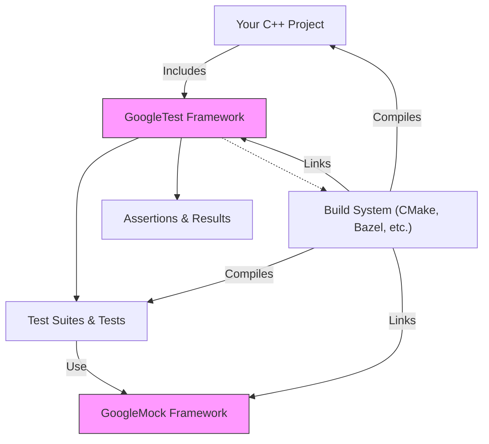

# Is GoogleTest/GoogleMock a Good Fit for My Project?

## Introduction

Choosing the right testing framework is crucial for building reliable, maintainable, and efficient software. This page helps you determine if GoogleTest and GoogleMock are the right tools for your project by addressing common evaluation questions, clarifying supported languages and platforms, and articulating key value propositions.

Whether you are starting a new C++ project or integrating tests into an existing codebase, understanding the fit of GoogleTest/GoogleMock will ensure that you leverage their capabilities effectively without surprises.

---

## Common Questions About Fit

### What programming languages does GoogleTest support?
GoogleTest is **exclusively designed for C++** projects. It supports writing tests for C++ code and integrates natively with C++ test programs. GoogleMock, as an extension, enables mocking within these C++ tests.

### Can I use GoogleTest for testing non-C++ code?
GoogleTest focuses on C++ testing. For other languages, consider language-specific frameworks. However, if your project has a C++ component or interface, GoogleTest can effectively test that part.

### Are GoogleTest and GoogleMock suitable for all sizes of projects?
Absolutely. GoogleTest and GoogleMock scale well from small libraries to large, complex systems. They offer features like test isolation, fixtures, and parameterized tests to maintain clarity and manageability as your test suite grows.

### Does GoogleTest/GoogleMock support all platforms?
Yes. GoogleTest is designed to be **platform-neutral**, supporting Linux, Windows, and Mac. It handles differences in compilers and environments, ensuring portability and reuse of tests regardless of your operating system.

### Will GoogleTest slow down my development or CI pipelines?
No. GoogleTest emphasizes **fast execution** and efficient test isolation to keep turnaround times minimal. Shared fixtures and proper structuring can further optimize performance.

### Can GoogleTest help with both unit and integration testing?
Yes. While GoogleTest is widely used for unit testing, it supports *any* kind of test, including integration and system-level tests. Its flexible assertion mechanisms and test grouping support a variety of testing styles.

### What if I want to mock dependencies in my tests?
GoogleMock integrates seamlessly with GoogleTest, providing powerful mocking capabilities to specify expected calls, behaviors, and verify interactions. This is especially advantageous when testing components that depend on external interfaces.

### Are there limitations or special considerations?
- GoogleTest expects C++17 support and an appropriate build environment.
- It is thread-safe on pthread-enabled systems; multi-threaded assertion handling varies.
- Some advanced features like death tests require attention to detail in threaded contexts.

Please review [System Requirements](../getting-started/setup-requirements/system-requirements) and [Known Limitations](primer.md#known-limitations) for details.

---

## Why Choose GoogleTest and GoogleMock?

GoogleTest/GoogleMock stand out for multiple reasons:

- **Comprehensive C++ Support**: Covers basic to advanced tests, including fixtures, typed, parameterized, and death tests.
- **Powerful Assertions**: Rich built-in assertions and support for custom predicates provide clear, actionable test failures.
- **Portability & Integration**: Works consistently across platforms and integrates smoothly with popular build tools like CMake and Bazel.
- **Test Isolation & Debuggability**: Each test runs independently, enabling easy fault isolation and iterative debugging.
- **Efficient Mocks**: GoogleMock supports declarative mocks with flexible expectations, allowing full control over test doubles.
- **Open Source & Industry Proven**: Backed by Google and widely adopted in the C++ community.

---

## Scenarios Where GoogleTest/GoogleMock Are Especially Valuable

- You need dependable, repeatable C++ tests across multiple platforms.
- Your project requires mocking complex interfaces and verifying interactions.
- You want a framework that supports a broad variety of tests without extensive setup.
- You require detailed test failure diagnostics with rich context.
- You want integration into automated CI pipelines with test filtering, sharding, and repeat.

---

## Evaluating GoogleTest for Your Project

If you have the following:

- A C++ codebase that needs automated testing.
- Access to a C++17-compliant compiler and an appropriate build environment.
- Interest in advanced test features such as fixtures, parameterized and typed tests.

Then GoogleTest will meet and exceed your needs.

If you need mocking capabilities alongside your tests, GoogleMock is fully compatible and provides a powerful syntax and featureset.

---

## Getting Started with Confidence

You can quickly get started with GoogleTest by:

1. Reading the [GoogleTest Primer](primer.md) to understand core concepts and writing your first tests.
2. Exploring the [Test Macros and Suites Reference](../api-reference/core-testing-apis/test-macros-suites) for defining tests.
3. Leveraging [GoogleMock for Dummies](gmock_for_dummies.md) to grasp mocking concepts.

The framework's extensive documentation and community support make onboarding straightforward.

---

## Additional Resources

- [GoogleTest Primer](primer.md) — Learn how to write simple tests and understand terminology.
- [Advanced GoogleTest Topics](advanced.md) — Explore advanced assertions, fixtures, and parameterized tests.
- [Mocking Reference](reference/mocking.md) — In-depth guidance on mocks.
- [Getting Started with CMake](../getting-started/installation-initialization/installation-cmake) — Instructions for setup.
- [Supported Platforms & Compatibility](../overview/integration-platforms/supported-platforms) — Platform coverage details.

---

## Summary

GoogleTest and GoogleMock are the premier C++ testing and mocking frameworks designed for reliability, portability, and performance.

By understanding your project’s needs and environment, you can confidently decide to adopt these tools to accelerate your development with robust, maintainable tests.

---

## FAQ — Quick Answers

<AccordionGroup title="Quick Fit Questions">
<Accordion title="Can GoogleTest be used for languages other than C++?">
GoogleTest is designed specifically for C++. It does not support other languages.
</Accordion>
<Accordion title="What platforms does GoogleTest support?">
Linux, Windows, and Mac OS with compatible C++ compilers are supported.
</Accordion>
<Accordion title="Is GoogleMock required to use GoogleTest?">
No. GoogleTest can be used independently. GoogleMock is an optional extension for mocking.
</Accordion>
<Accordion title="Can GoogleTest tests run on embedded or limited platforms?">
GoogleTest is portable and can run on many platforms with appropriate adaptations, though some features (like threading) may have constraints.
</Accordion>
<Accordion title="Does GoogleTest integrate with popular build tools?">
Yes. GoogleTest integrates well with CMake, Bazel, and manual project setups.
</Accordion>
<Accordion title="Are tests in GoogleTest independent?">
Yes. Tests run in isolation, making failures deterministic and debugging straightforward.
</Accordion>
<Accordion title="Does GoogleTest support parameterized testing?">
Yes. GoogleTest supports value-, type-, and type-parameterized tests for comprehensive coverage.
</Accordion>
<Accordion title="What if my test requires mocking complex dependencies?">
Use GoogleMock, which provides flexible macros to define expectations and behaviors for mock classes.
</Accordion>
<Accordion title="Does GoogleTest support multi-threaded testing?">
Yes, it is thread-safe on systems with pthread support; caution is required on other platforms.
</Accordion>
<Accordion title="Does it support test filtering and selective execution?">
Yes. You can filter tests by name patterns and control test execution on granular levels.
</Accordion>
</AccordionGroup>

---

## Troubleshooting Fit

If you encounter issues such as lack of C++17 support, or your project requires a language or platform outside GoogleTest's design scope, consider evaluating other frameworks.

If your project fits the C++ ecosystem and requires precise control over test organization, mocking, and diagnostics, GoogleTest/GoogleMock is the recommended choice.

---

> Ready to decide? Start with the [GoogleTest Primer](primer.md) to explore test writing fundamentals.

---

## Diagrams: How GoogleTest Fits in a Project

This diagram shows the integration of GoogleTest and GoogleMock into typical C++ projects, highlighting the relationship between your source code, tests, and the frameworks, all managed by your build system.
