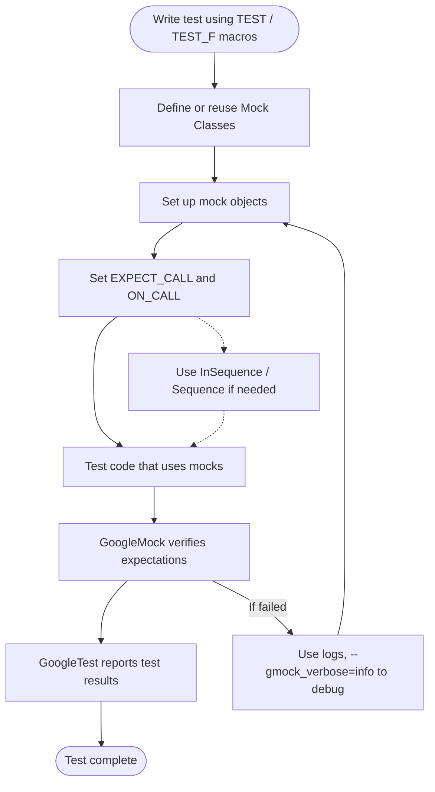

# Usage & Core Concepts

Understanding the core concepts behind GoogleTest and GoogleMock is essential for writing effective and maintainable tests. This FAQ addresses common questions related to the testing lifecycle, test discovery, assertions, expectations, and mocking behavior in GoogleTest and GoogleMock.

---

## 1. How Does GoogleTest Discover and Run Tests?

GoogleTest identifies tests through the use of special macros (`TEST`, `TEST_F`, etc.) that register test cases automatically with the framework. When you run your test binary, GoogleTest:

- Enumerates all registered tests.
- Runs selected tests based on command-line filters.
- Executes test setup, the test body, and teardown in a defined lifecycle.
- Reports results with detailed messages and summaries.

**Tip:** To understand this process better, see the [Test Discovery, Registration, and Execution](https://github.com/google/googletest/blob/main/docs/concepts/framework-architecture/test-discovery-execution.md) documentation.

---

## 2. What Are the Basic Components of a GoogleTest Test Case?

Tests are organized into:

- **Test Suites:** Grouping of related tests.
- **Test Cases:** Individual tests defined using `TEST` or `TEST_F` macros.
- **Test Fixtures:** Classes that share setup and teardown code for multiple tests.

This structure helps isolate and organize your tests systematically.

---

## 3. How Can I Write Assertions and Validate Conditions in Tests?

GoogleTest provides a rich set of assertion macros:

- **Fatal assertions** (`ASSERT_*`) abort the current test on failure.
- **Nonfatal assertions** (`EXPECT_*`) continue running the test after failure.

Assertions include:

- Boolean checks (`ASSERT_TRUE`, `EXPECT_FALSE`)
- Equality and comparison (`EXPECT_EQ`, `ASSERT_NE`)
- String matching
- Exception testing
- Predicate assertions for advanced conditions

Refer to [Standard Assertions](https://github.com/google/googletest/blob/main/docs/api-reference/core-test-api/standard-assertions.md) for details and examples.

---

## 4. What Are Mock Objects in GoogleMock and Why Use Them?

In unit testing, sometimes code depends on other components that are:

- Slow (e.g., databases, network resources)
- Difficult to reproduce in a test environment
- Unreliable or nondeterministic

Mock objects let you replace real dependencies with controllable and observable substitutes. GoogleMock helps you:

- Define mock classes easily with the `MOCK_METHOD` macro.
- Set expectations on calls, arguments, and invocation counts using `EXPECT_CALL`.
- Check call order and interaction sequences.
- Specify responses and side effects for mock methods.

Using mocks reduces test fragility and improves test speed and clarity.

---

## 5. How Does GoogleMock Set Expectations and Verify Them?

The core macros:

- `EXPECT_CALL(mock_object, Method(args))` sets an expectation that `Method` will be called with certain arguments.
- `ON_CALL` defines default behavior without expectation.

You can specify:

- How many times a method should be called (`Times()` with cardinalities like `Exactly(n)`, `AtLeast(n)`, `AnyNumber()`).
- The call order via sequences (`InSequence`, `After`).
- Return values or actions with `WillOnce()` and `WillRepeatedly()`.

GoogleMock automatically verifies expectations at mock object destruction and reports failures immediately on any mismatch.

---

## 6. How Are Test Failures and Expectation Violations Reported?

GoogleTest and GoogleMock emit detailed messages including:

- Nature of failure (e.g., assertion failure, unexpected mock call).
- Which expectation was violated.
- Argument mismatches with values.
- Stack traces showing call locations (if verbosity enabled).

You can adjust verbosity with the `--gmock_verbose` flag (`info`, `warning`, `error`). Running tests with `--gmock_verbose=info` enables detailed call tracing helpful for debugging.

---

## 7. How to Use GoogleMock with Overloaded or Const Methods?

When mocking overloaded methods, declare all overloads with `MOCK_METHOD` for complete coverage to avoid hidden base class warnings. Use the `override` and `const` specifiers as needed:

```cpp
MOCK_METHOD(int, GetValue, (), (const, override));
```

Disambiguate overloaded functions in expectations by specifying argument types or using helper wrappers like `Const()`.

---

## 8. What Should I Know About Uninteresting and Unexpected Calls?

- **Uninteresting calls:** Calls to mock methods without any `EXPECT_CALL`. By default, these print warnings but do not fail the test.
- **Unexpected calls:** Calls that do not match any expectation but invoke mocked methods that have expectations. These always cause test failures.

You can suppress warnings on uninteresting calls using `NiceMock` or make them failures with `StrictMock`.

---

## 9. Can I Control Call Order in GoogleMock?

Yes, to assert call order:

- Use `InSequence` to require strict sequential order of expectations in a scope.
- Use `Sequence` objects and `.InSequence()` clauses to set partial (DAG-based) orders.
- Use `.After()` to specify a call must occur after one or more other calls.

This enables you to write robust tests for code where the order of interactions is critical.

---

## 10. How Do I Define and Use a Mock Class?

To mock an interface or abstract class:

- Derive a mock class inheriting from the interface.
- Use `MOCK_METHOD` macros to mock virtual methods.

Example:

```cpp
class MockFoo : public Foo {
 public:
  MOCK_METHOD(int, GetValue, (), (const, override));
  MOCK_METHOD(void, SetValue, (int), (override));
};
```

Use in tests:

```cpp
MockFoo mock;
EXPECT_CALL(mock, GetValue()).WillOnce(Return(42));
```

This provides clear, maintainable mocking.

---

## 11. Common Pitfalls and How to Avoid Them

- **Forgetting virtual destructors:** Always ensure interfaces mocked have virtual destructors to prevent leaks.
- **Setting expectations after mock usage:** Set your `EXPECT_CALL` before exercising the mock.
- **Misunderstanding cardinalities:** Use `Times()` carefully to avoid tests failing due to too strict or too loose expectations.
- **Mixing strictness modes unwisely:** Use `NiceMock` for general use to suppress noisy warnings; reserve `StrictMock` for critical parts.

Always start simple, set clear expectations, and add complexity only as needed.

---

## 12. Troubleshooting Test and Mock Failures

- Use `--gmock_verbose=info` to trace which expectations are matched or missed.
- Check the mismatch messages for argument details.
- Look into call sequences to find ordering violations.
- Use heap checkers or debugging tools if your mocks leak or if destructors are not called.

Refer to [Debugging Test & Mock Failures](https://github.com/google/googletest/blob/main/docs/faq/troubleshooting-advanced/debugging-failures.md) for detailed guidance.

---

## Related Documentation

- [gMock for Dummies](https://github.com/google/googletest/blob/main/docs/gmock_for_dummies.md) — for learning how to create and use mock objects
- [gMock Cookbook](https://github.com/google/googletest/blob/main/docs/gmock_cook_book.md) — detailed recipes for advanced mocking
- [Mocking Reference](https://github.com/google/googletest/blob/main/docs/api-reference/mocking-framework-api/defining-mocks.md) — comprehensive API specifications
- [GoogleTest Primer](https://github.com/google/googletest/blob/main/docs/primer.md) — for basic test writing and assertions
- [Framework Architecture Overview](https://github.com/google/googletest/blob/main/docs/overview/core-concepts-architecture/architecture-overview.md) — to understand the internals and flow

---

## Summary Diagram: Typical User Flow in GoogleMock Testing



---

<Check>
Remember to set expectations *before* exercising the mocks and verify that your interfaces have virtual destructors to prevent resource leaks.
</Check>

---

For detailed usage examples and in-depth explanations, please visit the main [GoogleTest User's Guide](https://github.com/google/googletest/blob/main/docs/index.md) and the [GoogleMock documentation](https://github.com/google/googletest/blob/main/docs/gmock_for_dummies.md).
