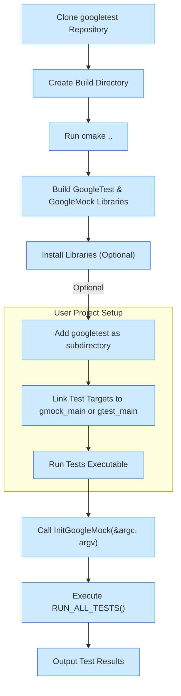

# How do I install and set up GoogleTest/GoogleMock?

GoogleTest and GoogleMock are powerful C++ testing frameworks designed to help you write robust, maintainable tests. This guide walks you through supported installation methods, platform compatibility, minimum C++ version requirements, and how to verify your setup with sample projects. It is ideal for users integrating the framework for the first time or facing build challenges.

---

## Supported Platforms and Requirements

- **Operating Systems:** Linux, macOS, Windows, and many Unix-like systems are supported.
- **C++ Version:** A compiler supporting at least C++11 is required; however, modern setups strongly recommend C++17 for full feature compatibility.
- **Build Tools:** The framework supports multiple build systems; however, CMake is the primary and recommended method.

<Tip>
Ensure your compiler and build environment satisfy the C++17 or newer standard requirements to prevent build and runtime errors.
</Tip>

---

## Installation Methods

### 1. Building with CMake (Recommended)

GoogleTest (including GoogleMock) provides community-supported CMake scripts enabling straightforward build and integration.

<Steps>
<Step title="Clone the repository">
Clone the GoogleTest repository to get both GoogleTest and GoogleMock sources:

```bash
git clone https://github.com/google/googletest.git -b main
downloaded_dir/googletest
```
</Step>
<Step title="Create a build directory and run CMake">
Navigate to the cloned directory and create a separate build folder:

```bash
cd googletest
mkdir build
cd build
cmake ..
```
By default, this builds both GoogleTest and GoogleMock.
</Step>
<Step title="Build and install">
Build the framework with:

```bash
make
sudo make install
```
On Windows with Visual Studio, opening the generated solution will allow building directly.
</Step>
</Steps>

#### Notes on Building Only GoogleTest

If you only want GoogleTest without GoogleMock:

```bash
cmake .. -DBUILD_GMOCK=OFF
```

### 2. Incorporating into Your CMake Project

You can build GoogleTest/GoogleMock as part of your existing project, ensuring consistent compiler/linker settings:

1. Use CMake's `add_subdirectory()` to add GoogleTest sources.
2. Link your test targets against `gtest`, `gtest_main`, `gmock`, or `gmock_main` as appropriate.

Example snippet from your `CMakeLists.txt`:

```cmake
add_subdirectory(path/to/googletest)
add_executable(mytests test.cpp)
target_link_libraries(mytests gmock_main)
```

<Tip>
Building GoogleTest as part of your project avoids runtime compatibility issues commonly seen with pre-built binaries.
</Tip>

### 3. Using FetchContent in CMake

For automated download and integration:

```cmake
include(FetchContent)
FetchContent_Declare(
  googletest
  URL https://github.com/google/googletest/archive/main.zip
)
set(gtest_force_shared_crt ON CACHE BOOL "" FORCE) # For Windows
FetchContent_MakeAvailable(googletest)
```

This method requires CMake 3.14 or later.

---

## Verifying Your Installation

After installation, validate the setup by compiling and running a simple test program that uses GoogleTest and GoogleMock.

Example `test.cpp`:

```cpp
#include <gtest/gtest.h>
#include <gmock/gmock.h>

class Foo {
 public:
  virtual ~Foo() = default;
  virtual int GetValue() { return 42; }
};

class MockFoo : public Foo {
 public:
  MOCK_METHOD(int, GetValue, (), (override));
};

TEST(MockTest, ReturnsValue) {
  MockFoo mock;
  EXPECT_CALL(mock, GetValue()).WillOnce(testing::Return(10));
  EXPECT_EQ(mock.GetValue(), 10);
}

int main(int argc, char **argv) {
  ::testing::InitGoogleMock(&argc, argv);
  return RUN_ALL_TESTS();
}
```

Build and run this with:

```bash
clang++ test.cpp -lgmock_main -lgtest -lpthread -o test
./test
```

The tests should pass, confirming correct installation.

---

## Common Configuration and Build Options

- **Shared vs Static Libraries:** 
  - Use the CMake option `BUILD_SHARED_LIBS=ON` to build GoogleTest/GoogleMock as shared libraries.
  - This may require additional flags to properly link your tests.

- **Compiler Flags:**
  - For Windows and Visual Studio, setting `gtest_force_shared_crt` ensures compatibility with dynamic runtime usage.
  - Compiler warnings and exceptions behaviors can be adjusted; GoogleMock uses stricter warnings internally to maintain code quality.

- **Testing GoogleMock itself:**
  - By default, GoogleMock's own tests are not built.
  - Enable with `-Dgmock_build_tests=ON` during CMake configuration.

---

## Troubleshooting Common Installation Issues

<AccordionGroup title="Troubleshooting Installation & Setup">
<Accordion title="Build Fails Due to Missing C++17 Support">
Make sure your compiler supports C++17. Update or change your compiler if necessary. Pass `-DCMAKE_CXX_STANDARD=17` explicitly to your build.
</Accordion>
<Accordion title="Linker Errors About Missing Symbols">
Verify that you are linking against both `gmock` and `gmock_main` (or `gtest` and `gtest_main`). Check for mismatched runtime libraries especially on Windows.
</Accordion>
<Accordion title="Tests Are Not Running or Being Discovered">
Confirm that your test executable initializes the framework properly by calling `::testing::InitGoogleMock(&argc, argv)` or `::testing::InitGoogleTest(&argc, argv)`. Check your filtering options if any arguments are passed.
</Accordion>
<Accordion title="Conflicts with Other Libraries or Macros">
Use the provided compiler flags to rename GoogleTest macros (`-DGTEST_DONT_DEFINE_TEST=1`) to avoid clashes.
</Accordion>
</AccordionGroup>

---

## Best Practices and Tips

- Always initialize GoogleMock (which also initializes GoogleTest) in your test `main()` function before running tests.
- Use the `gmock_main` library if you want the test runner to provide a default `main()`.
- For complex projects, integrate GoogleTest/GoogleMock as a submodule or FetchContent dependency for easier maintenance.
- Build and run the provided sample tests in the GoogleTest repository for confidence in your setup.

---

## Additional Resources

- [GoogleTest Installation Instructions](https://github.com/google/googletest/tree/main/googletest)
- [GoogleMock README and Quick Start](https://github.com/google/googletest/tree/main/googlemock)
- [Writing Your First Test Guide](/getting-started/first-test-run/writing-first-test)
- [Configuration & Environment Setup](/getting-started/setup-basics/configuration-setup)
- [Troubleshooting Common Setup Issues](/getting-started/first-test-run/troubleshooting-setup)

For comprehensive details on build options and platform specifics, consult the respective `CMakeLists.txt` and official GitHub repository documentation.

---

Should you encounter issues not resolved here, consider visiting the community forums or submitting an issue on the [GoogleTest GitHub repository](https://github.com/google/googletest/issues).


---

# Frequently Asked Questions

<AccordionGroup title="Basic Installation Questions">
<Accordion title="What is the recommended way to build GoogleTest and GoogleMock?">
GoogleTest with GoogleMock is best built using CMake. This supports all major platforms and allows easy integration into existing projects.
</Accordion>
<Accordion title="Can I build GoogleTest without GoogleMock?">
Yes, disable GoogleMock with the CMake option `-DBUILD_GMOCK=OFF` when running CMake configuration.
</Accordion>
<Accordion title="Do I need to initialize GoogleMock and GoogleTest separately?">
No. `InitGoogleMock()` initializes both GoogleMock and GoogleTest automatically.
</Accordion>
</AccordionGroup>

<AccordionGroup title="Build and Runtime Issues">
<Accordion title="My test executable fails at linking. What should I check?">
Ensure you link against the appropriate libraries (`gmock_main` or `gmock` and `gtest_main` or `gtest`) and link with pthread on POSIX systems.
</Accordion>
<Accordion title="Why do my tests say they are not discovered or executed?">
Verify that your test executable calls `InitGoogleMock()` properly and that no test filters are excluding tests.
</Accordion>
<Accordion title="How do I enable verbose logging for GoogleMock?">
Pass the flag `--gmock_verbose=info` or set programmatically via `GMOCK_FLAG_SET(verbose, 'info')` before test execution.
</Accordion>
</AccordionGroup>

---

# Visual Diagram: Typical GoogleTest/GoogleMock Build and Test Flow



---

# Summary

This page helps you successfully install and set up GoogleTest and GoogleMock with a focus on CMake-based builds across supported platforms. It provides detailed steps for cloning, building, integrating, and validating your test setup, along with troubleshooting guidance for common errors.

---