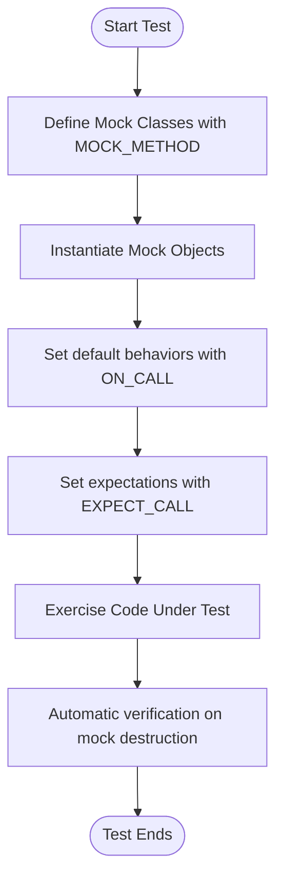

# What are GoogleTest and GoogleMock?

GoogleTest and GoogleMock together form a comprehensive C++ testing environment designed to help you write robust, maintainable, and efficient unit tests. This page explains their purpose, scope, and key advantages — empowering you to understand when and why to use each, and how they streamline your testing process.

---

## 1. Introduction to GoogleTest and GoogleMock

**GoogleTest (gTest)** is a widely-used C++ testing framework that provides powerful assertions, test fixtures, and a clear structure to write and organize unit tests.

**GoogleMock (gMock)** is a framework built on top of GoogleTest that enables creation and use of mock objects, facilitating interaction-based testing by verifying how your code interacts with its dependencies.

Together, they form a unified project simplifying both state-based and interaction-based testing.

### Why Use Both?

- GoogleTest ensures your code produces the correct results.
- GoogleMock ensures your code interacts correctly with other components.

This combined approach covers comprehensive testing needs, from verifying logic to enforcing correct collaboration.

---

## 2. Purpose and Scope

- **GoogleTest** is focused on *checking program correctness* via assertions and test management.
- **GoogleMock** extends this by *simulating dependent objects* and *verifying method calls*, expectations, and behaviors.

GoogleMock supports:

- Defining mock classes with ease.
- Setting expectations on method calls (how many, with what arguments, in which order).
- Specifying default behaviors and return values for mocks.
- Controlling strictness levels on uninteresting or unexpected calls.

---

## 3. Key Advantages

### a. Expressive, Readable Syntax

With macros like `MOCK_METHOD`, `EXPECT_CALL`, and `ON_CALL`, GoogleMock lets you express testing intent clearly:

```cpp
class MockFoo : public Foo {
 public:
   MOCK_METHOD(int, GetSize, (), (const, override));
};

MockFoo mock;
EXPECT_CALL(mock, GetSize()).WillOnce(Return(10));
```

This declarative approach makes tests easier to write and understand.

### b. Powerful Control Over Behavior

Customize how mocks respond with actions such as `Return()`, `Invoke()`, or complex chained actions.

### c. Automatic Verification

When mocks are destroyed, GoogleMock automatically verifies all expectations, reducing test boilerplate and enforcing correctness.

### d. Control on Call Strictness

Choose between `NiceMock` (ignore uninteresting calls), `NaggyMock` (warn on uninteresting calls), and `StrictMock` (fail on uninteresting calls), optimizing test verbosity and strictness for your scenario.

### e. Support for Complex C++ Features

GoogleMock supports mocking of overloaded methods, const methods, methods with move-only types, templates, and more.

---

## 4. When to Use

- Use **GoogleTest** whenever you need to write unit tests verifying code correctness.
- Use **GoogleMock** when your code interacts with external dependencies (files, databases, services) or collaborating objects, and you want to isolate, spy, or inject failures.

---

## 5. Typical Workflow

1. Define mock classes using `MOCK_METHOD` macros for the interfaces you want to mock.
2. Instantiate mocks in tests.
3. Use `ON_CALL` to set default behaviors where needed.
4. Use `EXPECT_CALL` to set expectations on method calls, arguments, ordering, and cardinalities.
5. Exercise the system under test.
6. GoogleMock verifies expectations automatically on mock destruction.

Example:

```cpp
using ::testing::Return;

class MockTurtle : public Turtle {
 public:
   MOCK_METHOD(void, PenDown, (), (override));
};

TEST(PainterTest, DrawsLine) {
  MockTurtle turtle;

  EXPECT_CALL(turtle, PenDown())
      .Times(1);

  Painter p(&turtle);
  p.DrawLine();
}
```

---

## 6. Best Practices

- **Mock only interfaces or abstract classes.** Avoid mocking concrete classes directly.
- **Use `NiceMock` where you want to suppress warnings about uninteresting calls.**
- **Specify expectations with the right cardinality** to avoid brittle tests (e.g., `Times(AnyNumber())`, `AtLeast`, `Exactly`).
- **Use sequences or `.InSequence()` to specify strict order of calls** only when necessary to avoid fragile tests.
- **Utilize `ON_CALL` to set default behaviors without adding expectations.**
- **Leverage advanced matchers to verify complex argument properties.**

---

## 7. Additional Resources

- [gMock for Dummies](https://google.github.io/googletest/gmock_for_dummies.html): Beginner-friendly tutorial
- [gMock Cookbook](https://google.github.io/googletest/gmock_cook_book.html): Detailed recipes and examples
- [Mocking Reference](https://google.github.io/googletest/reference/mocking.html): Comprehensive reference on mocking API
- [gMock Cheat Sheet](https://google.github.io/googletest/gmock_cheat_sheet.html): Quick syntax guide
- [Mock Strictness Wrappers](https://google.github.io/googletest/gmock_cook_book.html#NiceStrictNaggy): Controlling warnings and errors on uninteresting calls

---

## 8. Navigating Documentation

To build mastery, consider exploring these documentation sections in sequence:

- **Core Concepts & Terminology:** Your foundation on testing and mocking basics
- **Getting Started Guides:** Installing, configuring, writing your first test
- **Guides on Mocking:** Writing mock classes, setting expectations, using matchers
- **Mastering Mock Strictness:** Learn how to control warnings and failures
- **Extending gMock:** Writing custom matchers and actions for advanced needs

---

By incorporating GoogleTest and GoogleMock into your development workflow, you gain powerful tools to improve test reliability, enable early bug detection, and foster maintainable code through precise contract verification and interaction checking.

---

<Info>
For in-depth examples and advanced techniques, visit the official [GoogleTest GitHub repository](https://github.com/google/googletest) and the online documentation portal.
</Info>

---

### Diagram: Mocking Workflow Simplified



---

### Related Documentation

- [Mock Objects and Method Expectations](../api-reference/mocking-framework/mock-objects-and-methods.md)
- [Matchers and Call Strictness](../api-reference/mocking-framework/matchers-and-strictness.md)
- [gMock Cookbook](../docs/gmock_cook_book.md)
- [Getting Started with Mocking](../guides/getting-started/mocking-basics.md)
- [Mock Strictness: Nice, Naggy, and Strict](../guides/mocking-masterclass/mock-class-strictness.md)

---

<Callout title="Tip">
Start with simple expectations and gradually add precision as your test cases require, ensuring tests remain resilient and focused.
</Callout>

<Note>
Remember: GoogleMock depends on virtual functions to replace real method calls with mock implementations. Non-virtual methods cannot be mocked directly.
</Note>
