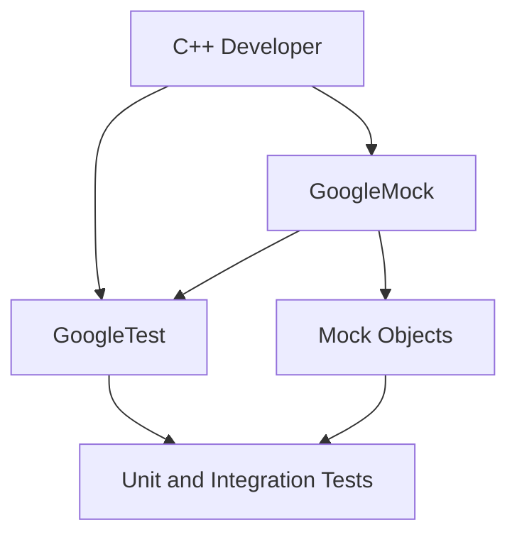

# What is GoogleTest (and GoogleMock)?

GoogleTest and GoogleMock are powerful frameworks developed by Google to help C++ developers write reliable, maintainable, and well-structured tests. While they are tightly integrated, they serve distinct purposes and solve complementary problems in the testing domain.

---

## Introduction

### GoogleTest (gTest)

GoogleTest is a C++ testing framework designed to simplify writing and running tests. It adheres to the xUnit architecture and enables writing test code that is clean, expressive, and portable across platforms. With GoogleTest, developers can organize tests into suites, use assertions to verify correctness, and generate detailed test reports.

### GoogleMock (gMock)

GoogleMock is a companion framework built on top of GoogleTest that specifically focuses on creating mock objects for testing interfaces and interaction patterns. It allows developers to specify expected calls, define return behaviors, and verify that mock objects behave as intended within tests. GoogleMock enhances test coverage and robustness through fine-grained control over dependencies.

---

## Core Differences and Usage

| Aspect                 | GoogleTest                       | GoogleMock                                     |
|------------------------|---------------------------------|------------------------------------------------|
| Purpose                | General C++ testing framework    | Framework for creating and using mocks          |
| Primary Focus          | Writing and running test cases   | Defining mock classes, setting expectations     |
| Usage                  | Use macros like `TEST()`, `TEST_F()` for tests | Define mocks with `MOCK_METHOD()`, use `EXPECT_CALL()` to specify behavior |
| Dependencies           | Standalone testing               | Built on GoogleTest, extends its capabilities    |
| Typical use case       | Unit tests verifying actual outputs and state | Interaction testing verifying calls and collaborations |

---

## Why Use Both?

In complex C++ codebases, tests need to verify both the final outputs (value/state correctness) and that components interact correctly. GoogleTest facilitates writing these comprehensive tests, while GoogleMock excels in simulating components that are not easily available or controllable, enabling isolation during testing.

For example, to test a class `Foo` that depends on an interface `Bar`, GoogleMock lets you create a `MockBar` to verify that `Foo` calls `Bar` methods correctly without invoking real `Bar` implementations.

---

## Key GoogleTest Features

- **Test Suites and Fixtures:** Organize related tests and share setup/teardown code.
- **Assertions:** Rich collection of assertion macros like `EXPECT_EQ`, `ASSERT_TRUE` to verify expected outcomes.
- **Parameterized Tests:** Write tests that run with multiple input parameters using `TEST_P` and instantiation macros.
- **Death Tests:** Verify that faulty code terminates as expected.
- **Test Events and Listeners:** Extend test reporting and behavior through event hooks.

### Example GoogleTest test:
```cpp
TEST(FactorialTest, HandlesPositiveInput) {
  EXPECT_EQ(Factorial(1), 1);
  EXPECT_EQ(Factorial(3), 6);
}
```

---

## Key GoogleMock Features

- **Mock Classes:** Define mocks for interfaces using `MOCK_METHOD` macro.
- **Expectations:** Specify expected calls and argument matchers using `EXPECT_CALL`.
- **Default Behaviors:** Define fallback behaviors with `ON_CALL`.
- **Call Sequences and Order:** Control call order using `Sequence` and clauses like `.InSequence()`.
- **Strictness Modes:** Choose between `NiceMock`, `NaggyMock`, and `StrictMock` for call handling.

### Example GoogleMock mock:
```cpp
class MockBar : public Bar {
 public:
  MOCK_METHOD(int, GetValue, (), (const override));
};

TEST(FooTest, CallsBarGetValue) {
  MockBar mock_bar;
  EXPECT_CALL(mock_bar, GetValue())
      .Times(1)
      .WillOnce(testing::Return(42));

  Foo foo(&mock_bar);
  EXPECT_EQ(foo.UseBar(), 42);
}
```

---

## How to Choose Between GoogleTest and GoogleMock?

- If you want to write tests to verify function outputs or state changes, **GoogleTest** is your tool.
- If your tests involve complex dependencies or require simulating interfaces for isolation, **GoogleMock** adds the necessary capability.
- Use **GoogleMock alongside GoogleTest** for maximum flexibility.

---

## Integration and Getting Started

GoogleMock depends on GoogleTest and extends it. To use both:

1. Include GoogleTest headers for tests: `#include <gtest/gtest.h>`.
2. Include GoogleMock headers where mocks are defined or used: `#include <gmock/gmock.h>`.
3. Link with both libraries (`gtest` and `gmock`) during build.

GoogleTest and GoogleMock come with integration support for popular build systems like CMake and Bazel. See the [Installation Options](https://github.com/google/googletest/blob/main/docs/getting-started/setup-introduction/installation-options.md) guide for detailed setup instructions.

---

## Additional Resources

- [GoogleTest Primer](overview/getting-started/introduction) — Introduction and core concepts
- [Writing Your First Test](gtest-guides/getting-started/write_first_test) — Step-by-step tutorial
- [Mocking Reference](docs/reference/mocking.md) — Detailed macros and classes
- [Assertions Reference](docs/reference/assertions.md) — Available assertion macros
- [Test Case Structure & Lifecycle](api-reference/core-apis/test-case-structure) — How tests run
- [Effective Mocking Patterns](gtest-guides/intermediate-patterns/mocking_patterns) — Best mocking practices

---

## Summary

GoogleTest is a comprehensive C++ testing framework focusing on assertions, test organization, and running tests. GoogleMock builds upon it to offer powerful mocking tools, enabling detailed testing of interactions and dependencies. Together, they offer an industry-standard approach to writing high-quality unit and integration tests in C++.

---

## Tips for Users

- Use GoogleTest for isolated functional tests.
- Use GoogleMock to simulate dependencies and verify call behaviors.
- Avoid mixing underscore characters `_` in test and test suite names to prevent naming conflicts.
- Use the rich assertion macros and parameterized tests in GoogleTest to cover diverse scenarios.
- Leverage event listeners for customized test reporting.

---

## Diagram: Simplified Relationship



---

## FAQ Highlights

**Q:** Can I use GoogleTest without GoogleMock?  
**A:** Yes. GoogleTest is standalone and sufficient for basic testing.  

**Q:** Is GoogleMock usable without GoogleTest?  
**A:** No. GoogleMock requires GoogleTest's test runner and assertion facilities.

**Q:** When should I write a mock vs. a real instance?  
**A:** Use mocks when the real object is unavailable, has side effects, or is costly. Otherwise, prefer real instances.

**Q:** How do I set up tests to run with parameters?  
**A:** Use GoogleTest's parameterized test macros (`TEST_P`) and instantiate them with `INSTANTIATE_TEST_SUITE_P`.

**Q:** What if I want to customize failure messages?  
**A:** Use assertions with streaming output (`<<`) or write custom assertions and predicate-formatters.

---

This page aims to clarify the roles and interplay of GoogleTest and GoogleMock, enabling you to select and use the right tool effectively in your C++ testing projects.