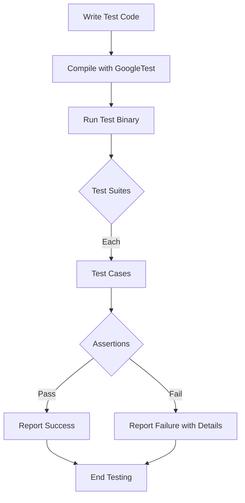

# Writing and Running Your First Test

Welcome to the starting point of your journey with GoogleTest! This guide empowers new users to quickly write, execute, and understand their initial test cases, including creating mock objects and using basic assertions. By following these instructions, you'll overcome common beginner hurdles and accelerate your productivity with confidence.

---

## 1. Getting Started: Your First Test Case

Writing your first test involves verifying a small piece of your code behaves as expected. GoogleTest provides the `TEST` macro to define simple tests without needing additional fixture setup.

### How to Write a Basic Test

```cpp
#include <gtest/gtest.h>

// The function to test
int Add(int x, int y) {
  return x + y;
}

// Define a test suite named AddTest and a test named HandlesPositiveInput
TEST(AddTest, HandlesPositiveInput) {
  EXPECT_EQ(Add(1, 2), 3);  // Assert Add(1,2) == 3
}
```

* `TEST(TestSuiteName, TestName)` creates an isolated test.
* Use assertions like `EXPECT_EQ` to verify expected results.
* Both names must be valid C++ identifiers and should avoid underscores to prevent naming conflicts.

### Running Your Test

To run your tests:

1. Compile your test program linking against GoogleTest libraries.
2. Call `testing::InitGoogleTest(&argc, argv);` in your `main` function.
3. Call `RUN_ALL_TESTS()` which runs all registered tests and returns a success/failure code.

Example main function:

```cpp
int main(int argc, char **argv) {
  testing::InitGoogleTest(&argc, argv);
  return RUN_ALL_TESTS();
}
```

Successful runs print results grouped by test suites and cases.

---

## 2. Using Test Fixtures: Sharing Setup Among Tests

When multiple tests share frequent setup and teardown code, use test fixtures. A test fixture is a class derived from `testing::Test` containing shared objects and methods.

### Creating a Test Fixture

```cpp
class QueueTest : public testing::Test {
 protected:
  QueueTest() {
    q1_.Enqueue(1);
    q2_.Enqueue(2);
    q2_.Enqueue(3);
  }

  Queue<int> q0_;
  Queue<int> q1_;
  Queue<int> q2_;
};
```

### Writing Tests with Fixtures

Use `TEST_F` (F = Fixture) to use the fixture class:

```cpp
TEST_F(QueueTest, IsEmptyInitially) {
  EXPECT_EQ(q0_.size(), 0);
}

TEST_F(QueueTest, DequeueWorks) {
  int* n = q0_.Dequeue();
  EXPECT_EQ(n, nullptr);

  n = q1_.Dequeue();
  ASSERT_NE(n, nullptr);
  EXPECT_EQ(*n, 1);
  delete n;
}
```

GoogleTest creates a fresh fixture instance for each test, calls its `SetUp()` method (if defined), runs the test, then calls `TearDown()`.

---

## 3. Introducing Mock Objects for Dependency Simulation

When your code under test interacts with other components, mocks let you simulate and inspect those interactions.

### Defining a Mock Class

Use the `MOCK_METHOD` macro inside a class derived from your interface.

Example mocking a simple interface:

```cpp
class Turtle {
public:
  virtual ~Turtle() {}
  virtual void PenUp() = 0;
  virtual void PenDown() = 0;
  virtual void Forward(int distance) = 0;
};

class MockTurtle : public Turtle {
public:
  MOCK_METHOD(void, PenUp, (), (override));
  MOCK_METHOD(void, PenDown, (), (override));
  MOCK_METHOD(void, Forward, (int distance), (override));
};
```

### Using Mocks in Tests

```cpp
#include <gmock/gmock.h>
using ::testing::AtLeast;

TEST(PainterTest, CanDrawSomething) {
  MockTurtle turtle;
  EXPECT_CALL(turtle, PenDown()).Times(AtLeast(1));

  Painter painter(&turtle);
  EXPECT_TRUE(painter.DrawCircle(0, 0, 10));
}
```

Here, the test verifies that `PenDown()` is called at least once. If the code doesn't do so, the test will fail immediately.

---

## 4. Basic Assertions: Verifying Test Outcomes

Assertions are how you specify expected behavior in tests.

Common assertions:

- `EXPECT_EQ(val1, val2)`: Non-fatal, verifies equality.
- `ASSERT_EQ(val1, val2)`: Fatal, aborts the current function on failure.
- `EXPECT_TRUE(cond)`, `ASSERT_TRUE(cond)`: Verify boolean conditions.

Assertions provide clear failure messages to help diagnose issues.

---

## 5. Common Pitfalls and Quick Fixes

### Why does my fixture fail to compile?

Ensure your test fixture has a **default constructor**. If you define any constructor with parameters, explicitly declare a default constructor.

### Why can't I use `ASSERT_*` macros in constructors/destructors?

GoogleTest requires assertions that can generate fatal failures to be in `void`-returning functions, so avoid using them in constructors/destructors. Use `SetUp()` or `TearDown()` instead.

### My test fails due to unexpected function calls on mocks

Always set expectations on mocks *before* exercising the code that calls them. Use `EXPECT_CALL` to specify expected calls.

### Test names should not contain underscores (`_`)

Test and suite names generate internal class names which use underscores. To prevent name conflicts or compiler errors, avoid underscores in these names.

### My death tests hang or cause problems

Death tests run in a child process. Avoid creating threads outside the death test and consider setting the death test style to "threadsafe" for stability.

---

## 6. Step-by-Step Workflow for Your First Test

<Steps>
<Step title="Step 1: Write your code to be tested">
Write the function/class you want to verify.
</Step>
<Step title="Step 2: Define a test case">
Use the `TEST` macro to define a simple test.
</Step>
<Step title="Step 3: Write assertions">
Inside the test, use assertions like `EXPECT_EQ` to verify behavior.
</Step>
<Step title="Step 4: Compile your test program">
Link against GoogleTest (and GoogleMock if needed).
</Step>
<Step title="Step 5: Run the tests">
Invoke `RUN_ALL_TESTS()` in `main()`.
</Step>
<Step title="Step 6: Interpret test results">
Check output; failures provide file, line, and message.
</Step>
</Steps>

---

## 7. Practical Tips for Fast Productivity

- Use `TEST_F` fixtures when sharing common setup among tests.
- Set expectations on mock objects before calling code under test.
- Use `SCOPED_TRACE` to add trace info inside helper functions for clearer failure messages.
- Avoid over-specifying arguments in `EXPECT_CALL`; prefer using matchers like `_` to avoid brittle tests.
- To disable tests temporarily, prefix test names or suites with `DISABLED_`.

---

## 8. Troubleshooting Common Issues

<AccordionGroup title="Common First-Time Test Issues">
<Accordion title="Test not discovered or run">
Make sure you link with GoogleTest libraries, and call `testing::InitGoogleTest()` before `RUN_ALL_TESTS()`.
</Accordion>
<Accordion title="Cannot link mock methods">
Verify that the mocked methods are declared `virtual` in the base interface, and that your mock class uses `MOCK_METHOD` appropriately.
</Accordion>
<Accordion title="Unexpected failures about mock expectations">
Make sure expectations (`EXPECT_CALL`) are set *before* exercising the mock.
</Accordion>
<Accordion title="Test crashes due to null pointers in fixture">
Use `ASSERT_*` when dereferencing pointers, so the test aborts cleanly if null.
</Accordion>
<Accordion title="Failures in death tests unexpected">
Death tests run in subprocesses; avoid global state changes leaking. Put expectations inside `EXPECT_DEATH` to ensure they are visible to the subprocess.
</Accordion>
</AccordionGroup>

---

## 9. Next Steps and Related Resources

* Explore the [Writing Your First Unit Test guide](/getting-started/configuration-and-first-test/writing-your-first-unit-test) for more detailed tutorials.
* Read the [Mocking for Dummies tutorial](/gmock_for_dummies.md) to understand mocks.
* Deepen your knowledge with the [gMock Cookbook](/gmock_cook_book.md) for advanced mock usage.
* Visit the [Assertions Reference](/reference/assertions.md) for a complete list of assertion macros.
* See the [Writing Mock Expectations guide](/guides/mocking-with-googlemock/writing-mock-expectations) to master expectations and matchers.

---

## Visual Overview of the Test Workflow



---

<Tip>
Remember to always start small: write simple tests, verify they pass, then gradually add complexity. Keep your tests independent and expressive, focusing on verifying behavior rather than implementation details.
</Tip>

<Check>
Be sure to link the GoogleTest and GoogleMock libraries properly and include the correct header files (`<gtest/gtest.h>` and `<gmock/gmock.h>`) to access all functionalities.
</Check>