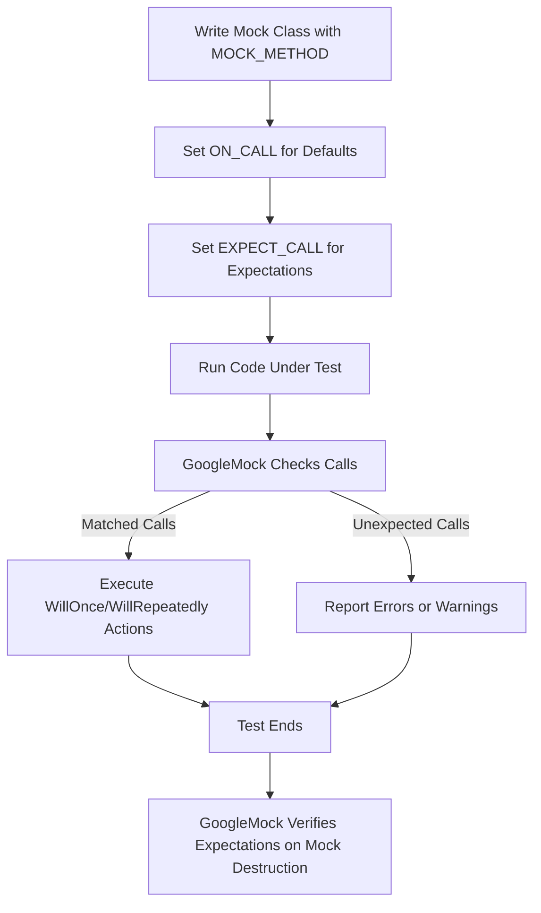

# How do I use GoogleMock with GoogleTest?

GoogleMock (gMock) is seamlessly integrated with GoogleTest (gTest) to provide powerful C++ unit testing with mocking capabilities. This page explains how to combine GoogleMock and GoogleTest effectively in the same project, guiding you through their integration, usage patterns, and common questions related to their combined usage.

---

## 1. What is GoogleMock and how does it relate to GoogleTest?

GoogleMock is a C++ mocking framework designed to work alongside GoogleTest. While GoogleTest provides the core framework for writing and running tests, GoogleMock allows you to create mock classes and set expectations on the behavior of dependencies that your code interacts with.

GoogleMock is actually bundled within GoogleTest, and their API and headers have been merged to simplify usage. You only need to include `<gmock/gmock.h>`, and it automatically brings in necessary GoogleTest components.

The integration offers:

- Declarative macros to define mock classes and methods.
- Facilities to set default behaviors with `ON_CALL` and expectations with `EXPECT_CALL`.
- Rich matchers and actions to specify argument constraints and actions on calls.
- Automatic verification of mock expectations upon test completion.


## 2. Getting Started: Using GoogleMock in a GoogleTest project

### Step 1: Include the right headers

Start by including the unified GoogleMock header in your test files:

```cpp
#include <gmock/gmock.h>
```

This brings in both GoogleMock and GoogleTest API, so you don't need to include `<gtest/gtest.h>` explicitly.

### Step 2: Define your mock classes

You define mocks by inheriting from your interfaces or classes with virtual methods, and using the `MOCK_METHOD` macro to mock those methods. For example:

```cpp
class MockFoo : public Foo {
 public:
  MOCK_METHOD(void, DoSomething, (int x), (override));
  MOCK_METHOD(int, GetValue, (), (const, override));
};
```

Place `MOCK_METHOD` declarations in the `public:` section even if the base class method is protected or private.

### Step 3: Set default behaviors and expectations

You specify the behavior and expectations of mock methods using:

- `ON_CALL(mock_obj, Method(args))` to set the default action without enforcing call counts.
- `EXPECT_CALL(mock_obj, Method(args))` to both set behavior and expect calls.

Example:

```cpp
using ::testing::Return;

MockFoo mock;
ON_CALL(mock, GetValue()).WillByDefault(Return(42));
EXPECT_CALL(mock, DoSomething(5)).Times(1);
```

### Step 4: Use the mocks in your tests and verify

Invoke your code under test, passing mocks as dependencies. GoogleMock will automatically verify that all expectations are met when mock objects are destroyed at the end of the test.

If expectations are violated (e.g., methods are called too many/few times or with unexpected arguments), GoogleMock reports detailed failures immediately during execution.


## 3. Guidelines and Best Practices for Combining GoogleMock & GoogleTest

- **Set expectations before exercising the code under test.** `EXPECT_CALL` statements define expectations for future calls.
- **Prefer `ON_CALL` to set sane default behaviors** and use `EXPECT_CALL` only for interactions you want to verify.
- **Use `NiceMock`, `NaggyMock`, or `StrictMock`** wrappers around mocks to control warnings and failures related to uninteresting calls.
- **Leverage matchers** (like `_`, `Eq()`, `Ge()`, etc.) to specify arguments in expectations flexibly.
- **Use sequences or `After` clause** for specifying call order as needed.
- **Avoid overconstraining tests** to maintain maintainability and resilience to refactoring.


## 4. FAQ: Common Questions When Using GoogleMock with GoogleTest

<AccordionGroup title="Common Questions about GoogleMock & GoogleTest Integration">
<Accordion title="Do I need to include both gtest and gmock headers?">
Use only `#include <gmock/gmock.h>`. This header includes all necessary components of both GoogleMock and GoogleTest.
</Accordion>

<Accordion title="Are GoogleMock and GoogleTest separate projects?">
They were originally separate but now are merged. GoogleMock is part of GoogleTest’s single repository, sharing the API and header files.
</Accordion>

<Accordion title="How do I write tests that use both GoogleMock and GoogleTest?">
Write your tests following typical GoogleTest patterns (`TEST`, `TEST_F`). Create mock objects as needed using `MOCK_METHOD`. Use `EXPECT_CALL` and `ON_CALL` in the setup phase, then run your tests normally.
</Accordion>

<Accordion title="What if the mock method is called without an EXPECT_CALL?">
It’s called an uninteresting call. By default, GoogleMock prints a warning but lets the call proceed. You can suppress warnings by using `NiceMock`, or enforce failures with `StrictMock`.
</Accordion>

<Accordion title="How do I combine GoogleMock expectations with GoogleTest assertions?">
You can freely use all assertions (`EXPECT_`, `ASSERT_`) alongside your GoogleMock `EXPECT_CALL`s. GoogleMock reports mock failures separately to test assertion failures.
</Accordion>

<Accordion title="Can I verify mock expectations manually before the test ends?">
Yes. Use `::testing::Mock::VerifyAndClearExpectations(&mock_obj)` to force verification early if needed.
</Accordion>

<Accordion title="Do GoogleMock and GoogleTest share the same runtime and environment?">
Yes. Since GoogleMock is part of GoogleTest, they share initialization, flags, and runtime support seamlessly.
</Accordion>

<Accordion title="How should I handle mocked methods returning non-copyable or move-only types?">
GoogleMock supports mocking move-only types naturally in C++11 and later. Use lambdas or callable objects in `WillOnce` / `WillRepeatedly` to return fresh objects.
</Accordion>

<Accordion title="Can I mock non-virtual methods?">
Yes, but with limitations. GoogleMock supports mocking non-virtual methods via dependency injection and templates, described in the Cookbook.
</Accordion>
</AccordionGroup>


## 5. Troubleshooting Tips for GoogleMock and GoogleTest Integration

- **Unexpected calls warnings:** Use `NiceMock` to suppress or add catch-all `EXPECT_CALL(mock, Method(_)).Times(AnyNumber())` for allowed calls.
- **Linking errors:** Make sure to link with both `gtest` and `gmock` libraries if separated in your build setup.
- **Compilation issues:** For large mocks, consider moving mock class constructor/destructor definitions to `.cc` files to speed up builds.
- **Over-constraining expectations:** Avoid setting strict expectations on too many calls; use `Times(AnyNumber())` wisely.
- **Order failures:** Use `InSequence` or `After` clauses to explicitly control call ordering.


## 6. Additional Resources and Next Steps

- [Mocking Reference](../reference/mocking.md): Detailed API and macro references for mocking.
- [gMock Cookbook](../gmock_cook_book.md): Practical recipes, examples, and advanced mocking techniques.
- [gMock for Dummies](../gmock_for_dummies.md): Beginner friendly introduction.
- [Matchers Reference](reference/matchers.md): Guide to argument matchers.
- [GoogleTest Primer](https://github.com/google/googletest/blob/main/docs/principles.md): For getting started on basic testing.


---

## Summary

Using GoogleMock with GoogleTest enables powerful interaction-based testing in C++. The unified header `gmock.h` consolidates both frameworks. Defining mocks, setting expectations, and writing tests follow an intuitive workflow supported by rich matchers and actions. Control the strictness of mock behavior and order of expectations to create robust tests. Consult the linked references for in-depth guidance and the cookbook for practical recipes.

---

<Check>Before writing tests, ensure you initialize GoogleMock with `testing::InitGoogleMock(&argc, argv);` in your main function.</Check>

<Info>Remember to set expectations before exercising the code under test to avoid undefined behavior.</Info>

---

## Example: Basic GoogleMock with GoogleTest usage

```cpp
#include <gmock/gmock.h>
#include <gtest/gtest.h>

using ::testing::Return;
using ::testing::_;

class Foo {
 public:
  virtual ~Foo() {}
  virtual int GetValue(int x) const = 0;
};

class MockFoo : public Foo {
 public:
  MOCK_METHOD(int, GetValue, (int x), (const, override));
};

TEST(FooTest, ReturnsValue) {
  MockFoo mock_foo;

  // Set up default behavior
  ON_CALL(mock_foo, GetValue(_)).WillByDefault(Return(42));
  
  // Expect GetValue to be called exactly once with 10
  EXPECT_CALL(mock_foo, GetValue(10)).Times(1);

  // Call the method
  EXPECT_EQ(mock_foo.GetValue(10), 42);
}

int main(int argc, char** argv) {
  ::testing::InitGoogleMock(&argc, argv);
  return RUN_ALL_TESTS();
}
```

This simple example demonstrates the synchronized use of GoogleMock and GoogleTest, covering mock creation, expectation setting, and running tests with automatic verification.


---

## Diagram: Simplified Interaction Flow



This flow shows the typical lifecycle of a mock in a GoogleTest + GoogleMock test.


---

<Note>
For complex mocking scenarios such as mocking non-virtual methods, move-only types, or multithreaded tests, refer to the gMock Cookbook and official docs for detailed guidance.
</Note>


---

# Summary

GoogleMock integrates tightly with GoogleTest to provide a comprehensive C++ testing and mocking solution. Using the unified header and well-defined macros like `MOCK_METHOD`, `EXPECT_CALL`, and `ON_CALL`, users can define mock behavior and expectations cleanly. The framework automatically verifies these expectations and provides detailed diagnostics. For deep expertise, explore related guides such as the Mocking Reference and gMock Cookbook.

# Related Documentation

- [Mocking Reference](../reference/mocking.md)
- [gMock Cookbook](../gmock_cook_book.md)
- [gMock for Dummies](../gmock_for_dummies.md)
- [Matchers Reference](reference/matchers.md)
- [Core GoogleTest Testing](../overview/core-testing-apis/test-macros.md)
- [Setting Expectations & Actions](api-reference/mocking-apis/expectations-actions.md)

This page fits seamlessly in the overall documentation to support users in adopting and mastering GoogleMock usage within GoogleTest-based projects.
