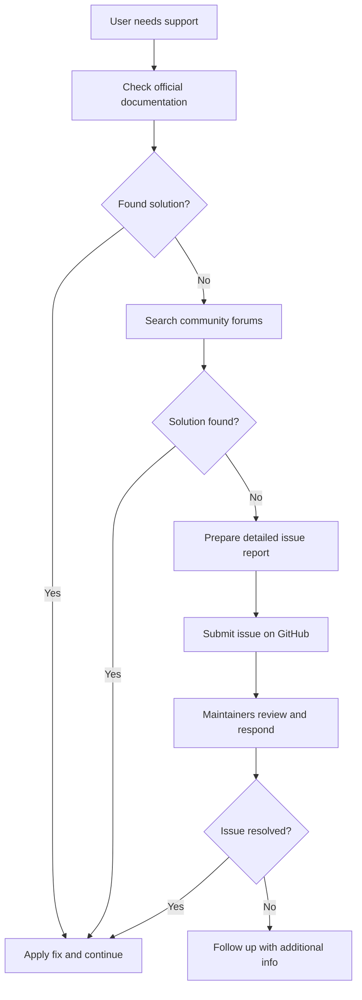

# Getting More Help & Reporting Issues

This page guides you on how to obtain hands-on support and report issues effectively when using GoogleTest and GoogleMock. It directs you to documentation resources, community channels, and issue reporting guidelines. Furthermore, it sets clear expectations for submitting issues and understanding typical response times.

---

## Frequently Asked Questions

### Where can I find official documentation and guides?
- The complete documentation for GoogleTest and GoogleMock is available online, including comprehensive guides, API references, and cookbooks. Key resources:
  - [GoogleTest User's Guide](../index.md)
  - [gMock for Dummies](../gmock_for_dummies.md)
  - [gMock Cookbook](../gmock_cook_book.md)
  - [API Reference for Mocking and Testing](../reference/mocking.md)

Refer to the navigation map under the FAQ section for quick access to topic-based FAQs.

### How do I report a bug or request a feature?
- Use the GitHub issues page at the official repository: [https://github.com/google/googletest/issues](https://github.com/google/googletest/issues).
- Before opening an issue:
  - Search existing issues to avoid duplicates.
  - Include a clear description of the problem or request.
  - Provide minimal reproducible code if reporting bugs.
  - Specify your environment details (OS, compiler version, GoogleTest version).

### What information should I include when submitting an issue?
- A succinct title summarizing the issue.
- Detailed description with steps to reproduce the problem.
- Expected and actual behavior.
- Sample code snippet demonstrating the problem.
- Environment details (platform, compiler, build system).
- Any relevant logs, error messages, or stack traces.

### How long does it take to get a response to an issue?
- Response times vary depending on the priority and complexity of the issue.
- The maintainers prioritize security and critical bugs.
- Community contributions often accelerate resolution.
- It is recommended to monitor the issue thread and contribute information or suggestions.

### Are there community resources for help?
- Yes, a vibrant community supports GoogleTest and GoogleMock.
  - Use forums such as Stack Overflow tagged with [googletest](https://stackoverflow.com/questions/tagged/googletest) or [gmock](https://stackoverflow.com/questions/tagged/gmock).
  - Participate in Google groups or other discussion platforms.
  - Review common problems and solutions in the [Legacy gMock FAQ](../gmock_faq.md) and [GoogleTest FAQ](../faq/general-usage-faqs/getting-started-common-issues.md).

---

## Common Issues and How to Get Support

<AccordionGroup title="Common Support Topics">
<Accordion title="Installation and Setup Problems">
Ensure your environment meets prerequisites: correct compiler with C++17 support, properly installed build tools (e.g., CMake or Bazel), and linked libraries. Refer to the [Prerequisites & Supported Platforms](../../getting_started/setup_requirements/prerequisites_platforms) and [Preparing Your Environment](../../getting_started/setup_requirements/environment_preparation) guides.
</Accordion>
<Accordion title="Mocking and Expectation Errors">
For issues with mock expectations, or unexpected/uninteresting calls, consult the detailed explanations in the [Legacy gMock FAQ](../gmock_faq.md) and [Mocking Reference](../reference/mocking.md). Running tests with `--gmock_verbose=info` can give insightful logs to diagnose failures.
</Accordion>
<Accordion title="Build and Integration Challenges">
Problems linking GoogleTest and GoogleMock are common. Check your build configurations, ensure only one `main()` is linked, and validate linking order. See the [Integration & Build Failures FAQ](../faq/troubleshooting-advanced/integration-build-failures.mdx) for targeted advice.
</Accordion>
</AccordionGroup>

---

## Reporting Guidelines

When reporting issues or requesting support, keep in mind:

- Include a minimal code example to illustrate the problem clearly.
- Specify your test scenario, what you expect vs. what happens.
- Use the latest stable release or include version info if using a development build.
- For performance or flaky tests, provide details about your setup and system load.

Providing thorough information helps maintainers and the community resolve your issue faster.

---

## Useful Links

- **Official Documentation:** [GoogleTest GitHub](https://github.com/google/googletest), [GoogleTest Docs](https://google.github.io/googletest/)
- **Issue Tracker:** [GitHub Issues](https://github.com/google/googletest/issues)
- **Community Help:** Stack Overflow `#googletest`, Google groups, and forums
- **Mocking and Assertions:** [gMock Cookbook](../gmock_cook_book.md), [Matchers Reference](../reference/matchers.md), [Actions Reference](../reference/actions.md)
- **Getting Started:** [Writing Your First Test](../../getting_started/first_test_run_validation/write_first_test.md)

---

## Best Practices for Seeking Help

- **Be Specific:** Focus your question on one problem at a time.
- **Replicate:** Try to isolate and reproduce the problem in a minimal test case.
- **Search First:** Use existing docs, FAQs, and previous issues/answers before posting.
- **Respect Maintainership:** Use issue tracker appropriately—issues for bugs and feature requests; community forums for usage questions.

---

## Summary
This page serves as your starting point to find additional support for GoogleTest and GoogleMock. Whether you encounter setup hurdles, test failures, or need to file bugs, follow the described channels and tips to engage effectively and get timely assistance.

---

<Check>
Remember, setting expectations correctly in mocks prevents common test failures. Use `ON_CALL` for default behaviors and `EXPECT_CALL` only when verifying interactions.
</Check>

<Note>
Running tests with `--gmock_verbose=info` enhances visibility into mock calls and matching, aiding fast diagnosis.
</Note>

---

## Contact and Support Flow Diagram

---

# Appendix

### Understanding Response Times
The maintainers balance multiple priorities. Issues submitted with clear reproduction steps and minimal code receive quicker attention.

### Community Etiquette
Be polite and concise when engaging on forums or submitting issues. This fosters a productive support environment.

---

For complete mastery, please explore the related documentation sections on mocking workflows, assertions, and test writing best practices linked throughout this page.

---

<Source url="https://github.com/google/googletest" branch="main" paths={[{"path": "docs/gmock_faq.md", "range": "1-100"},{"path": "docs/gmock_for_dummies.md", "range": "1-150"},{"path": "docs/gmock_cheat_sheet.md", "range": "1-300"},{"path": "docs/reference/mocking.md", "range": "1-250"}]} />
