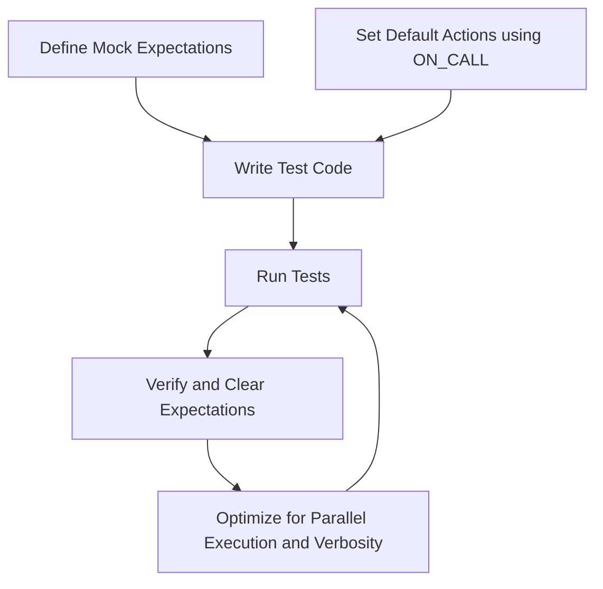

# Performance and Resource Usage Tips

Efficient management of test performance and resource usage is essential to maintain fast, reliable, and scalable test suites. This guide covers effective strategies for writing performant tests using GoogleTest and GoogleMock, optimizing mock lifecycles, running tests in parallel safely, and troubleshooting common performance pitfalls.

---

## 1. Writing Efficient Expectations and Mocks

### Craft Clear, Minimal Expectations

Avoid over-specifying mock expectations. Setting too many constraints or complex expectations can slow down tests unnecessarily and make them brittle. Instead:

- Use `ON_CALL()` to define default mock behaviors without enforcing call counts.
- Use `EXPECT_CALL()` only where you need to verify specific interactions.
- Avoid excessive or redundant `.Times()` clauses; prefer the inferred cardinality when possible.

### Use Nice, Naggy, or Strict Mocks Appropriately

- **NiceMock** suppresses warnings on uninteresting calls and reduces output noise.
- **NaggyMock** (default) warns on uninteresting calls.
- **StrictMock** treats uninteresting calls as failures, which may slow tests due to additional checks.

Choose the appropriate strictness to balance test reliability and performance.

### Delegate to Real or Fake Objects When Appropriate

Complex mocks with elaborate behaviors can slow down tests. In such cases, consider:

- Using a fake implementation for default behaviors.
- Delegating calls to a real object to preserve realistic performance.
- Writing simpler mocks focused on interaction verification rather than full behavior.

```cpp
class MockFoo : public Foo {
 public:
  MOCK_METHOD(int, DoWork, (), (override));

  void DelegateToReal() {
    ON_CALL(*this, DoWork).WillByDefault([this]() {
      return real_.DoWork();
    });
  }
 private:
  Foo real_;
};
```

### Avoid Mocking Non-Virtual Methods Unless Necessary

Mocking non-virtual methods requires special techniques and can add overhead. Prefer virtual methods or interface-based design.

---

## 2. Optimizing Test Execution

### Compile-Time Optimization

- Move mock class constructors and destructors to `.cc` files to avoid heavy recompilation from headers.
- Use the new `MOCK_METHOD` macros over legacy `MOCK_METHODn` to benefit from improvements.

### Parallel Test Execution

GoogleTest supports running tests in parallel safely, but:

- Do not modify mock expectations concurrently from multiple threads; set expectations before concurrent execution.
- Use thread-safe actions and synchronizations if your tests involve multiple threads calling mocks.

### Use Sequences and Retiring Expectations Judiciously

- Using sequences to define call order helps reduce ambiguous matches and improves verification speed.
- Employ `.RetiresOnSaturation()` on edges of sequences to retire expectations early, improving matching performance by keeping expectations active only as long as necessary.

```cpp
Sequence s;
EXPECT_CALL(foo, Bar(1)).InSequence(s);
EXPECT_CALL(foo, Bar(2)).InSequence(s).RetiresOnSaturation();
```

### Simplify Matchers and Actions

- Simple matchers (like `_` or `Eq()`) are faster than complex predicate matchers.
- Avoid expensive computations or side effects in matchers and actions.
- Cache complex matchers or share matcher instances if reused frequently.

---

## 3. Managing Mock Lifecycle for Resource Efficiency

### Use `Mock::AllowLeak()` When Appropriate

If a mock is intentionally leaked (e.g., owned by production code), mark it with `Mock::AllowLeak()` to avoid unnecessary leak checks that can slow test teardown.

### Explicitly Verify and Clear Expectations

Call `Mock::VerifyAndClearExpectations(&mock_obj)` or `Mock::VerifyAndClear(&mock_obj)` early if needed to keep test resource usage tight and reduce heap contention.

### Avoid Large or Excessively Complex Mock Classes

- Break large mock classes into focused components.
- Overly large mocks increase compilation time and runtime overhead.

---

## 4. Parallelism and Platform Considerations

### CI Environment Adaptations

- Ensure tests and mocks behave consistently across OS, compiler, and platform differences.
- Use GoogleTest flags such as `--gtest_parallel` or build system parallelism options to distribute test workloads safely.

### Controlling Verbosity for Performance

- Reduce logging verbosity (`--gmock_verbose=error`) for high-volume test runs to reduce I/O overhead.
- Use `--gtest_stack_trace_depth=0` to limit stack trace printing on failures if performance is critical.

<Tip>
Excessive logging or verbosity substantially increases test run duration, especially in large test suites or CI systems.
</Tip>

---

## 5. Troubleshooting Common Performance Issues

### Slow Compilation of Mock Classes

- Move mock class constructor and destructor definitions out of headers.
- Avoid excessive template or macro complexity.

### Unexpected High Memory Use

- Avoid `/clr` flag in MSVC if using native mocks, as it inflates memory.
- Limit large action or matcher state sharing unless carefully controlled.

### Slow Test Runs Due to Verbose Warnings

- Use `NiceMock` to suppress uninteresting call warnings.
- Control verbosity with `--gmock_verbose` flag.

### Excessive Lock Contention in Multithreaded Mocks

- GoogleMock serializes mock calls internally; avoid concurrent calls that cause contention.
- Use synchronization in actions to control parallelism if needed.

---

## 6. Summary Diagram



---

## 7. Additional Tips

- Regularly profile your test suite to identify performance bottlenecks.
- Prefer simple, stateless matchers and actions.
- Use GoogleMock's `--gmock_verbose=info` selectively for diagnostics; revert to less verbose levels to improve speed.

---

## References and Related Documentation

- [gMock Cookbook](gmock_cook_book.md): Advanced mocking patterns and performance tips.
- [gMock Cheat Sheet](gmock_cheat_sheet.md): Quick syntax reference for mocks and expectations.
- [Mocking Reference](mocking.md): Detailed API reference including mocking macros and behavior modifiers.
- [gMock for Dummies](gmock_for_dummies.md): Beginner-friendly introduction that includes testing best practices.
- [Build and Running Tests Guide](getting-started/first-test-run-validation/building-and-running-tests.mdx): Best practices for test execution and environment setup.

----