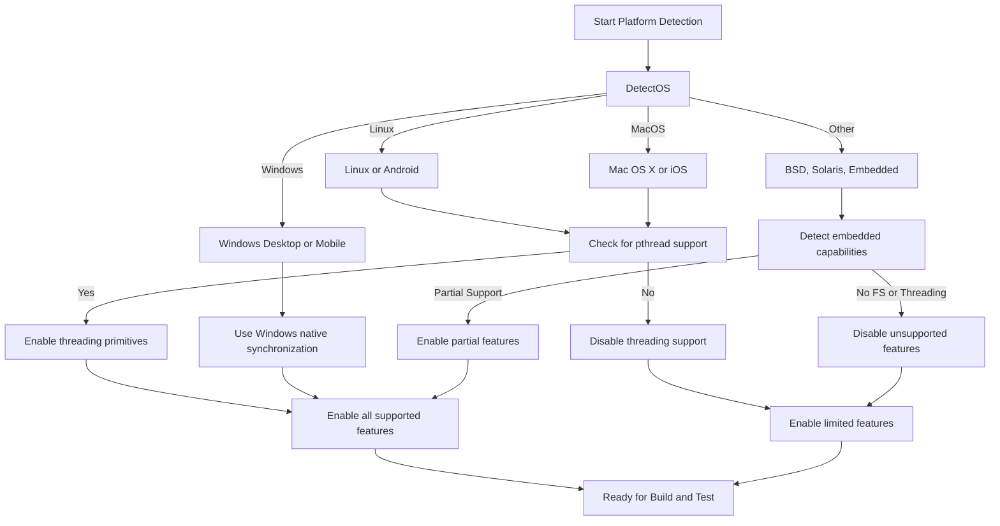

# Platform-Specific Questions

This FAQ addresses common issues, questions, and troubleshooting tips related to running GoogleTest and GoogleMock on various operating systems, compiler platforms, and environments. It helps you resolve platform-specific test failures, unsupported features, and compatibility concerns to achieve a smooth testing experience.

---

## 1. Supported Operating Systems and Platforms

GoogleTest supports a broad range of platforms following Google's [Foundational C++ Support Policy](https://opensource.google/documentation/policies/cplusplus-support), including Linux, Windows (Desktop, MinGW, Mobile), and macOS. The platform detection is automatic but can be customized via macros if needed.

### Key Platform Macros

- `GTEST_OS_LINUX` (and `GTEST_OS_LINUX_ANDROID`)
- `GTEST_OS_WINDOWS` (desktop, MinGW, Mobile variants)
- `GTEST_OS_MAC` (including `GTEST_OS_IOS`)
- Other Unix-like systems like FreeBSD, Solaris, etc.

These macros are automatically defined by the framework to indicate the platform being built on. Code can leverage these to handle platform-specific behavior.

For the full list and details, see the platform detection macros in [gtest-port-arch.h](https://github.com/google/googletest/blob/main/googletest/include/gtest/internal/gtest-port-arch.h).

---

## 2. Compiler and Language Requirements

GoogleTest requires a compiler supporting **C++17 or higher.** Older C++ standards are not supported and will cause build errors.

### Supported Compiler Families

- GCC (G++), version 7.0 or later recommended
- Clang/LLVM with C++17 support
- MSVC 2017 Update 3 (version 19.11) or later

### Enforcing C++17

Use your build system or compiler flags to explicitly set the standard, e.g., with CMake:

```cmake
set(CMAKE_CXX_STANDARD 17)
set(CMAKE_CXX_STANDARD_REQUIRED ON)
```

---

## 3. Threading Support and Synchronization

GoogleTest automatically detects support for pthreads and threading primitives based on your platform and environment.

- `GTEST_HAS_PTHREAD` is defined to 1 where POSIX threads are supported (Linux, macOS, most UNIXes).
- Windows uses its native threading and synchronization APIs.
- Thread safety and mutexes are implemented accordingly.

If the detection is incorrect, you can manually override this by defining `-DGTEST_HAS_PTHREAD=1` or `=0` in your compiler flags.

### Common Pitfalls

- On some Windows MinGW environments, pthread support may be inconsistent; GoogleTest defaults to native Windows synchronization.
- Embedded platforms or constrained environments often do not support threading, which disables thread safety.

See full threading implementation in [gtest-port.h](https://github.com/google/googletest/blob/main/googletest/include/gtest/internal/gtest-port.h).

---

## 4. Platform-Specific Limitations and Features

### Stream Redirection

On platforms without file systems or standard stream redirection capabilities (e.g., Windows Mobile, ESP8266, QURT), `GTEST_HAS_STREAM_REDIRECTION` is disabled. This can cause issues with capturing stdout/stderr during tests.

### Death Tests

Death tests require file system support and are disabled on platforms without it. The macro `GTEST_HAS_DEATH_TEST` indicates availability and depends on platform and file system presence.

### RTTI (Run-Time Type Information)

GoogleTest detects whether RTTI is enabled (important for some type-based features). Compilers without RTTI require disabling related tests or functionality.

Override via `-DGTEST_HAS_RTTI=0` if needed.

---

## 5. Common Platform-Specific Failures and Solutions

### Test Failures on Specific Platforms

- **Linux vs Windows Line Endings**: Be mindful of text differences affecting expected strings.
- **Threading Race Conditions**: Tests relying on concurrency may behave differently on platforms without full pthread support.
- **Missing Symbols in Linking**: Follow platform-specific build instructions to ensure flags like pthread linkage are set.

### Unsupported Features Errors

- If you encounter errors about disabled features (like death tests or stream redirection), verify platform macros and ensure your target platform supports those.

- On embedded platforms, many desktop features may be unavailable.

---

## 6. Configuring Platform-Specific Behavior

GoogleTest allows tuning through **build macros** and **custom header injections**:

- Use macros like `GTEST_HAS_PTHREAD`, `GTEST_HAS_DEATH_TEST`, and similar to force-enable or disable features depending on your environment.

- Custom code can be placed in `custom/gtest-port.h` to override or patch platform-specific behaviors (e.g., disabling pthread-related code).

- See [Customization Points](https://github.com/google/googletest/blob/main/googlemock/include/gmock/internal/custom/README.md) for guidance on defining custom configurations.

---

## 7. Troubleshooting Build and Runtime on Different Platforms

### Build Issues

- Ensure your compiler supports C++17 and that appropriate flags are set.
- On Linux/macOS, add `-lpthread` to linker flags if not automatically linked.
- On Windows, verify correct runtime library linkage, especially when mixing static and dynamic CRTs.

### Runtime Issues

- Missing or empty test runs often indicate build or linkage errors.
- Use verbose test runs to identify platform-specific runtime errors:

```bash
test_binary --gtest_break_on_failure --gtest_verbose=info
```

- For stream capture failures, verify stream redirection support on your platform.

---

## 8. Reference Diagram: Platform Support Flow



This flow illustrates GoogleTest's decision process detecting platform capabilities to adjust feature availability.

---

## 9. Getting More Help

If you continue to encounter platform-specific problems:

- Review the [Supported Platforms & Dependencies](https://github.com/google/googletest/blob/main/docs/platforms.md) documentation.
- Consult the [Build System & IDE Integration FAQ](https://github.com/google/googletest/blob/main/faq/integration-and-environment-faq/build-integration.mdx) for detailed setup instructions.
- Reach out via mailing lists or community forums referenced in the main documentation.

---

## Related Documentation

- [Supported Platforms & Dependencies](https://github.com/google/googletest/blob/main/overview/integration-and-ecosystem/platforms-dependencies.mdx)
- [Customization Points for Platform Builds](https://github.com/google/googletest/blob/main/googlemock/include/gmock/internal/custom/README.md)
- [Build System & IDE Integration FAQ](https://github.com/google/googletest/blob/main/faq/integration-and-environment-faq/build-integration.mdx)
- [Installation and Compatibility FAQ](https://github.com/google/googletest/blob/main/faq/getting-started-faq/installation-compatibility.mdx)

---

For a robust, smooth integration of GoogleTest and GoogleMock across platforms, always start by verifying platform macros, compiler and threading support, and build configuration files specific to your environment.


