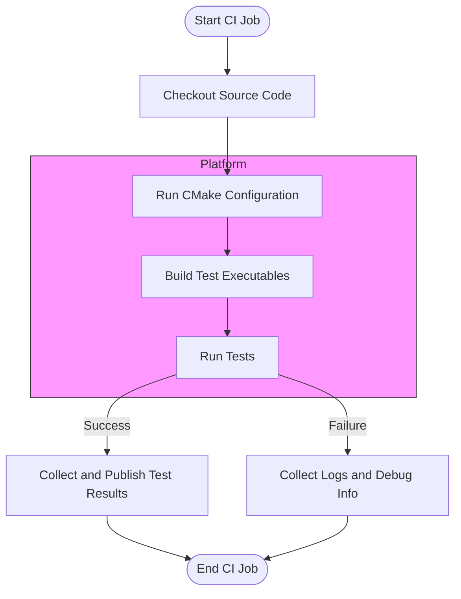

# CI and Platform Integration Issues

This page addresses frequently asked questions and common issues users encounter when integrating GoogleTest into Continuous Integration (CI) environments and across different operating systems and platforms. It focuses on platform-specific quirks, configuration details, and common stumbling blocks related to build setup and execution.

---

## 1. General Integration Questions

### What are the key considerations when adding GoogleTest to a CI pipeline?

- **Compatibility:** Ensure your build environment (OS, compiler version) meets GoogleTest's minimum system requirements (usually C++17 compatible compiler).
- **Dependency Installation:** GoogleTest and GoogleMock can be included via source, submodules, or package managers; your CI scripts must handle this consistently.
- **Build & Test Steps:** Typically involve running CMake or Bazel build commands, followed by running the test executable with suitable flags.
- **Parallel Execution:** Utilize test sharding and parallel test execution features for speed.

### How do I avoid flaky tests when running on CI?

- Use mock objects (GoogleMock) to isolate external dependencies.
- Fix any timing or threading issues in tests detected under CI.
- Run tests with controlled random seeds.
- Increase verbosity (`--gmock_verbose=info`) for diagnosing intermittent failures.

---

## 2. Platform-Specific Issues

### Supported Operating Systems and Compilers

GoogleTest supports major OSes including Linux, macOS, and Windows with Visual Studio. It requires:

- A C++17-compatible compiler.
- Support for threading and filesystem features.

Ensure your platform's compiler and standard libraries meet these requirements to avoid build or runtime failures.

### Common Platform Pitfalls

- **Windows:**
  - Use Visual Studio 2017 or newer for full compatibility.
  - Beware of threading model differences; configure CMake accordingly.
  - When using CMake, avoid building GoogleTest and your code in the same binary directory.

- **Linux/macOS:**
  - Ensure `pthread` support is enabled; CMake will detect and link automatically.
  - On MinGW or Cygwin, compile options may require `-Wa,-mbig-obj` for large object files.

### Cross-Compiling or Embedded Platforms

GoogleTest can be built on embedded or special-purpose platforms, but some features (e.g., filesystem support, stack traces) may be limited or disabled.

---

## 3. Configuration Files and Build System Tips

### Using CMake

- Ensure minimum required CMake version is 3.13 or above.
- Use the provided GoogleMock `CMakeLists.txt` to add GoogleTest and GoogleMock to your build.
- To enable tests, turn on the `gmock_build_tests` option (off by default) with `-Dgmock_build_tests=ON`.
- When installing, CMake generates `.pc` pkg-config files for `gmock` and `gmock_main` to assist in linking.
- Avoid mixing shared and static libraries unless intentional; control with `BUILD_SHARED_LIBS`.

### Using Bazel

- GoogleTest is natively supported by Bazel.
- Use Bazel targets `@com_google_googletest//:gtest` and `@com_google_googletest//:gmock`.
- Refer to Bazel integration guides for details.

### Integration With Other Build Systems

- GoogleTest offers straightforward integration with other systems (e.g., Make) by including source files and headers.
- Always link against `gtest` and `pthread` libraries as needed.

---

## 4. Troubleshooting Common Issues in CI and Platform Integration

<AccordionGroup title="Common Issues and Their Solutions">
<Accordion title="Build Failures Due to Missing Dependencies">
- **Problem:** Build fails due to missing pthread or c++ standard library support.
- **Solution:** Verify that your environment supports `pthread` and C++17. Select the proper compiler and libraries. Configure CMake to find pthread (`find_package(Threads REQUIRED)`).
</Accordion>
<Accordion title="Test Executables Not Running or Crashing">
- **Problem:** Test binary crashes immediately or fails with linking or runtime errors.
- **Solution:** Check for mismatched runtime libraries, especially on Windows. Ensure that all dependencies are correctly linked. Run tests manually in the CI environment to verify the runtime.
</Accordion>
<Accordion title="Tests Are Not Discovered or Executed in CI">
- **Problem:** CI runs test executables but reports no tests run.
- **Solution:** Verify that `InitGoogleMock(&argc, argv)` is called in your main. Use the `--gtest_list_tests` option locally to list tests.
- Check that the test executable is built with appropriate entry points.
</Accordion>
<Accordion title="Unhandled Platform-Specific Failures">
- **Problem:** Tests pass locally but fail in CI on particular platforms.
- **Solution:** Use `--gmock_verbose=info` to enable detailed logging.
- Look for platform-specific assumptions in your tests (paths, case sensitivity).
- Look for timing or concurrency issues more sensitive on CI.
</Accordion>
</AccordionGroup>

---

## 5. Best Practices for Smooth CI and Platform Integration

- **Use Standard Build Methods:** Prefer CMake or Bazel with supplied GoogleTest build scripts.
- **Separate Test and Build Artifacts:** Don't mix source, build, and install directories to avoid conflicts.
- **Explicitly Specify Compiler and Flags:** Ensure consistent environments across CI nodes.
- **Control Test Verbosity:** Use `--gtest_break_on_failure`, `--gmock_verbose` for detailed debugging.
- **Use Mocking to Isolate Dependencies:** This reduces flaky test failures related to external resources.
- **Use Test Filtering in CI:** Control which tests run per CI job to speed up runs.

---

## 6. Additional Resources

- [System Requirements & Supported Platforms](https://github.com/google/googletest/blob/main/getting-started/setup-prerequisites-installation/system-requirements-supported-platforms.md)
- [Installation and Setup Guide](https://github.com/google/googletest/blob/main/guides/getting-started/installation-setup.md)
- [Integrating with Build Systems](https://github.com/google/googletest/blob/main/overview/integration-and-getting-started/integration-with-build-systems-and-tools.md)
- [Troubleshooting & Quick Validation](https://github.com/google/googletest/blob/main/getting-started/configuration-and-validation/troubleshooting-validation.md)

---

For detailed debugging information, increase verbosity by passing the flag `--gmock_verbose=info` when running your tests, which will print detailed call traces and help diagnose integration faults.

---

<Note>
If you require bespoke platform support or face integration challenges that aren’t documented here, please consult the community forums or file an issue in the [GoogleTest GitHub repository](https://github.com/google/googletest/issues).
</Note>

---

### Diagram: Continuous Integration Test Flow

