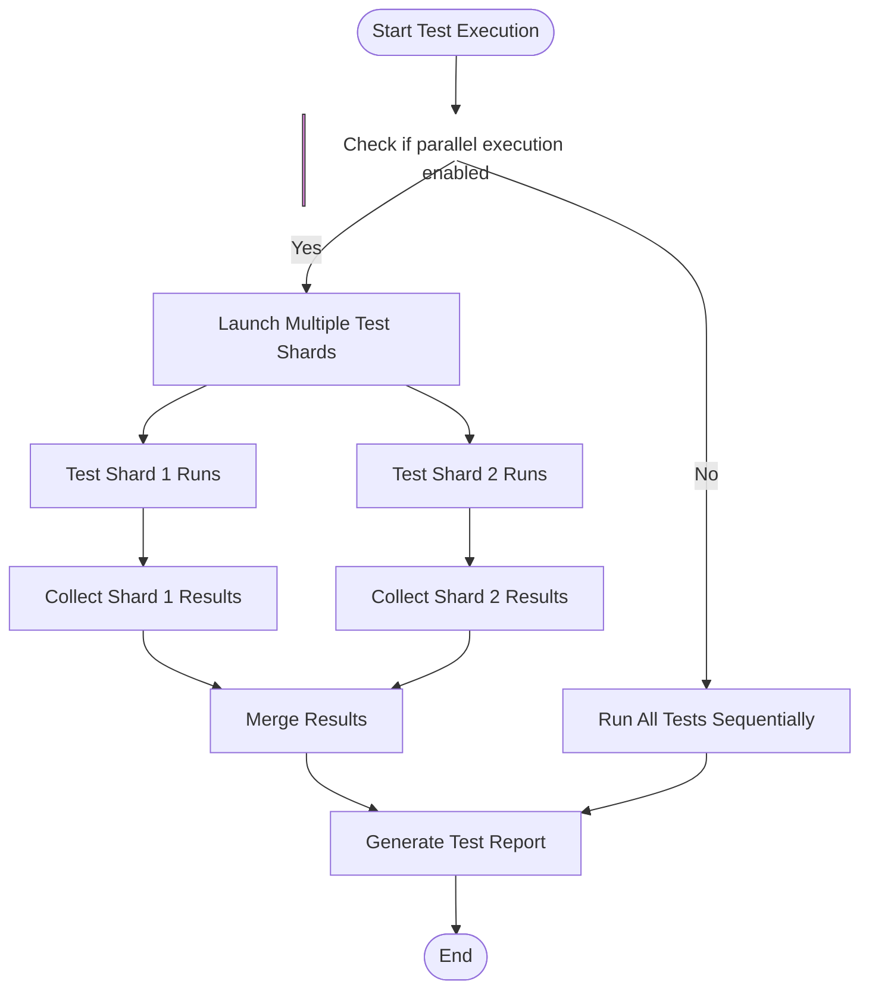

# Optimizing Test Performance

This guide provides comprehensive strategies to help you speed up test execution, efficiently manage large test suites, and identify bottlenecks within your tests when using GoogleTest and GoogleMock. It covers parallelization options, best practices for writing efficient assertions and mocks, and practical advice to maximize the performance and reliability of your test runs.

---

## 1. Improving Test Execution Speed

Writing fast and efficient tests is critical to maintain a productive development and continuous integration workflow. Consider these approaches:

### a) Parallel Test Execution (Sharding)
- **What it is:** Running multiple test shards in parallel across available CPU cores or machines.
- **How it helps:** Reduces overall test execution time by distributing the workload.
- **How to use:** Leverage test runners or CI platforms that support sharding; GoogleTest's `--gtest_shard_index` and `--gtest_total_shards` flags enable test suite splitting.

### b) Minimize Fixture Overhead
- Use **`SetUpTestSuite` / `TearDownTestSuite`** (static setup/teardown) instead of per-test `SetUp()`/`TearDown()` when possible to reduce repeated setup costs.
- Reuse expensive resources (databases, network connections) across tests carefully.

### c) Efficient Test Design
- Avoid redundant or overly expansive test cases.
- Use **parameterized tests** to consolidate similar tests.
- Design tests to isolate and run quickly rather than bulky end-to-end tests where possible.

### d) Control Logging and Verbosity
- High verbosity and extensive logging slow tests down.
- Use the `--gmock_verbose` flag to reduce output (e.g., `error` level outputs only serious errors).
- Mute excessive mock warnings by using `NiceMock` strategically.

---

## 2. Managing Large Test Suites

Large projects can face challenges when test suites grow unwieldy.

### a) Breaking Tests into Smaller Suites
- Organize tests logically into smaller test suites and test binaries.
- Enables selective execution and faster feedback loops.

### b) Use of Test Filters and Test Suites
- Apply `--gtest_filter` to run subsets of tests relevant to current changes.

### c) Avoid Over-Mocking
- Excessive mocking may slow down tests due to overhead.
- Use mocks judiciously; rely on fakes or stubs when appropriate.

---

## 3. Identifying Test Bottlenecks

### a) Enable Verbose Output for Diagnostics
- Run tests with `--gmock_verbose=info` to get detailed tracing of mock calls.
- Use this information to identify unexpectedly frequent or expensive mock interactions.

### b) Profiling and Timing
- Instrument your tests or use external profilers to measure execution times.
- Focus on slow tests or repeated expensive setup.

### c) Mock Call Analysis
- Look for **uninteresting calls** and **unexpected calls** in mock logs.
- Unexpected calls may indicate missing expectations leading to wasted mock effort.
- Optimize matcher complexity; avoid overly broad or costly matchers.

---

## 4. Parallelization Options

Parallelization is a primary means of improving test throughput.

### a) Test Binary Parallelism
- Run multiple test binaries concurrently if tests are split accordingly.

### b) In-Binary Parallelization
- Use GoogleTest's sharding flags:
  - `--gtest_total_shards=N`: Tells GoogleTest how many shards to divide tests into.
  - `--gtest_shard_index=M`: Selects which shard (0-based) to run.

### c) Distributed Test Execution
- Integrate with CI platforms that support distributed test execution.

### d) Parallel Mock Interactions
- GoogleMock is thread-safe for mock function calls.
- Avoid setting expectations or modifying mock state concurrently from multiple threads.

---

## 5. Best Practices for Efficient Assertions and Mocks

### a) Use Lightweight Matchers
- Prefer simple matchers like `_`, `Eq()`, or `Ge()` over complex custom matchers.
- Complex predicates or lambdas can slow test execution.

### b) Limit Expectation Scope
- Only set `EXPECT_CALL`s where verification is needed.
- Use `ON_CALL` for default behaviors without rigid expectations to reduce overhead.

### c) Avoid Over-Specification
- Don't over-constrain expectations, especially on argument matchers or call counts.
- Too many `EXPECT_CALL`s increase matching complexity and test brittleness.

### d) Use `NiceMock` and `StrictMock` Judiciously
- Use `NiceMock` to suppress warnings about uninteresting calls when they are acceptable.
- Use `StrictMock` only when you want to fail tests on unexpected mock calls.

### e) Delegate to Fakes When Possible
- If mock behavior involves complex internal logic, consider delegating to fake implementations.
- Use the `DelegateToFake()` pattern from the gMock Cookbook to combine fake and mock behaviors.

### f) Efficient Setup and Teardown
- Move shared mock setup into test fixtures.
- Clear expectations and reset mocks between tests with `Mock::VerifyAndClear()` to avoid leaks and stale states.

---

## 6. Troubleshooting Common Performance Issues

### Identifying Leaked Mocks
- Leaked mocks delay verification and cause warnings.
- Use `testing::Mock::AllowLeak(mock_object)` if intentional, but generally avoid leaks.

### Excessive Actions or Calls
- Mismatched call counts can cause excessive or missing actions, leading to slowdowns or failures.
- Review `EXPECT_CALL` counts with `.Times()` clauses.

### Unnecessary Verbosity
- Excessive `--gmock_verbose=info` slows tests but useful for diagnosing; dial down verbosity for routine test runs.

### Debugging Slow Tests
- Profile test duration; focus on tests that dominate runtime.
- Split these tests or optimize their mocks and assertions.

---

## 7. Useful Resources and References

- GoogleMock Cookbook: [gmock_cook_book.md](https://google.github.io/googletest/gmock_cook_book.html)
- Mocking Reference: [mocking.md](https://google.github.io/googletest/reference/mocking.html)
- gMock Cheat Sheet: [gmock_cheat_sheet.md](https://google.github.io/googletest/gmock_cheat_sheet.html)
- Understanding Mock Strictness: NiceMock, NaggyMock, StrictMock
- Test Sharding: [GoogleTest Sharding documentation](https://google.github.io/googletest/reference/run_tests.md#sharding)
- Parallel Test Execution: CI platform integration best practices

---

## Appendix: Parallel Test Execution Flow

This illustrates core test parallelism with sharding support to split and coordinate test execution.

---