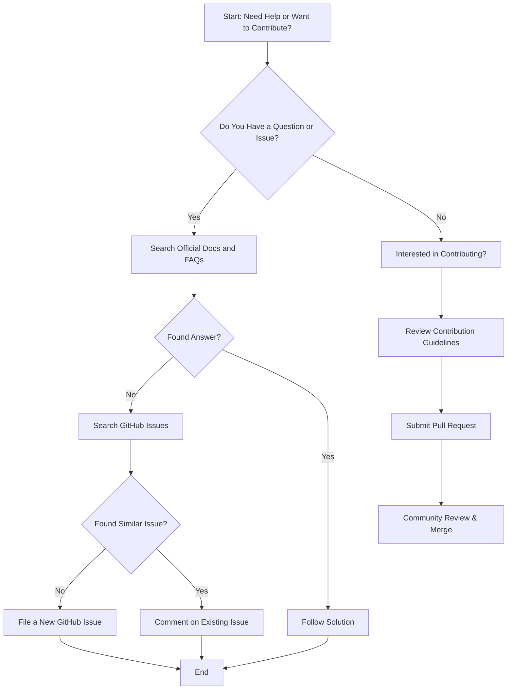

# Where Can I Get Help or Contribute to GoogleTest/GoogleMock?

This page guides you on how to access GoogleTest and GoogleMock documentation resources, get assistance, report issues, and participate in the contributor community. It connects you directly with user guides, GitHub issue tracking, and the rich ecosystem of extensions around the projects.

---

## 1. Accessing Official Documentation

### User Guides and Tutorials
Start by exploring comprehensive guides that cover from basic usage to advanced mocking techniques:

- **gMock for Dummies**: A beginner-friendly tutorial that introduces the core concepts and shows simple mock creation and usage. [gMock for Dummies](https://google.github.io/googletest/gmock_for_dummies.html)
- **gMock Cookbook**: Contains detailed recipes and patterns for creating mocks, setting expectations, writing actions, and more. [gMock Cookbook](https://google.github.io/googletest/gmock_cook_book.html)
- **GoogleMock README**: Official overview and foundational introduction to GoogleMock. Available in the GitHub repository.

### API References
For exact syntax and comprehensive API details, check:

- **Mocking Reference**: Details on macros like `MOCK_METHOD`, `EXPECT_CALL`, matchers, cardinalities, and expectations.
- **Matchers Reference**: Built-in and custom matcher usage for argument validation.
- **Actions and Stubbing Reference**: How to define default actions and customize mock behavior.

### FAQ Sections
Review the FAQs for common problems and advanced tips:

- Troubleshooting mock behavior and expectations.
- Installation and basic configuration help.

---

## 2. Filing Issues and Reporting Bugs

GoogleTest and GoogleMock are hosted on GitHub. To file issues or contribute bug reports:

- Visit the official repository issue tracker: [https://github.com/google/googletest/issues](https://github.com/google/googletest/issues)
- Before opening an issue, search existing ones for duplicates.
- When reporting, please provide a minimal reproducible example to help maintainers diagnose the problem.

<Check>
Proper issue reporting accelerates fixes and helps improve the project for everyone.
</Check>

---

## 3. Getting Involved with the Contributor Community

GoogleTest and GoogleMock welcome external contributions, whether fixing bugs, improving documentation, or adding new features.

### Ways to Contribute
- **Code Contributions:** Fix bugs, implement new mocking features, or optimize existing code.
- **Documentation Improvements:** Enhance guides, examples, and references.
- **Examples and Tutorials:** Share your use cases or custom mocking patterns as community examples.

### Getting Started
- Fork the repository on GitHub.
- Follow contribution guidelines outlined in the repo.
- Engage in discussions via GitHub issues and pull requests.

---

## 4. Ecosystem and Extensions

Explore additional libraries and tools that work with GoogleTest and GoogleMock:

- Third-party matchers and actions.
- Integrations with build systems and IDEs.
- Community-developed extensions for custom testing needs.

For more, refer to the [Integration & Extensibility overview](https://google.github.io/googletest/overview/architecture-core-concepts/integration-overview.html).

---

## 5. Practical Next Steps & Recommendations

### Finding What You Need Quickly
- Use the table of contents or search functionality in the official docs.
- Bookmark the gMock Cookbook for recipe-based problem solving.
- Use `--gmock_verbose=info` when running tests to get detailed logs for debugging.

### When Stuck
- Review the FAQ topics related to setup, configuration, and mocking issues.
- Join relevant discussion forums or Stack Overflow tags for community support.
- Open an issue on GitHub with a clear description.

---

## 6. Additional Resources

- **GoogleTest GitHub Repository**: [https://github.com/google/googletest](https://github.com/google/googletest)
- **gMock Cheat Sheet**: Quick syntax reminders and examples
- **GoogleTest Primer**: For foundational C++ testing methodology

---

## Summary
Getting help for GoogleTest and GoogleMock is straightforward through official user guides, comprehensive API references, and detailed FAQs. For bugs or feature requests, use the GitHub issues page, and to contribute improvements, engage with the community on GitHub. Many additional learning resources and integrations are available in the ecosystem to support your testing journey.

<Callout title="Tip">
Always ensure you check existing documentation and issues before asking for help or filing bugs to speed up resolution.
</Callout>

---

### Example GitHub Links
- [GoogleTest GitHub Main Repository](https://github.com/google/googletest)
- [GoogleTest Issue Tracker](https://github.com/google/googletest/issues)

---

### Illustrative Workflow for Getting Help

---

For more information, explore related documentation sections:

- [Getting Started & Installation](https://google.github.io/googletest/getting-started/)
- [Mocking Basics](https://google.github.io/googletest/gmock_for_dummies.html)
- [Configuring Actions & Expectations](https://google.github.io/googletest/guides/mocking-and-advanced-techniques/actions-and-expectations.html)
- [Troubleshooting Mocking Issues](https://google.github.io/googletest/faq/troubleshooting-and-best-practices/mocking-issues.html)

 

---

<Info>
For personalized assistance, consider joining developer forums and communities such as GitHub Discussions or Stack Overflow with the `googletest` or `googlemock` tags.
</Info>
