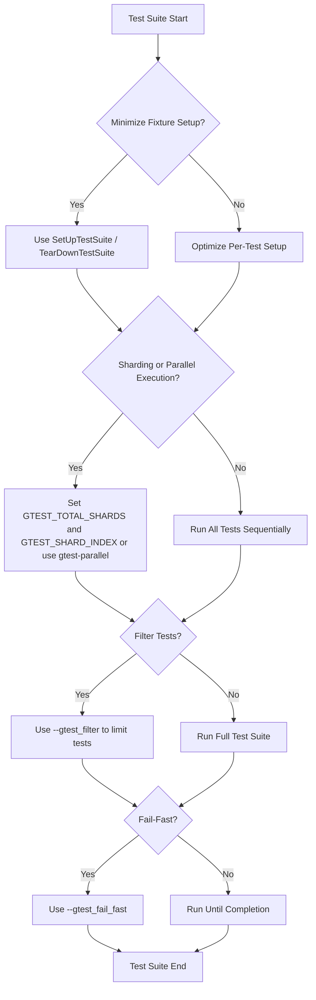

# How can I speed up my test suite?

Improving the performance of your test suite is essential to maintain rapid development cycles, minimize wait times, and efficiently use resources during local development and continuous integration (CI). This guide presents best practices and techniques to accelerate your GoogleTest-based test suites while preserving correctness, reliability, and maintainability.

---

## 1. Minimize Per-Test Fixture Overhead

Every `TEST_F()` or `TEST_P()` test creates a fresh test fixture object, invoking its constructor and `SetUp()`/`TearDown()` methods. When fixtures allocate expensive resources or perform slow initialization, per-test overhead increases dramatically.

### Strategies

- **Use Shared Resources Within a Test Suite:**
  Define expensive shared objects as static members of your fixture class and initialize them once in `SetUpTestSuite()` and clean up in `TearDownTestSuite()`. This way, the costly setup only occurs once per test suite.

```c++
class FooTest : public ::testing::Test {
 protected:
  static void SetUpTestSuite() {
    shared_database_connection_ = new DatabaseConnection("localhost");
  }
  static void TearDownTestSuite() {
    delete shared_database_connection_;
    shared_database_connection_ = nullptr;
  }

  static DatabaseConnection* shared_database_connection_;
};

DatabaseConnection* FooTest::shared_database_connection_ = nullptr;
```

- **Avoid Heavy Work in Fixture Constructors:**
  Prefer placing expensive setup and teardown logic in `SetUp()` and `TearDown()` instead of constructors and destructors, ensuring better control.

- **Reuse Immutable Resources:**
  If your fixture uses immutable or idempotent resources, caching or sharing them greatly reduces overhead.

### Pitfalls to Avoid

- Don’t modify shared resources in individual tests without restoring state, as tests must remain independent.
- Ensure your shared setup and teardown are exception-safe to prevent leaks.

---

## 2. Use Test Sharding and Parallel Execution

Large test suites can be split and run in parallel to leverage multiple CPU cores or machines.

### Local Parallelism with gtest-parallel

[gtest-parallel](https://github.com/google/gtest-parallel) is an external Python script that runs your GoogleTest binaries’ tests concurrently across multiple processes. It schedules tests to maximize CPU utilization without relying on internal GoogleTest parallelization.

Benefits:
- Runs test binaries in parallel to speed up test runs on multi-core machines.
- Supports running tests with sharding and limits resource contention.

Usage example:

```shell
python3 gtest-parallel --jobs 8 ./my_test_binary
```

This will run tests using up to 8 parallel jobs.

### Test Sharding Across Machines or Processes

If your CI or infrastructure permits, distribute tests to multiple runners across machines (shards) using GoogleTest’s built-in sharding support.

Set environment variables:
- `GTEST_TOTAL_SHARDS` — total number of shards.
- `GTEST_SHARD_INDEX` — the current shard’s index (0-based).

Example for 3 shards:

```shell
GTEST_TOTAL_SHARDS=3 GTEST_SHARD_INDEX=0 ./my_test_binary
GTEST_TOTAL_SHARDS=3 GTEST_SHARD_INDEX=1 ./my_test_binary
GTEST_TOTAL_SHARDS=3 GTEST_SHARD_INDEX=2 ./my_test_binary
```

Each shard runs a non-overlapping subset of tests, collectively covering the entire suite.

### Important Considerations

- Ensure tests are independent and free of shared global state for safe parallel execution.
- Test order is not guaranteed; design fixtures and resources accordingly.
- Use sharding carefully to balance load and reduce bottlenecks in CI.

---

## 3. Filter and Select Tests with `--gtest_filter`

Running the full test suite may be unnecessary during development. Limit test execution to relevant subsets using the `--gtest_filter` flag.

Syntax:

```
--gtest_filter=PositivePatterns[-NegativePatterns]
```

Example: Run only tests beginning with `WidgetTest.`

```shell
./my_test_binary --gtest_filter=WidgetTest.*
```

Combining patterns:

```shell
./my_test_binary --gtest_filter=*Null*:*Constructor*  # Run tests matching "Null" or "Constructor"
```

Exclude tests:

```shell
./my_test_binary --gtest_filter=-*FlakyTest*  # Run all tests except those with "FlakyTest"
```

Filtering can improve iteration time by skipping unnecessary work.

---

## 4. Disable Disabled or Flaky Tests Temporarily

Prefix tests or test suites with `DISABLED_` to prevent them from running while keeping them compiled:

```c++
TEST(DISABLED_FooTest, DoesAbc) {
  ...
}
```

Temporarily removing flaky tests reduces test suite noise and speeds up runs. Remember to fix them later.

---

## 5. Use Fast-Fail Strategies

If you want faster feedback during development, stop test execution on the first failure by enabling the fail-fast mode.

Use the command line flag:

```shell
--gtest_fail_fast
```

or set environment variable:

```shell
GTEST_FAIL_FAST=1
```

This minimizes wasted time by avoiding subsequent test runs once failure is detected.

---

## 6. Optimize Test Code and Assertions

- **Avoid Expensive Computations in Tests:** Cache expensive results or mock them.
- **Prefer `EXPECT_*` to `ASSERT_*` When Safe:** Nonfatal failures let tests run longer, revealing more bugs per run, but if performance is critical and failures are likely, use `ASSERT_*`.
- **Use Predicate Assertions and Custom Matchers Wisely:** They can provide better diagnostics without extra overhead.

---

## 7. Reduce Test Binary Size and Dependencies

Reducing external dependencies and compile times can speed up overall test execution.

- Modularize test code.
- Limit large static data initialization.
- Split very large test binaries into smaller ones run separately or in parallel.

---

## 8. Use GoogleTest’s Built-in Repetition and Shuffling Wisely

- Use `--gtest_repeat=<count>` to run tests multiple times to expose flaky tests without re-running the entire suite.
- Use `--gtest_shuffle` to detect order-dependent tests that might cause slowdowns or failures.

Example:

```shell
./my_test_binary --gtest_repeat=100 --gtest_shuffle
```

---

## 9. Global and Per-Test Program Setup/TearDown

Avoid expensive global setup between tests by using GoogleTest’s environment setup (`Environment`) and per-test-suite fixture setup to keep initialization minimal and efficient.

---

## 10. Monitor and Profile Test Execution

Use verbose output flags (`--gtest_print_time`) or custom test event listeners to profile slow tests. Identify bottlenecks and then apply optimization techniques described above.

---

# Summary

By combining these strategies—reducing fixture overhead, running tests in parallel with sharding, filtering to relevant subsets, fail-fast execution, and optimizing individual tests—you can significantly speed up your GoogleTest test suite without sacrificing quality or coverage.

For comprehensive guidance, consider integrating `gtest-parallel` for local execution, and infrastructure-driven test sharding in CI environments.

---

# Additional Resources

- [GoogleTest Primer](primer.md): Learn the basics of writing fast, effective tests.
- [Advanced GoogleTest Topics](advanced.md): Explore test parallelism, parameterized tests, and global fixtures.
- [Getting Started: Building and Running Tests](getting-started/first-test-experience/building-running-tests.md): Best practices for test execution.
- [Test Lifecycle and Registration](concepts/architectural-overview/test-lifecycle-and-registration.md): Understand test independence and fixture usage.
- [FAQ: How can I speed up my test suite?](faq/optimization-and-integration/test-suite-performance.md): Topic overview and community tips.
- [gtest-parallel GitHub Repository](https://github.com/google/gtest-parallel): Tool for parallel test execution.
- [Test Sharding Documentation](advanced.md#running-test-shards): How to distribute tests across compute resources.

---

# Callouts

<Tip>
Start optimizing by identifying slow tests using `--gtest_print_time` and profiling tools before modifying test code or build infrastructure.
</Tip>

<Warning>
Parallel execution requires tests that do not share or corrupt global state. Test isolation is key.
</Warning>

<Info>
Using `DISABLED_` prefix on flaky tests is a temporary solution; schedule fixing them to avoid piling technical debt.
</Info>

---

# Example: Running Tests in Parallel with gtest-parallel

```shell
$ python3 gtest-parallel --jobs 4 ./my_test_binary
[==========] Running 100 tests from 10 test suites.
[ RUN      ] Suite1.TestA
[ RUN      ] Suite2.TestB
[ RUN      ] Suite3.TestC
[ RUN      ] Suite4.TestD
...
```

This uses 4 parallel jobs to execute tests, significantly reducing total runtime on multi-core CPUs.

---

# Summary Diagram of Test Speedup Approaches



This outlines an approach going from fixture optimization, through parallel/sharded execution, to filtering and fail-fast options.
