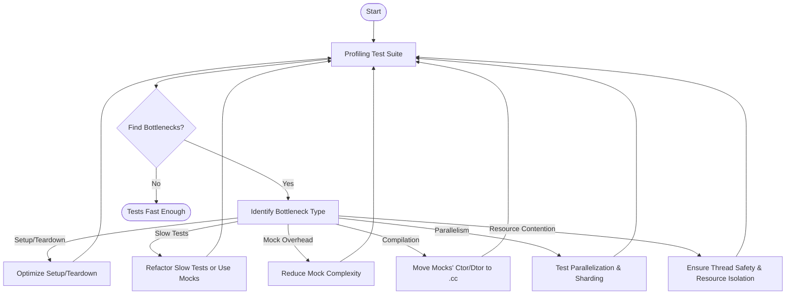

# Test Performance & Scalability Tips

Optimizing the performance and scalability of your test suite is vital for maintaining fast feedback loops and developer productivity, especially as your C++ codebase and tests grow in size and complexity. This document shares practical advice to make your GoogleTest and GoogleMock test runs faster while efficiently managing resources and scaling your testing infrastructure for large projects.

---

## 1. Understanding Performance Bottlenecks

Before optimizing, identify where your test suite spends most of its time:

- **Test Initialization and Teardown**: Expensive setup/cleanup code can dramatically affect runtime.
- **Slow Tests or Expensive Dependencies**: Tests using external resources like databases or the network tend to slow down the entire suite.
- **Excessive Mocking Overhead**: Large mocks with many mock methods may increase compile time and runtime overhead.
- **Test Discovery and Execution Order**: Inefficient test ordering may cause cache misses or resource contention.
- **Parallel Execution Challenges**: Lack of parallelism or inefficient threading can limit throughput.

Use profiling tools, test runtime reports, or specialized monitoring to pinpoint bottlenecks.

---

## 2. Managing Resources and Shared State

Tests that repeatedly setup or tear down heavy resources hurt performance. Apply these best practices:

- **Reuse Resources Across Tests**: Use test fixtures (`TEST_F`) with shared setup and teardown to amortize expensive work.

- **Prefer Lightweight Initialization**: Minimize the setup logic in constructors or `SetUp()` when possible.

- **Avoid Global State Dependencies**: Tests that share mutable global state are slower due to synchronization or flakiness.

- **Use Mocks Effectively to Replace Expensive Dependencies**: Substitute slow system components (databases, networks) with mocks to speed tests and reduce flakiness.

- **Manage Mock Complexity**: Keep mock definitions focused and move heavy constructor/destructor implementations to `.cc` files to reduce compile times.

---

## 3. Parallelizing and Sharding Tests

Leverage concurrency to reduce overall suite runtime:

- **Run Tests in Parallel**: Use the `--gtest_parallel` flag or your build system's test runners to execute independent tests concurrently.

- **Shard Tests Across Machines**: For very large test suites, distribute tests across multiple machines using test sharding or filtering.

- **Avoid Shared-State Contention**: Design tests with thread safety in mind to prevent locking and race conditions when running in parallel.

- **Use Thread-Safe GoogleTest & GoogleMock Features**: Both frameworks internally support multi-threaded use, but ensure your test code respects thread-safety boundaries.

---

## 4. Writing Efficient Tests

Optimize individual tests to reduce cost:

- **Limit Test Scope**: Focus tests on small, independent units rather than large integrated scenarios that are slow.

- **Use Parameterized Tests to Avoid Duplication**: Employ `TEST_P` and `TYPED_TEST` to cover multiple input sets without writing multiple functions.

- **Avoid Excessive Expectations and Mocks**: Overusing `EXPECT_CALL` on mocks adds runtime overhead; set only essential expectations.

- **Use Default Actions (`ON_CALL`) Wisely**: Set default mock method behaviors globally rather than repeatedly in many tests.

- **Retire Saturated Expectations**: Use `.RetiresOnSaturation()` on expectations to let GoogleMock efficiently match method calls and reduce overhead.

- **Minimize Heap Allocation in Tests**: Prefer stack allocation of test fixtures and mocks where feasible.

---

## 5. Reducing Compilation Time for Mock Classes

Compilation time can balloon with large mock classes:

- **Move Constructor and Destructor Out-of-Line**: Define mock class constructors and destructors in separate `.cc` files to limit recompilation.

- **Define Mock Methods in Public Section Only**: Helps keep a consistent class interface and can reduce compiler complexity.

- **Use Type Aliases for Complex Types**: Prevent macro parsing and template instantiation overhead by aliasing types in `MOCK_METHOD`.

---

## 6. Diagnosing and Troubleshooting Performance Issues

If you suspect performance regressions or test slowness:

- **Run with `--gtest_filter`** to isolate slow tests.

- **Use `--gtest_repeat` and `--gtest_shuffle`** to identify flaky tests affecting timing.

- **Enable `--gmock_verbose=info`** for detailed mock call tracing to detect excessive or unexpected mock interactions.

- **Leverage Profiling Tools**: Use external profilers to analyze CPU and memory usage in test runs.

- **Break Down Long-Running Tests**: Consider reducing complexity or splitting slow tests.

---

## 7. Scaling Your Test Infrastructure

For very large projects:

- **Automate Test Distribution and Parallelism**: Integrate with CI systems to shard and parallelize test jobs.

- **Collect and Analyze Test Performance Metrics**: Gather runtime and failure statistics to guide optimization.

- **Cache Test Artifacts and Results**: Use build cache and test result caching to avoid redundant work.

- **Regularly Review and Refactor Tests**: Prevent test suite bloat by removing obsolete or redundant tests.

---

## 8. Additional Tips & Tricks

- **Use Sequences in GoogleMock** to enforce order when it helps make tests predictable and avoids contention.

- **Control Mock Verbosity with `--gmock_verbose`** to reduce overhead due to excessive logging.

- **Leverage Lightweight Mock Types**: Use `NiceMock` or `NaggyMock` smartly to reduce noise and overhead.

- **Batch Multiple Assertions** in tests to reduce setup repetition.

---

## Useful References

- [GoogleTest Primer](https://google.github.io/googletest/primer.html): Learn core testing concepts.
- [Mocking Reference](https://google.github.io/googletest/reference/mocking.html): Detailed API for creating and using mocks.
- [gMock Cookbook](https://google.github.io/googletest/gmock_cook_book.html): Recipes and best practices for mocks.
- [Performance & Scalability Guide](https://google.github.io/googletest/guides/advanced-usage-integration/performance-scaling.html): Advanced optimization techniques.
- [Thread Safety in Tests](https://google.github.io/googletest/gmock_cook_book.html#using-threads): Guidelines for multi-threaded tests.

---

## Summary Diagram of Test Performance Optimization Workflow

---

<Tip>
Regularly profiling and iteratively optimizing your test suite keeps your development fast and efficient. Use GoogleTest's features, mocks judiciously, and your build tooling to maintain scalable test infrastructure.
</Tip>

<Note>
Many performance improvements focus not on the individual test speed alone but on overall developer productivity via fast, reliable, and maintainable tests.
</Note>

<Warning>
Attempting to parallelize tests that share mutable global state without adequate synchronization can cause flaky tests and obscure test failures.
</Warning>
