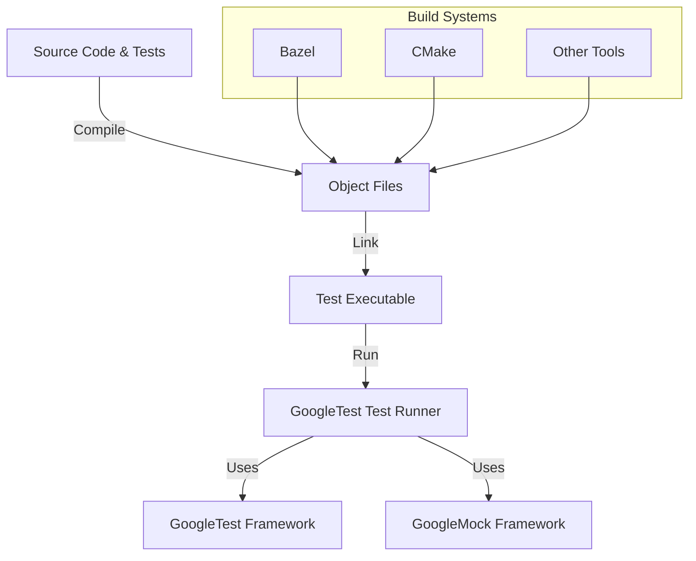

# Integrating with Bazel, CMake, and Other Tools

Integrating GoogleTest and GoogleMock into your build system and development environment can occasionally present challenges related to linking, test discovery, and build tool-specific configurations. This guide addresses the most common issues users face with Bazel, CMake, and other build tools, empowering you to effectively set up, run, and troubleshoot your tests.

---

## Common Issues in Integration

### Linking Errors

When linking test binaries, errors often stem from missing dependencies or incorrect linkage of GoogleTest or GoogleMock libraries.

#### Cause
- Not linking against the GoogleMock library (`gmock`) when using mocks.
- Incorrect or incomplete linkage of dependencies (e.g., missing GoogleTest or pthread).
- Mixing static and shared libraries inconsistently across your build.

#### Solutions
- For Bazel, ensure your `BUILD` files correctly add `@com_google_googletest//:gmock` or `@com_google_googletest//:gtest` as dependencies for your test targets.
- For CMake, use the provided `gtest` and `gmock` targets from the installed package or add the libraries explicitly.
- Verify that pthread (`-lpthread`) or the equivalent threading library is linked since both GoogleTest and GoogleMock depend on it.

##### Bazel Example
```python
cc_test(
    name = "my_test",
    srcs = ["my_test.cc"],
    deps = ["@com_google_googletest//:gmock_main"],  # Includes gtest and gmock
)
```

##### CMake Example
```cmake
find_package(GTest REQUIRED)
find_package(GMock REQUIRED)

add_executable(my_test my_test.cc)

target_link_libraries(my_test GTest::GTest GMock::GMock pthread)
```

### Test Discovery Issues

Sometimes the test runner does not discover your tests.

#### Causes
- Your test files are not included or compiled into the test binary.
- Your test functions are not defined with `TEST` or `TEST_F` macros from GoogleTest.
- The test runner is invoked with filters excluding your tests unintentionally.

#### Solutions
- Confirm test source files are part of the build/test target.
- Ensure you use the GoogleTest macros `TEST()` or `TEST_F()` properly to declare tests.
- Double-check command-line flags and environment variables that affect test filtering.

### Build Tool-Specific Challenges

#### Bazel
- Bazel relies on explicit declarations in `BUILD` files. Ensure you add correct dependencies on `gtest` and `gmock` targets.
- Use `@com_google_googletest//:gmock_main` if you want to link both GoogleTest and GoogleMock and makes test setup easier.
- Verify that the external GoogleTest workspace is properly declared (e.g., in your `WORKSPACE` file).

#### CMake
- You might need to specify include directories and link libraries explicitly.
- Confirm your `CMAKE_PREFIX_PATH` or `CMAKE_MODULE_PATH` points to the installed GoogleTest/GoogleMock locations.
- When building GoogleTest and GoogleMock from source, ensure you install them or build them as part of your project.

#### Other Tools
- For other build tools (Makefiles, Ninja, custom scripts), carefully follow the linking instructions for GoogleTest and GoogleMock, making sure all dependencies are included.

---

## Practical Tips for Smooth Integration

- **Link Correct Libraries:** Always link against `gmock` and/or `gmock_main` libraries if you use mocking features.
- **Compile with C++11 or later:** GoogleTest and GoogleMock require C++11 support. Ensure your compiler flags reflect this.
- **Virtual Destructor Enforcement:** If you mock a class, verify that the destructor of the base class is virtual. Missing virtual destructors cause runtime crashes or leaks.
- **Use Packages Carefully:** Prefer official integration targets like `GTest::GTest`, `GMock::GMock` in CMake to avoid manual errors.
- **Control Mock Strictness:** Use `NiceMock`, `NaggyMock`, or `StrictMock` wrappers from GoogleMock to manage your test noise and failure strictness (see mock strictness documentation).
- **Verify and Clear Mocks Properly:** In your teardown or after test execution, use `Mock::VerifyAndClearExpectations(&mock_obj)` to ensure expectations are met and avoid leaks.

---

## Debugging Common Integration Issues

### 1. Tests not running or no output shown
- Confirm your test binary contains tests (run `nm` or equivalent to check for `main` or test symbol presence).
- Add explicit GoogleTest initialization in your `main()`:

```cpp
int main(int argc, char** argv) {
  ::testing::InitGoogleMock(&argc, argv);  // Initializes GoogleTest and GoogleMock
  return RUN_ALL_TESTS();
}
```

### 2. Unexpected linking errors
- Check that all source files are included.
- Verify the order of linkage in your linker settings.

### 3. Undefined reference errors involving GoogleMock symbols
- Confirm that you link against the correct GoogleMock library.
- For Bazel, use `@com_google_googletest//:gmock` or `gmock_main` as dependencies.

### 4. Warnings about uninteresting calls
- Use the `NiceMock` wrapper to suppress noise about uninteresting calls if they're intentional.
- Alternatively, explicitly set expectations or default actions for mock methods with `EXPECT_CALL(...).Times(AnyNumber())` or `ON_CALL()`.

---

## Additional Resources

- [GoogleMock README](https://github.com/google/googletest/blob/main/googlemock/README.md) - Overview and basic setup.
- [gMock Cookbook](https://google.github.io/googletest/gmock_cook_book.html) - Recipes on mocking techniques and integration.
- [Mocking Reference](https://google.github.io/googletest/reference/mocking.html) - Detailed API documentation for mocks.
- [GoogleTest Primer](https://google.github.io/googletest/primer.html) - Introduction to writing tests.
- Bazel and CMake official documentation for external dependencies and linking.

---

## Summary Diagram of Build Integration Flow



---

## Best Practices Summary

| Area                      | Recommended Practice                                     |
| ------------------------- | --------------------------------------------------------|
| Mock Class Definition     | Define mocks with `MOCK_METHOD` in public section.
| Build Configuration       | Add correct `gmock` and `gtest` dependencies.
| Linking                   | Link with pthread and GoogleMock libraries.
| Test Initialization       | Use `InitGoogleMock` in main function.
| Mock Strictness           | Use `NiceMock` for ignoring uninteresting calls.
| Expectation Setup         | Specify expectations before exercising mocks.

---

For any persistent challenges, consult the community forums, GitHub issues, and official mailing lists linked from the GoogleTest homepage.
