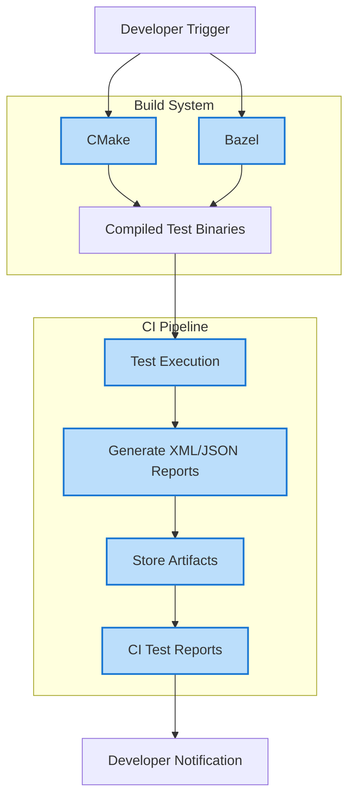

# How do I integrate GoogleTest with build systems and CI platforms?

This guide provides clear, actionable instructions for integrating GoogleTest with popular build systems like CMake and Bazel, as well as continuous integration (CI) platforms. It helps you automate the build and test execution process to ensure robust and efficient testing workflows.

---

## Overview of Integration

GoogleTest is designed to integrate smoothly with modern C++ build and CI environments. By properly configuring your build system, you can automatically compile, link, and run tests, generating reports suitable for CI tools.

Key goals of integration include:

- Seamless build and test execution automation
- Generation of standardized test results (XML/JSON) compatible with CI tools
- Minimal manual intervention during test runs
- Troubleshooting common integration pitfalls


## Integrating with CMake

CMake is a widely used cross-platform build system, and GoogleTest provides official support and examples to make integration straightforward.

### 1. Adding GoogleTest as a Dependency

You can include GoogleTest as a submodule or external project within your CMake setup.

- **Using FetchContent (Recommended for CMake 3.14+):**

  ```cmake
  include(FetchContent)
  FetchContent_Declare(
    googletest
    URL https://github.com/google/googletest/archive/refs/tags/release-1.17.0.zip
  )
  FetchContent_MakeAvailable(googletest)

  enable_testing()
  ```

- **Using ExternalProject_Add:**

  Configure to download and build GoogleTest if not available.

### 2. Creating Test Targets

Define your tests and link them with GoogleTest libraries:

```cmake
add_executable(my_test test/my_test.cc)
target_link_libraries(my_test PRIVATE gtest_main)
add_test(NAME MyTest COMMAND my_test)
```

This sets up the executable and registers it for CTest.

### 3. Enabling XML Output

For CI platforms, configure GoogleTest to output XML reports:

```cmake
add_test(NAME MyTest COMMAND my_test --gtest_output=xml:report.xml)
```

Or pass the flag during test invocation. This report can then be consumed by CI systems.

### 4. Additional Tips & Best Practices

- Use the `enable_testing()` command early in your CMakeLists to enable CTest support.
- Separate test code into `test/` directories with dedicated `CMakeLists.txt` for clarity.
- Invoke `ctest` as part of your build or CI scripts to run tests.
- Consider parallelizing tests with `ctest -jN` to leverage multi-core environments.

### 5. Troubleshooting CMake Integration

Common issues include:

- Missing `enable_testing()` which disables `add_test`.
- Incorrect linking against `gtest_main` or `gmock_main` leading to undefined references.
- Tests not discovered due to wrong `add_test` name or path.

Check verbose output of `ctest` for clues.


## Integrating with Bazel

Bazel users can add GoogleTest by importing the official `googletest` repository and defining `cc_test` targets.

### 1. Setup

In your `WORKSPACE` file:

```python
http_archive(
    name = "com_google_googletest",
    urls = ["https://github.com/google/googletest/archive/release-1.17.0.tar.gz"],
    strip_prefix = "googletest-release-1.17.0",
)

load("@com_google_googletest//bazel:repositories.bzl", "gtest_repositories")
gtest_repositories()
```

### 2. BUILD Files

Create `cc_test` targets linking to googletest libraries:

```bazel
cc_test(
    name = "my_test",
    srcs = ["my_test.cc"],
    deps = ["@com_google_googletest//:gtest_main"],
)
```

### 3. Running Tests

Use Bazel commands:

```bash
bazel test //path/to:my_test
```

You get output and status codes compatible with CI parsing.

### 4. Troubleshooting Bazel Integration

- Ensure `cc_test` rules depend on `gtest_main` for automatic main function.
- Confirm your workspace and `WORKSPACE` setup includes `googletest` archive.
- Use Bazel query and build logs to diagnose failure to link or run.


## Integrating GoogleTest with CI/CD Pipelines

Continuous integration platforms like Jenkins, GitHub Actions, GitLab CI, and others often rely on XML or JSON test reports. GoogleTest supports outputting these reports that can be consumed directly.

### 1. Enable XML/JUnit Report Generation

Pass `--gtest_output=xml:<filename>` when running your test binaries:

```bash
./my_test --gtest_output=xml:report.xml
```

- Set the output path relative to the workspace or a known artifact directory.
- Many CI systems can directly ingest this format to display test results.

### 2. Integrate Test Execution into CI

- Add build steps to compile tests using your build system.
- Add test execution steps with GoogleTest binary calls including XML output flags.
- Collect and archive XML reports as build artifacts.
- Configure CI to parse and render results using built-in plugins.

### 3. Common CI Best Practices

- Use environment variables or build variables to configure output paths.
- Clean previous reports to avoid mixing old results.
- Include build step logging and error checks to catch failures early.
- Enable verbose output when troubleshooting with `--gtest_verbose=info`.

### 4. Example: GitHub Actions Snippet

```yaml
name: C++ CI
on: [push]
jobs:
  build:
    runs-on: ubuntu-latest
    steps:
      - uses: actions/checkout@v2
      - name: Install dependencies
        run: sudo apt-get install cmake g++
      - name: Build
        run: cmake -S . -B build && cmake --build build
      - name: Run tests
        run: build/my_test --gtest_output=xml:test-results.xml
      - name: Upload Test Results
        uses: actions/upload-artifact@v2
        with:
          name: test-results
          path: test-results.xml
```

Refer to your CI provider's documentation for how to consume GoogleTest XML files.


## Troubleshooting Tips for Integration

- **Tests are not discovered in CTest:** Make sure `enable_testing()` and `add_test()` are called properly.
- **Linker errors:** Check that GoogleTest libraries (`gtest`, `gtest_main`, `gmock`) are correctly linked.
- **Unexpected test failures in CI:** Increase verbosity by passing `--gtest_verbose=info`.
- **XML reports not generated:** Confirm that the `--gtest_output` flag is used correctly.
- **Build system cache or stale artifacts:** Clear build caches and rebuild.


## Summary

Integrating GoogleTest with build systems and CI platforms sets the foundation for automated, reliable C++ testing. By following the recommended approaches for CMake and Bazel, enabling XML test reporting, and incorporating these steps into your CI pipelines, you can ensure fast feedback cycles and better code quality.


---

## Related Documentation & Resources

- [Integration with Build Systems (CMake & Bazel)](/overview/integrations/integration-with-build-systems)
- [Setting Up Your Test Environment](/guides/getting-started/environment-setup)
- [Writing and Running Your First Test](/guides/getting-started/writing-first-test)
- [Running Tests in Continuous Integration](/guides/advanced-and-best-practices/integrating-with-ci)
- [Assertions Reference](/docs/reference/assertions.md)
- [Using Mocks with GoogleMock](/guides/core-testing-workflows/using-mocks)


<Tip>
For smooth integration, always make sure your GoogleTest version matches your CI cache and dependencies, and test your build and test commands locally before pushing to CI.
</Tip>

<Note>
While this guide covers common setups, your environment may require specific adjustments. Consult your build/CI documentation for details.
</Note>

---

## Diagram: High-level Flow of GoogleTest Integration with Build Systems and CI



This diagram illustrates the typical path from build system configuration,
through test compilation, execution, result generation, and CI reporting.


---

## Final Tips

- Always run `ctest` or your CI test step with verbose flags when diagnosing failures.
- Consider caching GoogleTest builds in CI to speed up pipeline runs.
- Use GoogleTest's output format options to match your CI's expected inputs.
- Follow build system best practices to ensure reproducible builds.


---

*This page focuses solely on integrating GoogleTest with build systems and CI. For detailed GoogleTest usage and coding guidance, please see corresponding guides and references.*
