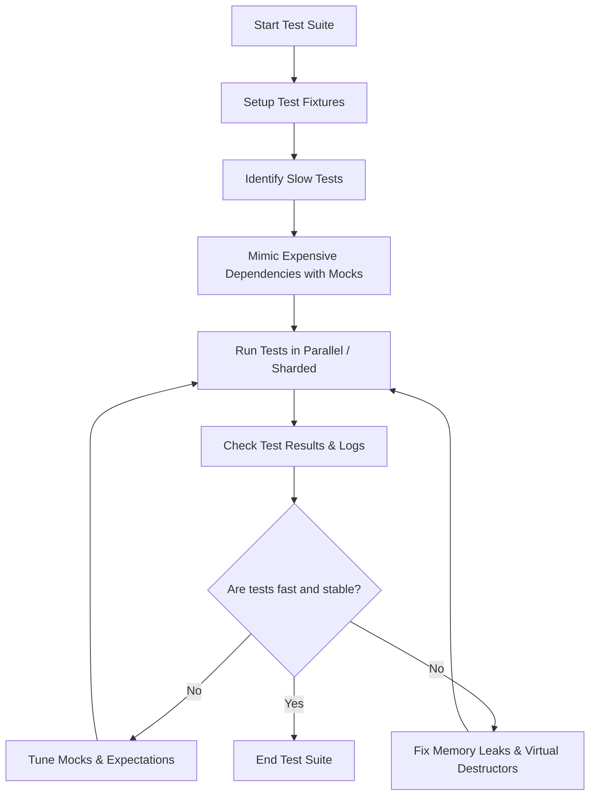

# Performance & Scalability Best Practices

GoogleTest is designed to empower C++ developers with a robust and flexible testing framework, but writing and running large-scale tests efficiently requires attention to how you structure and execute your test suites. This guide provides actionable advice and answers to common concerns about improving test performance, handling parallelism, managing resource usage, and scaling your tests for large projects.

---

## 1. Minimizing Test Execution Time

Long-running tests slow down developer feedback loops and continuous integration pipelines. Use the following best practices to reduce test runtime:

### Identify Slow Tests
- Use the `--gtest_brief=1` flag or generate XML reports (`--gtest_output=xml:<file>`) to detect which tests take the most time.
- Isolate slow tests and analyze their resource dependencies (e.g., database, network, file I/O) to find optimization opportunities.

### Employ Mocking to Replace Expensive Dependencies
- Replace external dependencies with mock objects using GoogleMock (`gMock`) to accelerate tests.
- Use `ON_CALL()` to set default behavior on mocks to avoid unnecessary test overhead.
- Write focused tests targeting behavior rather than integration when possible.

### Run Tests in Parallel
- Use test sharding with environment variables `GTEST_TOTAL_SHARDS` and `GTEST_SHARD_INDEX` to distribute test workloads across multiple machines or processes.
- Within a machine, run tests in parallel processes to utilize multiple CPU cores.
- Beware of tests that share non-thread-safe global resources when parallelizing.

### Filter and Run Subsets of Tests
- Use `--gtest_filter` to run only relevant tests, e.g., those related to your last change.
- Combine filtering with sharding and repetition for targeted debugging.

---

## 2. Structuring Test Suites for Scalability

Maintaining large test suites requires organization to avoid performance and maintenance pain:

### Use Test Fixtures and Shared Resources
- Group closely related tests in fixtures to share setup and teardown logic, avoiding redundant work.
- Use `SetUpTestSuite()` and `TearDownTestSuite()` static methods to set up expensive resources once per suite.

### Modularize and Parameterize Tests
- Create value-parameterized or typed tests to cover many scenarios with compact code.
- Isolate tests logically into suites to allow partial runs and reduce execution scope.

### Avoid Over-Specification
- Use `ON_CALL` for default mock behavior and `EXPECT_CALL` only for behaviors you want to verify strictly.
- Avoid overly strict cardinalities in `EXPECT_CALL` to prevent fragile tests and unnecessary reruns.

### Use NiceMocks to Reduce Noise
- Use `NiceMock` to suppress warnings about uninteresting calls in mocks, keeping logs cleaner and improving test output clarity.

---

## 3. Managing Memory and Resources

Handling resource consumption efficiently prevents flaky tests and system overload:

### Virtual Destructors in Mocked Classes
- Always ensure mocked base classes have virtual destructors to avoid memory leaks detected by runtime heap checkers.

### Avoid Long-Lived or Leaking Mocks
- Use `Mock::AllowLeak(&mock)` to mark mocks that the test framework should not verify or consider leaks (use with caution).
- Prefer allocating mocks on the stack where possible to leverage automatic teardown.

### Reduce Compilation Overhead
- Move mock class constructor and destructor definitions to `.cc` files to speed up compilation when mocking many classes.

---

## 4. Debugging and Troubleshooting Performance Issues

When tests underperform, use these approaches to diagnose and improve:

### Increase Verbosity for Call Tracing
- Use `--gmock_verbose=info` to trace mock function calls and how expectations match.
- Combine with `--gtest_stack_trace_depth` to control amount of stack trace printed.

### Analyze Mock Expectations
- Verify no unexpected calls are causing slow test failure or unexpected retries.
- Use sequences (`InSequence`) and partial orders (`After`) wisely to prevent deadlocks or test hangs.

### Heap Checker and Race Issues
- Enable GoogleTest heap checking to find memory leaks and misuse.
- Avoid setting or verifying expectations from multiple threads; confine mock setup and teardown to single threads.

---

## 5. Scaling Test Suites with Continuous Integration

For large-scale projects consider these best practices:

### Use Test Sharding and Filtering
- Distribute tests across shards and machines for faster test execution.
- Use filters to target frequent changes.

### Retry Flaky Tests
- Identify flaky tests and configure automatic retries with test runners.
- Investigate causes such as race conditions and non-deterministic expectations.

### Incremental Builds and Test Caching
- Where supported, leverage caching mechanisms to avoid recompilation.

### Generate Reports
- Use XML or JSON reports (`--gtest_output`) for CI dashboards and detailed failure triage.

---

## Practical Tips & Common Pitfalls

- Set expectations (`EXPECT_CALL`) **before** exercising mocks to avoid undefined behavior.
- When using `WillOnce` multiple times, consider `RetiresOnSaturation()` to mark expectations inactive after usage.
- If mock methods are called more than expected, GoogleMock will invoke the default action and print errors; consider whether cardinalities are set correctly.
- For complex mock behaviors, consider delegating to fake or real objects inside `ON_CALL` to maintain consistency.
- Avoid mocking non-virtual functions unless using template-based or specialized techniques, as it's more complex and less flexible.

---

## Related Documentation

- [GoogleTest Primer](primer.md) — Introduction to test writing
- [Mocking for Dummies](gmock_for_dummies.md) — Basics of mocking
- [Mocking Reference](reference/mocking.md) — Detailed mock API and usage
- [gMock Cookbook](gmock_cook_book.md) — Recipes for common mocking scenarios
- [Performance Best Practices](guides/solutions-and-patterns/performance-best-practices.mdx) — Broader guide to maximizing test performance
- [CI Integration & Troubleshooting FAQ](faq/performance-integration-support/integration-ci-troubleshooting-faq.md) — Handling CI scale and stability

---

## Sample Workflow for Improving Performance

<Steps>
<Step title="Identify Slow Tests">
Run the entire test suite with XML output or `--gtest_brief=1` and find the slowest contributors.
</Step>
<Step title="Mock or Stub Dependencies">
Refactor tests that depend on slow resources to use mocks or fakes where possible.
</Step>
<Step title="Parallelize Test Runs">
Configure test sharding or use parallel test runners to speed execution.
</Step>
<Step title="Organize and Parameterize">
Refactor redundant tests into parameterized form for maintainability and speed.
</Step>
<Step title="Instrument for Diagnostics">
Increase mock verbosity to trace unexpected calls or verify ordering constraints.
</Step>
<Step title="Prevent Memory Leaks">
Ensure destructors are virtual in mocked classes and monitor for leaked mocks.
</Step>
</Steps>

---

## Troubleshooting Troubleshooting Common Failures Related to Performance

<AccordionGroup title="Common Performance Issues and Their Solutions">
<Accordion title="Slow test execution due to external dependencies">
Use mocks or fakes to simulate slow services like databases or network calls. Avoid real I/O in unit tests.
</Accordion>
<Accordion title="Flaky or nondeterministic tests affecting parallel runs">
Use mock sequences and ordering constraints to enforce deterministic call order if critical. Isolate flaky tests for debugging.
</Accordion>
<Accordion title="Compilation is slow due to large mock classes">
Move mock class constructors and destructors out of header files into .cc files.
</Accordion>
<Accordion title="High memory consumption from test binaries">
Audit resource allocations. Prefer stack allocation of mocks where possible and allow leaks judiciously in CI.
</Accordion>
</AccordionGroup>

---

<Tip>
Always set expectations on mocks before invoking the code under test. This prevents undefined behaviors and makes tests reliable.
</Tip>

<Tip>
Use `NiceMock<>` to suppress warnings from mock methods without explicit expectations when you don't care about all calls.
</Tip>

<Tip>
Consider delegating mock method calls to real or fake implementations via `ON_CALL` for complex scenarios.
</Tip>

<Tip>
Use `EXPECT_CALL(mock, Method(...)).RetiresOnSaturation()` when expecting finite calls in sequence to avoid spurious failures.
</Tip>

---

## Summary Diagram: Optimizing Test Execution Flow

---