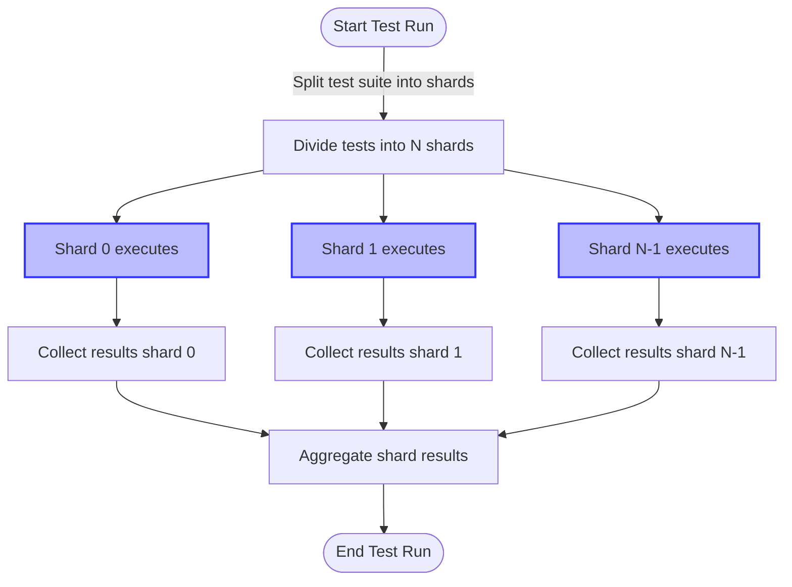

# How do I speed up my test suite?

GoogleTest offers several strategies and best practices to accelerate your test suite's execution and streamline your feedback cycles. This page guides you through effective techniques to run tests faster, write more efficient tests, and leverage GoogleTest’s advanced features for optimal performance.

---

## 1. Parallel Test Execution

Modern CPUs with multiple cores can execute tests in parallel to significantly reduce total runtime.

- **Test Sharding**: GoogleTest supports running tests in shards (subsets) distributed across multiple machines or processes.
  - Use the environment variables `GTEST_TOTAL_SHARDS` and `GTEST_SHARD_INDEX` to specify the total number of shards and the index of the current shard.
  - Each shard runs a unique subset of tests, ensuring total coverage in less time.

- **Tips:**
  - Maintain deterministic tests that don't interfere with each other to avoid flaky shard results.
  - Integrate with continuous integration systems to distribute shards automatically.

For details on sharding setup and usage, see [Running Test Functions to Multiple Machines](../advanced.md#distributing-test-functions-to-multiple-machines).

---

## 2. Efficient Test Fixtures and Setup

Setup and teardown overhead often dominates test runtime, especially when dealing with expensive resources.

- Use **`SetUpTestSuite()`** / **`TearDownTestSuite()`** methods for expensive resources shared across tests in the same test suite.
  - They are called once before all tests and once after all tests in a suite, reducing repeated initialization.

- Avoid costly operations in per-test `SetUp()`/`TearDown()` unless necessary.
  - When possible, use constructor/destructor for lightweight operations.

- Isolate expensive side effects between tests to safely share resources.

Example pattern for shared resource setup:

```cpp
class DatabaseTest : public testing::Test {
 protected:
  static void SetUpTestSuite() {
    db_connection_ = OpenDatabaseConnection();
  }

  static void TearDownTestSuite() {
    CloseDatabaseConnection(db_connection_);
    db_connection_ = nullptr;
  }

  void SetUp() override {
    // Prepare test-specific data here if necessary.
  }

  static DatabaseConnection* db_connection_;
};

DatabaseConnection* DatabaseTest::db_connection_ = nullptr;
```

---

## 3. Selective Test Execution

Focusing on relevant tests can drastically improve iteration speed.

- Use `--gtest_filter` to run a subset of tests by suite and/or test name.

- Run disabled tests with `--gtest_also_run_disabled_tests` when needed.

Example:

```shell
./my_test --gtest_filter=MySuite.*
```

---

## 4. Avoid Global State and Side Effects

Global variables and shared mutable state can cause unexpected test dependencies and slow down test isolation.

- Prefer test fixtures over global variables to ensure independent and repeatable tests.
- Minimize cross-test side effects to prevent cascading slowdowns.

---

## 5. Optimize Mocking and Assertions

Mocks and assertions can impact performance if overused or misused.

- Use `NiceMock` when you want to suppress warnings on uninteresting calls, reducing overhead.
- Simplify expectations and only set those essential to your test's correctness.
- Avoid redundant or expensive custom matchers where possible.

See the [Basic Mocking with GoogleMock](../guides/getting-started/basic-mocking.md) and the [Strict, Nice, and Naggy Mocks](../api-reference/mocking-api/strict-nice-mocks.md) for best practices.

---

## 6. Parallel Test Sharding Diagram



---

## 7. Advanced Configuration Options

Leverage GoogleTest’s flags for further optimization:

- `--gtest_repeat=N`: Repeat tests to catch flaky behavior which can indirectly improve reliability and efficiency.
- `--gtest_shuffle`: Run tests in random order to uncover unwanted dependencies.
- `--gtest_fail_fast`: Stop testing after the first failure to speed debugging in certain scenarios.

More flags are explained in the [Running Test Programs: Advanced Options](../advanced.md#running-test-programs) section.

---

## 8. Troubleshooting and Common Pitfalls

- **Slow Setup:** Excessive per-test setup often causes slowdowns; shift expensive setup to suite-level.
- **Non-isolated Tests:** Tests depending on order or shared state can cause flakiness and hinder parallel runs.
- **Over-Filtering:** Make sure `--gtest_filter` does not exclude tests unintentionally, or use groups for logical test partitioning.

Refer to [Troubleshooting Build and Integration Errors](../../faq/troubleshooting/build-issues.md) for integration-related bottlenecks.

---

## 9. Best Practices Summary

- Organize test suites to reflect code structure, enabling targeted test running and parallelization.
- Employ shared resource setup at the test suite level.
- Write small, independent tests that run quickly.
- Use GoogleMock judiciously to minimize overhead.
- Use filtering and sharding together for optimal CI and local development performance.

---

## See Also

- [Scaling and Maintaining Large Test Suites](../guides/integration-best-practices/scaling-maintaining-tests.md)
- [Test Performance Optimization Tips](../guides/integration-best-practices/performance-tips.md)
- [Basic Mocking with GoogleMock](../guides/getting-started/basic-mocking.md)
- [Running Test Functions to Multiple Machines (Sharding)](../advanced.md#distributing-test-functions-to-multiple-machines)
- [Advanced GoogleTest Topics](docs/advanced.md)
- [Running Test Programs: Advanced Options](../advanced.md#running-test-programs)

---

<Tip>
For the best speed improvements, combine parallel test execution, efficient fixture design, and selective test running. Automate sharding and filtering in your CI to maximize speed without sacrificing test coverage.
</Tip>

<Note>
Avoid adding heavy setup in constructors or per-test methods; GoogleTest creates a fresh fixture per test, so prefer static per-suite initialization.
</Note>

<Warning>
Parallel test runs require thread safety and isolation; be sure your tests don't have hidden dependencies on global or shared mutable state.
</Warning>

