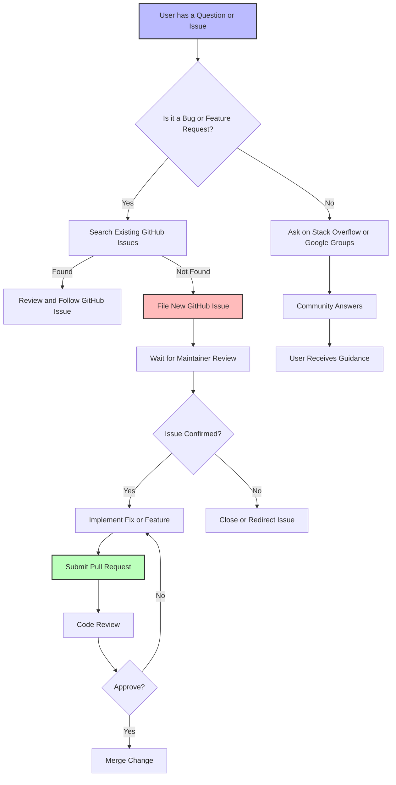

# Where Can I Get Help or Contribute to GoogleTest and GoogleMock?

GoogleTest and GoogleMock are open-source projects maintained by Google, developed collaboratively with the community. Whether you have questions, want to report bugs, suggest improvements, or contribute code, there are several official and community channels available to support you.

---

## 1. Official Support Channels

### Issue Tracker

The primary place to report bugs or request features is the [GoogleTest GitHub Issue Tracker](https://github.com/google/googletest/issues).

- Before opening a new issue, please search existing issues to avoid duplicates.
- Provide a clear description, steps to reproduce, expected vs actual behavior, and minimal code samples if possible.

### Mailing Lists and Forums

GoogleTest project does not maintain a dedicated official mailing list, but you can ask questions on these platforms:

- [Stack Overflow](https://stackoverflow.com/questions/tagged/googletest): Tag your questions with `googletest` or `googlemock` to attract community expertise.
- [Google Groups](https://groups.google.com/g/googletestframework): Community discussions and announcements.

### Google Testing Blog

Stay informed and learn advanced techniques from the [Google Testing Blog](https://testing.googleblog.com/), which occasionally features posts about GoogleTest and GoogleMock.

## 2. Community Resources

### Community-Created Documentation

The community actively contributes tutorials, insights, and guides that complement official documentation. One useful resource is the [Googlemock Insights by ElectricRCAircraftGuy](https://github.com/ElectricRCAircraftGuy/eRCaGuy_dotfiles/blob/master/googletest/insights.md), offering practical advice and examples.

### Discussions and Q&A

You can also engage with other users and contributors:

- GitHub Discussions on the [googletest repository](https://github.com/google/googletest/discussions)
- Various developer forums and IRC channels dedicated to C++ testing

## 3. How to Contribute

GoogleTest and GoogleMock welcome contributions that improve functionality, fix bugs, or enhance documentation.

### Getting Started

1. **Fork the repository**: Start from [https://github.com/google/googletest](https://github.com/google/googletest).
2. **Read the Contribution Guidelines**: Found in the repository’s `CONTRIBUTING.md` file.
3. **Implement your changes**: Follow the coding style and write tests.
4. **Submit a Pull Request**: Open a detailed pull request describing your changes.

### Contribution Types

- Bug fixes
- New features or improvements
- Added or improved documentation
- Test cases and examples

### Review and Merge Process

- Contributions are reviewed by maintainers.
- Follow-up changes may be requested.
- After approval, your changes are merged.

## 4. Accessing Further Documentation

GoogleTest and GoogleMock provide comprehensive documentation to master both frameworks:

- [gMock Cookbook](https://google.github.io/googletest/gmock_cook_book.html): Recipes and advanced usage.
- [gMock Cheat Sheet](https://google.github.io/googletest/gmock_cheat_sheet.html): Quick reference for mocking.
- [Mocking Reference](https://google.github.io/googletest/reference/mocking.html): Detailed API guide.
- [Core Testing API](https://google.github.io/googletest/api/): GoogleTest test framework APIs.

These resources are invaluable for new and advanced users alike.

## 5. Best Practices for Getting Help

- Clearly describe your problem or question.
- Include minimal reproducible examples.
- Reference relevant documentation or code sections.
- Be respectful and patient; contributors help voluntarily.

## 6. Summary

GoogleTest and GoogleMock provide a robust ecosystem supported by both official maintainers and an active community. Engage via the GitHub repository, issue tracker, community forums, and documentation to find help, contribute, and advance your testing practices.

---

## Related Documentation Links

- [gMock Cookbook](https://google.github.io/googletest/gmock_cook_book.html)
- [gMock Cheat Sheet](https://google.github.io/googletest/gmock_cheat_sheet.html)
- [Mocking Reference](https://google.github.io/googletest/reference/mocking.html)
- [GoogleTest Primer (Writing Your First Test)](https://google.github.io/googletest/guides/getting-started/writing-your-first-test.html)
- [Community-Created Documentation](docs/community_created_documentation.md)

---

## How to Report Issues Effectively

Effective bug reports improve resolution speed:

- Use descriptive titles.
- Provide environment and platform details (compiler, OS).
- Include minimal example code to reproduce the issue.
- Describe what you expect to happen and what actually occurs.
- Attach logs, error messages, or screenshots if relevant.

---

<Tip>
When seeking help via forums or GitHub Issues, always check the FAQ and the existing issues first to avoid duplication. Clear and concise questions get faster responses.
</Tip>

<Warning>
Avoid posting proprietary or sensitive information in public venues.
</Warning>

---

## How to Keep Updated

Keep up with project changes and community discussions by:

- Watching the [GoogleTest GitHub repository](https://github.com/google/googletest).
- Subscribing to release notes and announcements.
- Participating in community forums.

---

## Contact and Contribution Flowchart

