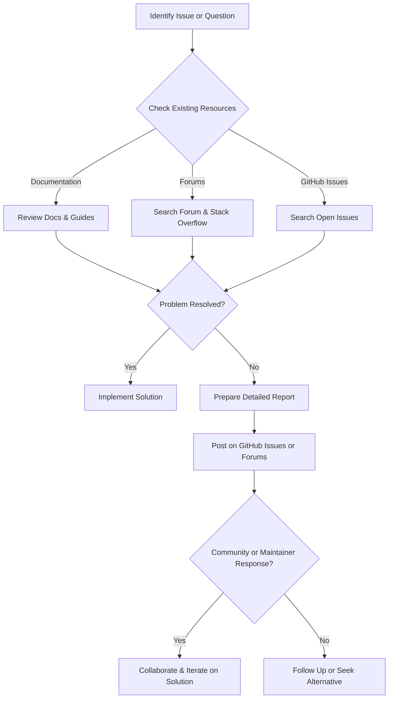

# How to Get Support or Ask Questions

This page guides you on where and how to seek support or ask questions about GoogleTest and GoogleMock. It directs you to official documentation, the GitHub issue tracker, notable discussion forums, and active community resources. Additionally, it clarifies what to expect in terms of response times and etiquette for reporting bugs or requesting features.

---

## Frequently Asked Questions About Getting Support

### Where can I find official documentation?
GoogleTest and GoogleMock provide extensive official documentation online including:

- **Getting Started Guides:** Introductory materials to help newcomers install and run tests.
- **API References:** Detailed descriptions of classes, macros, and functionalities.
- **Guides:** Practical tutorials and real-world examples.
- **FAQs:** Answers to common questions and troubleshooting tips.

**Explore these resources at the [GoogleTest documentation website](https://google.github.io/googletest/).**

### How do I report bugs or request new features?
The primary channel is the project's GitHub repository:

- Submit issues at: [https://github.com/google/googletest/issues](https://github.com/google/googletest/issues)

When reporting bugs or requesting features, be sure to:

- Provide clear, reproducible steps.
- Include your environment: OS, compiler version, GoogleTest version.
- Share minimal code snippets or logs that illustrate the problem.

### Are there forums or community resources where I can ask questions?
Yes. To engage with the community, you can:

- Visit the [GoogleTest Google Group forum](https://groups.google.com/g/googletestframework).
- Participate in discussions on Stack Overflow using the tag [`googletest`](https://stackoverflow.com/questions/tagged/googletest).

These venues are excellent for sharing issues, solutions, and advice.

### What are the best practices when asking questions or reporting bugs?

- Search existing issues and forum posts to avoid duplicates.
- Provide detailed descriptions and context.
- Attach relevant code samples and error messages.
- Be respectful and patient; maintainers and contributors are volunteers.

### How soon can I expect a response?
Response times vary depending on the issue's complexity, clarity, and community activity. A well-documented bug report or question increases the likelihood of a faster and more precise response.

---

## Support Channels Overview

| Channel                       | Purpose                                        | Link                                      |
|------------------------------|------------------------------------------------|-------------------------------------------|
| Official Documentation        | Comprehensive guides, references, tutorials    | https://google.github.io/googletest/      |
| GitHub Issues                 | Report bugs, request features, track progress  | https://github.com/google/googletest/issues |
| Google Group Forum            | Community Q&A and discussions                    | https://groups.google.com/g/googletestframework |
| Stack Overflow               | Peer support through Q&A                         | https://stackoverflow.com/questions/tagged/googletest |

---

## Tips to Get the Most Effective Support

1. **Be Clear and Specific**: Outline your problem concisely but with enough detail.
2. **Include Context**: State your development environment (OS, compiler, version).
3. **Share Minimal Reproducible Example**: Simple code snippets that reproduce the issue accelerate troubleshooting.
4. **Check Existing Resources Before Asking**: Avoid duplicates by searching docs and forums.
5. **Be Patient and Courteous**: Open source contributors volunteer their time.

<Tip>
Providing actionable, clear, and reproducible information in your queries will greatly enhance your chances of receiving timely and helpful responses.
</Tip>

---

## Understanding Response Expectations

- **Bug Reports:** Clearly documented bugs have priority. Complex issues may require follow-up questions.
- **Feature Requests:** Maintainers assess feasibility and impact; not all requests are accepted.
- **Support Questions:** Community members may respond on forums; the core team prioritizes development.

---

## Etiquette for Contribution and Communication

- Follow coding and reporting guidelines provided in the repository.
- Use respectful language and constructive feedback.
- Acknowledge the efforts of maintainers and community helpers.

---

## Related Documentation Sections

- [Getting Started with GoogleTest](../getting-started/prereq-install/prerequisites.md): Installation and setup prerequisites.
- [Mocking Reference](../docs/reference/mocking.md): Details on mock capabilities and usage.
- [Troubleshooting Common Setup Issues](../getting-started/troubleshooting-qa/common-issues.md): Quick fixes for common problems.

---

## Getting Help Flow

---

## Summary

This page serves as your primary compass to the support ecosystem around GoogleTest and GoogleMock. Whether you are troubleshooting a problem, reporting a bug, or seeking advice, it ensures you know where to turn, how to communicate effectively, and what to expect.

---

<Check>
For bug reports, please provide minimal reproducible examples including test code, logs, environment details, and steps to reproduce. This accelerates resolution and helps maintainers help you better.
</Check>

---

For advanced users or contributors interested in improving GoogleTest/GoogleMock, consider visiting the [Contributing Guide](../faq/support-community-faq/contribute-improve-faq.md).

---

<Note>
This support guidance relates specifically to interaction with the GoogleTest and GoogleMock projects and is not a general programming help resource.
</Note>
