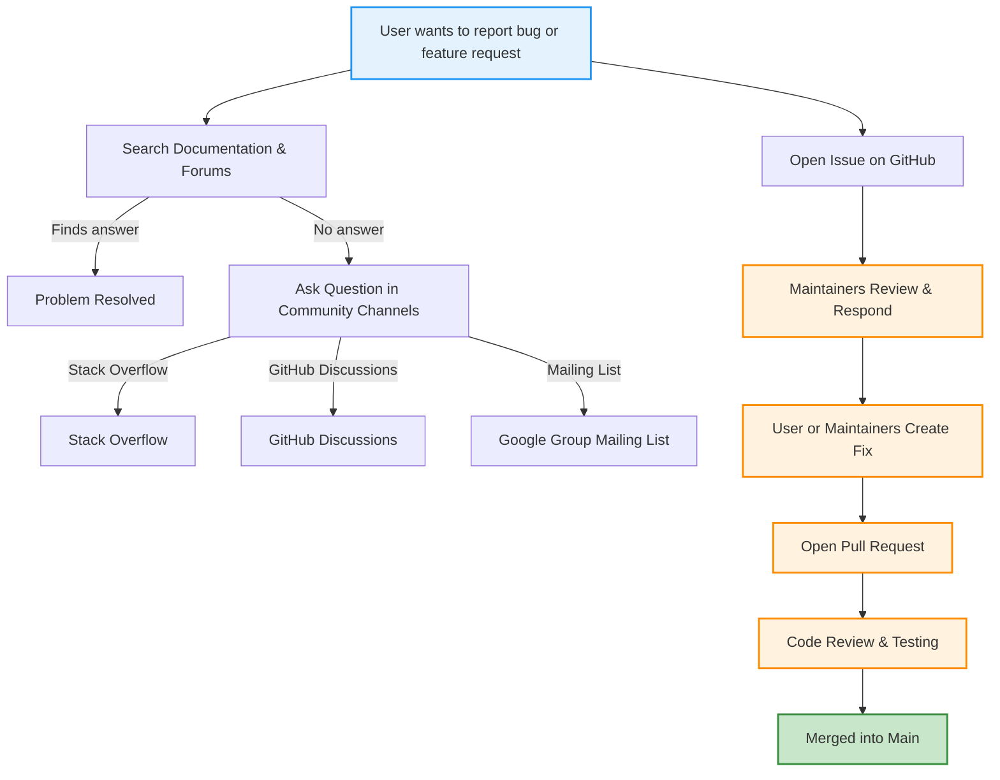

# Community Help & Bug Reporting

GoogleTest and GoogleMock thrive thanks to an engaged community of users and contributors. This page guides you on how and where to ask questions, request support, contribute issues or fixes, and engage proactively with both the development team and the wider user community.

---

## Frequently Asked Questions (FAQ)

### Where can I ask questions or get help?
- **Stack Overflow**: Use the `googletest` tag to ask usage questions.
- **GitHub Discussions**: Check the repository’s discussions for community Q&A.
- **Google Group Mailing List**: For announcements and discussions.
- **Chat Channels**: Some community channels for real-time support.

### How do I report a bug or request a feature?
- Open an issue on the [GoogleTest GitHub repository](https://github.com/google/googletest/issues).
- Provide a clear, detailed description including repro steps, environment, and expected behavior.

### How do I contribute a fix or improvement?
- Fork the repository and create a topic branch.
- Write isolated, test-covered commits.
- Follow the project’s coding style and commit message guidelines.
- Open a pull request describing the changes.

### Can I contribute documentation or tutorials?
- Absolutely! Community contributions enrich the project.
- See the contribution guidelines in the repository.
- Submit pull requests or open issues suggesting improvements.

### How do I stay updated or follow development?
- Watch the GitHub repository.
- Subscribe to release announcements in the mailing list or GitHub.
- Follow community forums or social media channels related to GoogleTest.

---

## How to Ask Questions Effectively

To get the best help from the community and maintainers:

1. **Search thoroughly** before asking to avoid duplicates.
2. **Provide context:** include your environment details (OS, compiler, GoogleTest version).
3. **Describe your problem in detail:** what you did, what you expected, what happened.
4. **Share code snippets or minimal reproductions:** small examples help others understand your issue quickly.
5. **Show error messages exactly:** copy full stack traces or logs.

Using these practices ensures quicker, higher quality responses.

---

## Requesting Support

If you encounter issues, consider the following support avenues:

- **Official Documentation:** The comprehensive user's guide and FAQ sections cover many common questions.
- **Community Forums:** Many experienced users frequent Stack Overflow and GitHub discussions.
- **Issue Tracker:** For bugs, file GitHub issues following the issue template.

Avoid support requests through personal emails or social media to keep the process efficient and transparent.

---

## Contributing Issues or Fixes

### Reporting Bugs

When you find a bug:

- Confirm it is reproducible with the latest release or main branch.
- Include steps to reproduce, environment details, and expected vs actual behavior.
- Tag the issue appropriately (bug, feature request, question).

### Fixing Bugs or Adding Features

- Review the [CONTRIBUTING.md](https://github.com/google/googletest/blob/main/CONTRIBUTING.md) file in the repo for development guidelines.
- Write clear, focused commits.
- Add or update tests to cover new behavior or fixed bugs.
- Submit a pull request and be responsive to feedback.

Maintainer reviews often include verifying that contributions do not break existing functionality.

---

## Engaging with the GoogleTest Development Team

- Participate in GitHub discussions and issues.
- Respect the project’s code of conduct.
- Engage constructively with maintainers and other contributors.
- Suggest improvements and participate in roadmap discussions when possible.

---

## Community Resources and Contribution

- [GoogleTest GitHub Repository](https://github.com/google/googletest/): Source code, issue tracking, pull requests.
- [GoogleMock Documentation](https://google.github.io/googletest/gmock_for_dummies.html): Learn how to mock effectively.
- [gMock Cheat Sheet](https://google.github.io/googletest/gmock_cheat_sheet.html): Quick reference for mocking syntax.
- Community created tutorials and guides.

---

## Troubleshooting Common Community Interaction Issues

<AccordionGroup title="Common Community Interaction Questions">
<Accordion title="I’m not getting any response to my question. What should I do?">
- Ensure your question is clear, detailed, and includes a minimal reproducible example.
- Be patient: community members contribute in their spare time.
- Consider improving your question based on feedback.
</Accordion>
<Accordion title="How do I follow best practices in filing issues?">
- Use the issue templates provided.
- Provide precise reproduction steps.
- Tag your issue correctly.
- Link to related issues if applicable.
</Accordion>
<Accordion title="Can I contribute without being a developer?">
- Yes! Documentation, examples, bug reports, feature suggestions, and answering others’ questions are immensely valuable.
</Accordion>
</AccordionGroup>

---

## Best Practices for Community Engagement

<Tip>
Always prepare before asking for help: search existing documentation, forums, and issues. Clear communication accelerates solutions.
</Tip>

<Note>
Respect the project’s code of conduct in all interactions to maintain a welcoming and productive environment.
</Note>

<Warning>
Avoid posting personal or sensitive code publicly. Instead, create minimal examples that reproduce issues without confidential information.
</Warning>

---

## Getting Help Summary

GoogleTest encourages community participation for support, issue reporting, and contributions. Use appropriate public channels to ask questions, report bugs, and submit fixes. Follow community guidelines for clear communication and respectful interaction to enhance your experience. Engage with official documentation, GitHub, and community forums to maximize your success.

---

## Related Documentation

- [GoogleTest Primer](primer.md): Start learning GoogleTest basics.
- [gMock for Dummies](gmock_for_dummies.md): Introduction to mocking.
- [Mocking Reference](reference/mocking.md): Detailed API for mocking.
- [gMock Cookbook](gmock_cook_book.md): Practical mocking recipes.
- [Bug Reporting Guidelines](https://github.com/google/googletest/blob/main/CONTRIBUTING.md#submitting-bug-reports)
- [Community-Created Documentation](docs/community_created_documentation.md)

---

## Useful Links

- [GoogleTest GitHub](https://github.com/google/googletest)
- [Issue Tracker](https://github.com/google/googletest/issues)
- [gMock Tutorials](https://google.github.io/googletest/gmock_for_dummies.html)

---

## Summary Diagram: Community Support Flow

---

## Troubleshooting Common Issues in Community Help

<AccordionGroup title="Troubleshooting Community Help">
<Accordion title="Why does my issue get closed or ignored?">
Make sure:
- It fits the issue tracker guidelines.
- You provide a minimal reproducible example.
- Your description is clear and actionable.
</Accordion>
<Accordion title="I'm unfamiliar with GitHub pull requests, how can I contribute fixes?">
- Review the [GitHub Help](https://help.github.com/en/github/collaborating-with-issues-and-pull-requests) to understand forking, branching, and submitting PRs.
- Start small changes and reference your fixes in issues.
</Accordion>
<Accordion title="The community responses seem too technical, how to follow?">
- Start with beginner-friendly guides like 'gMock for Dummies'.
- Ask for clarification politely.
</Accordion>
</AccordionGroup>

---

## Final Tips

- Always use clear, concise language when communicating.
- Provide context to make it easier for others to help.
- Follow up and thank contributors to foster community goodwill.
- Keep your local environment updated with the latest releases to avoid outdated issues.

---

We appreciate your engagement and contributions! Together, we make GoogleTest and GoogleMock better for everyone.
