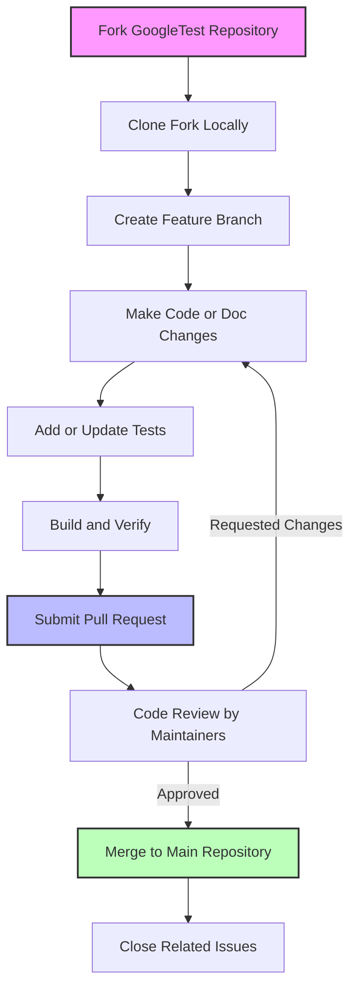

# Contributing & Feedback

Welcome to the contribution and feedback hub for GoogleTest and GoogleMock. This page answers common questions about how you can contribute code, report bugs, and help improve documentation for better community collaboration and product quality.

---

## 1. How Can I Contribute Code?

Contributions to GoogleTest and GoogleMock are welcomed and appreciated. Here’s how you can start:

- **Fork the Repository:** Begin by forking the [GoogleTest GitHub repository](https://github.com/google/googletest).
- **Create a Branch:** Work on your changes in a separate branch named clearly after your feature or fix.
- **Follow Coding Guidelines:** Ensure your code complies with Google’s [C++ style guide](https://google.github.io/styleguide/cppguide.html) and passes all existing tests.
- **Write Tests:** Add new tests or extend existing ones to cover your changes.
- **Document Your Changes:** Update or add relevant documentation, including examples or usage notes.
- **Submit a Pull Request (PR):** Open a PR describing your changes clearly and referencing any related issues.

Your PR will be reviewed by maintainers and may request changes for clarity, functionality, or style.

<Tip>
Good commits have concise descriptions and references to related issues to help reviewers understand context and rationale.
</Tip>

---

## 2. How Do I Report Bugs or Issues?

To report bugs effectively and help developers address them swiftly:

- **Use GitHub Issues:** Open a new issue on the [GoogleTest GitHub issues page](https://github.com/google/googletest/issues).
- **Provide Clear Details:** Include a descriptive title, a clear explanation of the problem, and steps to reproduce it.
- **Include Environment Info:** Add your platform details, compiler version, and GoogleTest version.
- **Attach Minimal Examples:** If possible, share a minimal test case that reproduces the issue.
- **Describe Expected and Actual Behavior:** Clarify what you expected to happen and what actually happened.

<Tip>
Before reporting, check existing issues and FAQ sections like the [Legacy gMock FAQ](docs/gmock_faq.md) or [Mocking Cookbook](docs/gmock_cook_book.md) to avoid duplicates and find quick workarounds.
</Tip>

---

## 3. How Can I Improve Documentation?

Clear documentation helps all users. You can contribute by:

- **Suggesting Edits:** Open PRs that improve clarity, fix typos, or update outdated information.
- **Adding Examples:** Practical code snippets or usage stories are especially valuable.
- **Enhancing Guides:** Help structure content in user-friendly ways, focusing on outcomes and workflows.
- **Reporting Issues:** File issues if the docs are confusing, incomplete, or inconsistent.

Contributions to docs follow the same PR process as code.

---

## 4. Where Can I Get Help and Support?

If you need assistance or want to discuss contribution ideas:

- **Join the Community:** Use forums and mailing lists linked on the [Community-Created Documentation](docs/community_created_documentation.md).
- **Submit Issues:** Use the GitHub issue tracker for bugs or feature discussions.
- **Ask Questions:** Look for help in GitHub Discussions or the googletest community channels.

<Tip>
Check out the [GoogleMock Cookbook](docs/gmock_cook_book.md) and [gMock for Dummies](docs/gmock_for_dummies.md) for practical usage advice.
</Tip>

---

## 5. What Are the Contribution Best Practices?

- **Be Respectful and Professional:** Maintain a positive and collaborative tone.
- **Keep Changes Atomic:** Focus each PR on a single concern.
- **Write Tests:** Ensure robust automated coverage.
- **Use Meaningful Names:** For branches, commits, variables, and functions.
- **Review and Respond:** Address feedback promptly.

---

## 6. How Do I Stay Updated on Project Changes?

- **Watch the Repository:** Subscribe on GitHub for notifications.
- **Follow Changelog:** Keep track of significant updates in the [Version History](changelog/version-history/releases-overview).
- **Read Release Notes:** Each release’s notes help understand new features and fixes.

---

## 7. Tips for Effective Feedback

- Provide **concise and clear descriptions**.
- Include **context and motivation** for your suggestions.
- Attach **relevant test logs or failure messages**.
- Suggest **practical solutions or improvements** if possible.

Feedback is a vital part of evolving GoogleTest and GoogleMock into better tools.

---

## 8. Additional Resources

- [gMock Cookbook](docs/gmock_cook_book.md) — Recipes and advanced mocking usage.
- [Mocking Reference](docs/reference/mocking.md) — Detailed API and usage.
- [GoogleMock FAQ](docs/gmock_faq.md) — Answers to common mocking questions.
- [Community-Created Documentation](docs/community_created_documentation.md) — Additional user guides and resources.

---

## Quick Links

- [GoogleTest GitHub Repository](https://github.com/google/googletest)
- [Issue Tracker](https://github.com/google/googletest/issues)
- [Contribution Guidelines](https://github.com/google/googletest/blob/main/CONTRIBUTING.md)

---

Happy contributing! Your input drives continuous improvement of GoogleTest and GoogleMock.

---

<AccordionGroup title="Frequently Asked Contribution Questions">
<Accordion title="Can I contribute code from outside Google?">
Yes. GoogleTest and GoogleMock are open-source projects accepting contributions from the public via GitHub pull requests, adhering to contribution guidelines.
</Accordion>
<Accordion title="What code style should I follow?">
Follow the [Google C++ style guide](https://google.github.io/styleguide/cppguide.html) to maintain consistency across the codebase.
</Accordion>
<Accordion title="Do I have to write tests for my changes?">
Absolutely. All code changes must include tests that validate the new or modified functionality to keep the project reliable.
</Accordion>
<Accordion title="How can I suggest documentation improvements?">
Fork the repository, edit the documentation files using Markdown, then submit a pull request describing your changes.
</Accordion>
<Accordion title="Who reviews my pull requests?">
Project maintainers and experienced contributors will review your PR, provide feedback, and approve or request changes.
</Accordion>
</AccordionGroup>

---

## Contribution Flow Diagram

---

## Contact & Further Feedback

If you want to discuss community involvement, upcoming features, or other feedback, consider joining community discussions or reaching out via GitHub.

We value your contributions and feedback to improve the robustness, usability, and documentation clarity of GoogleTest and GoogleMock.
