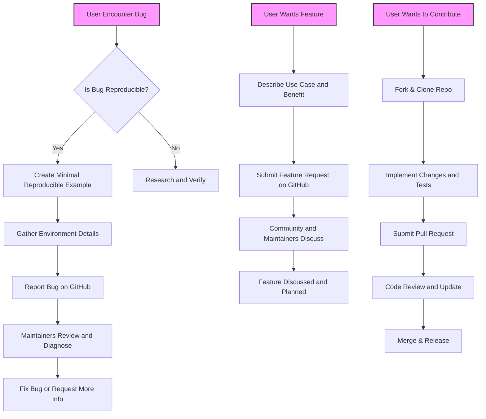

# Reporting Issues and Requesting Features

This page provides clear guidance on how to effectively report bugs, submit feature requests, and contribute improvements for the GoogleTest and GoogleMock projects. It outlines expectations for bug reports, best practices for submitting feature requests, and introduces contribution policies to ensure your efforts help improve the framework efficiently.

---

## Reporting Bugs

When you encounter an issue in GoogleTest or GoogleMock, providing a well-documented bug report is crucial for the maintainers to reproduce, diagnose, and fix the problem quickly.

### What to Include in a Bug Report

- **Clear Description of the Problem:** Explain what went wrong, the unexpected behavior, and why it is a bug.

- **Minimal Reproducible Example:** Provide a small, self-contained C++ code snippet that reproduces the issue. Preferably use the `MOCK_METHOD`, `EXPECT_CALL`, and/or `ON_CALL` as relevant.

- **Environment Details:** Include compiler version, platform, build system used, and any relevant flags or configurations.

- **Error Messages and Logs:** Copy the exact output, including error and warning messages, stack traces if applicable.

- **Steps to Reproduce:** Describe how to build and run the example to reproduce the bug.

- **Expected vs Actual Behavior:** Clearly state what you expected the framework to do and what actually happened.

### Bug Reporting Best Practices

- Try to isolate the bug to the smallest code snippet possible.

- Use the latest released version or main branch at <https://github.com/google/googletest> to ensure the bug has not been fixed.

- Search existing issues to avoid duplicates.

- Use descriptive titles and labels if possible when filing the issue.

### How to Report Bugs

Report issues via the official GitHub repository issue tracker at:

> https://github.com/google/googletest/issues

Please follow the issue template provided when creating an issue.

---

## Requesting Features

GoogleTest and GoogleMock welcome feature requests to improve the frameworks. When requesting a feature, keep the following in mind:

### What to Include in a Feature Request

- **Clear and Concise Description:** Explain the feature and its intended benefit.

- **Use Cases:** Describe the scenarios or workflows where this feature would be valuable.

- **Proposed API or Behavior:** If possible, describe how you imagine using the feature in your tests or mocks, e.g., new matchers, actions, or mocking modes.

- **Backward Compatibility Considerations:** Note if the feature might affect existing behavior or APIs.

- **Possible Implementation Ideas:** Useful but optional. Sharing how you might implement the feature can accelerate review.

- **Links to Related Issues or Discussions:** Reference prior related conversations or proposals.

### Feature Request Best Practices

- Check existing documentation and GitHub issues to avoid duplicates.

- Provide motivation from real use cases to help maintainers prioritize effectively.

- Keep requests focused and scoped to manageable goals.

### How to Submit Feature Requests

Submit feature requests via the GitHub issue tracker, selecting the feature request template where available.

---

## Contributing Improvements

GoogleTest and GoogleMock are open source projects that encourage community contributions. To contribute:

1. **Fork and Clone:** Fork the repository from <https://github.com/google/googletest> and clone it locally.

2. **Follow Coding Conventions:** Adhere to the existing style and conventions for consistency.

3. **Write Tests:** Always include tests for new features or bug fixes, following the established patterns using `EXPECT_CALL`, `ON_CALL`, and other mocking/testing APIs.

4. **Run All Tests:** Verify your changes do not break existing tests and pass all checks.

5. **Submit Pull Requests:** Create a pull request with a clear description of changes, linking to any corresponding issues.

6. **Engage in Review:** Respond constructively to feedback and make updates as requested.

---

## Contribution Policies and Guidelines

- **Respect License Terms:** Ensure your contributions comply with the project's BSD-style license.

- **Sign the CLA:** Contributor License Agreements may be required. Follow instructions on the repository to sign the CLA if applicable.

- **Keep PRs Focused:** Avoid large, sweeping changes in favor of incremental improvements.

- **Avoid Breaking Changes:** Strive to keep backward compatibility unless a strong justification is documented.

- **Maintain Test Reliability:** All new or changed features should be well tested.

- **Follow Security Practices:** Avoid including sensitive information and follow best security practices.

---

## Getting Support and Further Help

If you need assistance beyond reporting bugs or requesting features, consult these resources:

- [Official GoogleTest GitHub Repository](https://github.com/google/googletest) - for issues and pull requests.
- [GoogleTest Primer](https://google.github.io/googletest/primer.html) - Learning guide.
- [Mocking for Dummies](https://google.github.io/googletest/gmock_for_dummies.html) - Beginner guide on GoogleMock.
- [gMock Cookbook](https://google.github.io/googletest/gmock_cook_book.html) - Recipes and advanced usage.
- [GoogleTest Community](https://groups.google.com/g/googletestframework) - Mailing list for discussions.

---

## Summary

To keep GoogleTest and GoogleMock reliable and evolving, well-formed bug reports and thoughtful feature requests are essential. Contributions are welcomed and encouraged—whether fixing bugs, enhancing documentation, or extending functionality. Following these guidelines ensures your feedback and code changes have the highest impact and quality.

---

## Related Documentation

- [Mocking Reference](reference/mocking.md) - Learn about mock object APIs.
- [gMock for Dummies](gmock_for_dummies.md) - An easy introduction to GoogleMock.
- [gMock Cheat Sheet](gmock_cheat_sheet.md) - Quick reference for mocking syntax.
- [Mocking Techniques](guides/core-testing-workflows/mocking-techniques.mdx) - In-depth guide on defining mocks and expectations.
- [Mock Object Strictness Modes](guides/advanced-and-integrations/mock-object-strictness.mdx) - Managing naggy, nice, and strict mocks.
- [Integration Tips](faq/integration-performance/integration-tips.mdx) - Best practices for test integration.
- [Where to Get Help](faq/support-community/where-to-get-help.mdx) - Support channels and community resources.

---

## Additional Tips

- Always set expectations *before* exercising the code that uses mocks to avoid undefined behavior.
- Provide minimal reproducing examples using `MOCK_METHOD`, `EXPECT_CALL`, `ON_CALL` to illustrate bugs or features clearly.
- Use `--gmock_verbose=info` to generate detailed output for debugging mock issues.

---

