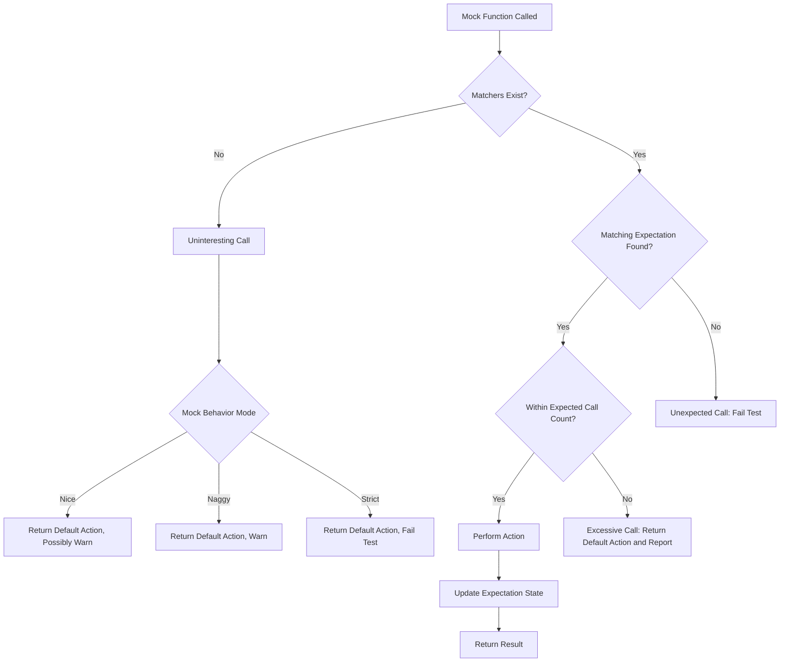

# Integration Troubleshooting

This page addresses common challenges users encounter when integrating GoogleTest and GoogleMock into C++ projects using CMake, Bazel, or other build systems. It focuses on problems related to dependency management, ABI compatibility, and proper build configuration for seamless adoption. Following these guidelines will help you unblock integration issues promptly.

---

## Frequently Asked Questions

### Why does my mock class fail to link or compile with errors about missing method definitions?
This usually occurs because your build system does not link GoogleMock properly or does not recognize generated mock implementations.

**Resolution:**
- Ensure you include the GoogleMock source or library in your build.
- When using CMake, link your test target to `gmock_main` or `gmock` as appropriate.
- For Bazel, include GoogleMock dependencies explicitly.
- If you separate mock class declarations and definitions, verify that constructors/destructors are defined in a `.cc` file included in the build.

### I get errors related to unprotected commas in `MOCK_METHOD`. How can I fix this?
The `MOCK_METHOD` macro parses its parameters at compile time and misinterprets unparenthesized commas within template arguments.

**Best Practices:**
- Wrap types with commas (e.g., `std::pair<int, int>`) inside extra parentheses.
  ```cpp
  MOCK_METHOD((std::pair<bool, int>), GetPair, ());
  MOCK_METHOD(bool, CheckMap, ((std::map<int, double>), bool));
  ```
- Alternatively, define type aliases and use them in `MOCK_METHOD` parameters:
  ```cpp
  using BoolIntPair = std::pair<bool, int>;
  MOCK_METHOD(BoolIntPair, GetPair, ());
  ```

### What does "uninteresting mock function call" mean and how do I handle it?
An *uninteresting call* is a call to a mock method without an associated `EXPECT_CALL`.

- By default, GoogleMock warns about these calls, which may indicate forgotten expectations.
- You can suppress these warnings by wrapping your mock with `NiceMock<T>`.
- Conversely, `StrictMock<T>` treats uninteresting calls as failures.
- To explicitly allow certain calls, add a catch-all expectation:
  ```cpp
  EXPECT_CALL(mock_obj, Method(_)).Times(AnyNumber());
  ```

### My tests fail due to "Unexpected mock function call" errors. What causes this?
An *unexpected call* happens when a mock method is called with arguments that don't match any `EXPECT_CALL` expectation.

**Solution:**
- Review your `EXPECT_CALL` argument matchers.
- Add more general expectations if needed, or verify that the code under test is calling mocks correctly.

### How can I ensure the order of mock calls in my tests?
Use `InSequence` or `Sequence` objects to specify expected call order:

```cpp
using ::testing::InSequence;
{
  InSequence s;
  EXPECT_CALL(mock_obj, Func1());
  EXPECT_CALL(mock_obj, Func2());
}
```

For partial orders, use multiple `Sequence` objects combined with `.InSequence(s1, s2)` or `.After(expectation)` clauses.

### What does `.RetiresOnSaturation()` do and when should I use it?
An expectation *retires* when it becomes inactive to allow other overlapping expectations to match calls.

- By default, expectations stay active even after their cardinality is reached ("sticky").
- `.RetiresOnSaturation()` makes an expectation retire immediately when it saturates, preventing upper-bound call errors for repeated arguments after the limit.
- Useful when overlapping expectations might otherwise cause hard-to-debug failures.

---

## Common Integration Issues & Solutions

### Linking Errors with Mock Methods
- Ensure you build and link against the GoogleMock library.
- If your mock classes declare constructors/destructors, define them in a `.cc` file compiled and linked by your build.
- With CMake, add:
  ```cmake
  target_link_libraries(your_test_target gmock_main)
  ```
  or 
  ```cmake
  target_link_libraries(your_test_target gmock)
  ```
- For Bazel, depend on `@com_google_googletest//:gmock` and `//:gtest` as needed.

### ABI Compatibility and Compiler Flags
- Use consistent compiler flags across your project and GoogleTest/GoogleMock builds.
- Mismatched standard library versions or C++ standard levels can cause runtime errors or failed tests.
- GoogleTest requires at least C++17; confirm your build settings meet this.

### Multiple Definitions or Duplicate Symbols
- Avoid including GoogleMock implementation files (`gmock-all.cc`, `gmock_main.cc`) in multiple targets.
- Only one target should compile/link these files, and tests should link against it.

### Unprotected Symbols in Static Linking
- When building static libraries, ensure all necessary template instantiations are visible.
- Consider compiling with `-fPIC` and linking properly.

### Macros Not Expanding Correctly
- If Windows headers redefine common function names (e.g., `Method`), it can interfere with macro expansions in mocks.
- Use the workaround of undefining or isolating macro expansions.
- Use provided `EXPECT_CALL` and `ON_CALL` macros as intended; avoid calling mock methods directly to prevent confusion.

---

## Best Practices for Successful Integration

- **Use public `MOCK_METHOD`s:** Always define mock methods in `public:` sections, even if base class methods are protected or private.
- **Set expectations before exercising code:** Define all `EXPECT_CALL`s before invoking functionality that uses mocks.
- **Handle overloaded methods carefully:** Use argument lists or `Const()` wrappers to disambiguate.
- **Suppress uninteresting call warnings consciously:** Prefer using `NiceMock` or explicit catch-all expectations over blindly adding `EXPECT_CALL`s.
- **Avoid mixing mocking styles:** Do not nest `NiceMock`, `NaggyMock`, and `StrictMock` excessively.
- **Match argument matchers to your test intent:** Overly strict matchers can cause brittle tests.

---

## Verifying and Resetting Mocks

Sometimes you want to explicitly verify that all expectations on a mock are satisfied before its destruction (e.g., for heap-allocated mocks):

```cpp
using ::testing::Mock;
...
ASSERT_TRUE(Mock::VerifyAndClearExpectations(&mock_obj));
```

You can also clear default actions and expectations:

```cpp
ASSERT_TRUE(Mock::VerifyAndClear(&mock_obj));
```

Use these methods carefully; do not set new expectations after clearing.

---

## Useful References

- [Defining and Using Mocks](/api-reference/mocking-framework-api/defining-mocks)
- [Expectations, Actions, and Sequences](/api-reference/mocking-framework-api/expectations-actions-sequences)
- [Nice, Strict, and Naggy Mock Classes](/api-reference/mocking-framework-api/mock-class-behavior-modes)
- [gMock Cookbook](docs/gmock_cook_book.md) for practical recipes
- [Mocking for Dummies](docs/gmock_for_dummies.md) for beginner-friendly explanation
- [Supported Platforms](/overview/integration-adoption/supported-platforms) for environment compatibility
- [CMake Integration Guide](/getting-started/environment-setup/install-platforms) for setting up GoogleTest with CMake

---

## Troubleshooting Checklist

- Validate your build system includes and links GoogleMock and GoogleTest correctly.
- Confirm consistent compiler versions and flags.
- Check for macro name conflicts due to platform headers.
- Use verbose logging flags (`--gmock_verbose=info`) during testing for detailed diagnostics.
- Use `NiceMock` or explicit catch-all `EXPECT_CALL` to fix uninteresting call warnings.
- When mocking move-only types, verify usage with `WillOnce` and lambda actions.

---

## Tips for Effective Use

- Write minimal expectations reflecting your real testing goals.
- Use `.RetiresOnSaturation()` to avoid call count conflicts with overlapping expectations.
- Leverage `InSequence` and `.After()` for ordered and partially ordered call expectations.
- Prefer `ON_CALL` for default behaviors without asserting call presence.
- Suppress warnings and errors for uninteresting calls strategically with `NiceMock` or `StrictMock`.

---

### Example: Suppress Uninteresting Call Warning with NiceMock

```cpp
using ::testing::NiceMock;
class MockFoo {
 public:
  MOCK_METHOD(int, DoSomething, (), ());
};

TEST(FooTest, SuppressWarnings) {
  NiceMock<MockFoo> mock;
  ON_CALL(mock, DoSomething()).WillByDefault(Return(42));
  // No warning if DoSomething() is called without explicit EXPECT_CALL.
  int result = mock.DoSomething();
  EXPECT_EQ(result, 42);
}
```

### Example: Use `.RetiresOnSaturation()` to Allow Multiple Expectations

```cpp
using ::testing::_;  
using ::testing::RetiresOnSaturation;
using ::testing::Exactly;

EXPECT_CALL(mock, Func(5))
    .Times(Exactly(1))
    .RetiresOnSaturation();
EXPECT_CALL(mock, Func(_))
    .Times(Exactly(1));

// Calls
mock.Func(5);  // Matches first expectation and retires it
mock.Func(10); // Matches second expectation
```

---

For detailed integration instructions and troubleshooting of build issues, please refer to the [Installing GoogleTest guide](/getting-started/environment-setup/install-platforms) and the [Troubleshooting Setup & Installation guide](/getting-started/environment-setup/troubleshooting-setup).

---

## Diagram of Mock Call Handling in GoogleMock



---

This diagram summarizes how GoogleMock processes calls to mocked methods,
distinguishing uninteresting, unexpected, expected, and excessive calls, and
shows where user-configured behavior modes influence the results.

---