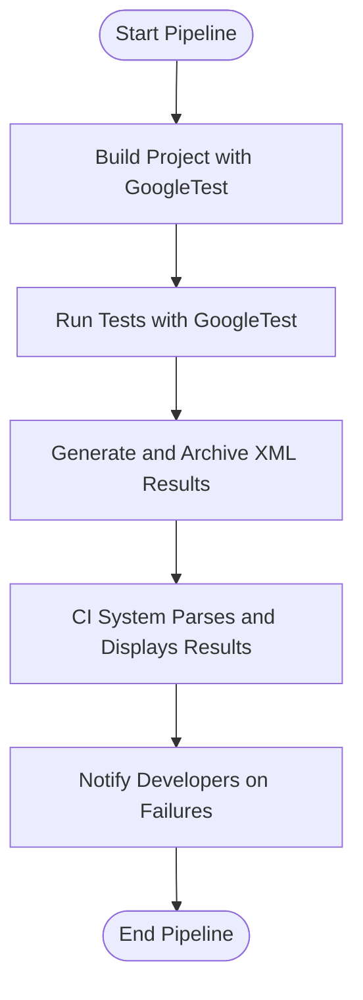

# What Should I Know About Using GoogleTest in CI/CD Environments?

Integrating GoogleTest into your Continuous Integration and Continuous Deployment (CI/CD) pipelines unlocks automated validation, faster feedback loops, and higher software quality. However, to realize these benefits effectively, you need to understand best practices, common pitfalls, and how to configure GoogleTest runs for automation environments.

---

## 1. Setting Up Your Build System for CI

### Use CMake or Bazel Integration

GoogleTest supports both CMake and Bazel build systems, enabling seamless test inclusion in your CI builds:

- **CMake**: Use `FetchContent` or add GoogleTest as an external project. Link your test targets against `gtest` or `gtest_main` to get the default test runner.
- **Bazel**: Add GoogleTest as an external dependency and define test targets with the required attributes for automated test discovery.

Make sure your CI build fetches dependencies and builds all components with the appropriate configuration and compiler flags.

### Tips:

- Prefer linking with `gtest_main` to get an out-of-the-box `main()` function that initializes GoogleTest and runs all tests.
- If you require custom setup, define your own `main()` but always call `testing::InitGoogleTest()` before `RUN_ALL_TESTS()`.

## 2. Running Tests in Parallel on CI Agents

To speed up test execution on CI agents, leverage parallelization strategies:

- **Test Sharding**: Use gTest’s `--gtest_shard_index` and `--gtest_total_shards` flags to split your test cases across multiple parallel jobs.
- **Concurrent Test Executions**: Run multiple test binaries concurrently if tests are split into modules.
- **Thread-Safe Tests**: Ensure your tests are thread-safe if running multi-threaded test executors (GoogleTest itself is thread-safe for test management).

### Example on Test Sharding:

```bash
# On shard 0 of 3
./your_test_binary --gtest_shard_index=0 --gtest_total_shards=3

# On shard 1 of 3
./your_test_binary --gtest_shard_index=1 --gtest_total_shards=3

# On shard 2 of 3
./your_test_binary --gtest_shard_index=2 --gtest_total_shards=3
```

## 3. Producing and Parsing Test Results

For automation, the output format is crucial to feed results back to dashboards or CI UI.

- **JUnit XML Output**: Use the `--gtest_output=xml:<path>` flag to generate standard XML test result files. Most CI systems support uploading JUnit XML for visualization and tracking.
- **JSON/XML with GoogleMock Details**: If you use GoogleMock extensively, the XML captures detailed test results including failures and stack traces.

### Best Practice:

- Ensure your CI workflow archives and uploads these result files for traceability.
- Integrate with CI plugins/tools that consume JUnit XML reports to surface flaky tests, regressions, or test coverage.

## 4. Environment Configuration Tips

- **Determinism**: Enable consistent test ordering, or explicitly use `--gtest_shuffle` with seeds for reproducibility.
- **Suppressing Extra Output**:
  - Use `--gmock_verbose=warning` or `error` to reduce noise from GoogleMock messages.
  - Control stack trace depth with `--gtest_stack_trace_depth=<n>`.
- **Managing Leak Detection**:
  - GoogleTest can detect leaked mocks; ensure mock lifetimes are well-managed in your tests.
  - Use `Mock::AllowLeak()` to suppress false positives when intentional.

## 5. Debugging Failed Automation Builds

When tests fail on CI but not locally, consider the following:

- **Check Environment Differences**: Library versions, compiler flags, environment variables.
- **Verbose Flag Usage**: Run with `--gtest_verbose=info` and `--gmock_verbose=info` to get detailed traces of mock calls and expectations.
- **Enable Heap Checker**: Helps identify leaks or improper mock destruction, especially if you create mocks on the heap.
- **Use Logs and Artifacts**: Upload test logs, stack traces, and result XML to the CI system.

## 6. Typical CI/CD Pipeline Integration Flow



## 7. Common Troubles and How to Address Them

<AccordionGroup title="Common CI/CD Integration Challenges">
<Accordion title="Tests Not Running or Detected">
Ensure that your test binaries are correctly linked with `gtest_main`, or provide your own main function properly calling `InitGoogleTest()`. Verify test discovery by running tests locally with `--gtest_list_tests`.
</Accordion>
<Accordion title="Test Failures Only On CI">
Validate environment consistency, including compilers and dependency versions. Use verbose flags to detect differences in behavior and output detailed traces to diagnose timing or threading issues.
</Accordion>
<Accordion title="Test Result Files Not Parsed">
Check your CI configuration to confirm the paths where XML result files are generated and ensure those paths are correctly specified for publishing reports.
</Accordion>
<Accordion title="Mock Failures and Unexpected Calls">
Review your `EXPECT_CALL` and `ON_CALL` usage to ensure expectations are correctly set prior to test execution. Consider using `NiceMock` or `StrictMock` to control uninteresting call warnings or errors.
</Accordion>
</AccordionGroup>

## 8. Additional Recommendations

- **Seed and Shuffle Tests**: To detect flaky or interdependent tests, randomly shuffle test order using the `--gtest_shuffle` flag.
- **Use Proper Mock Strictness**: Utilize `NiceMock`, `NaggyMock`, and `StrictMock` decorators based on your tolerance for uninteresting calls and test brittleness.
- **Automate Test Runs on Pull Requests**: Trigger GoogleTest runs early to prevent regressions from merging.

---

## Useful Command-Line Flags Summary

| Flag                               | Description                             |
|-----------------------------------|---------------------------------------|
| `--gtest_output=xml:<file>`        | Generates JUnit XML test result file  |
| `--gtest_shard_index=<n>`          | Current shard index for parallel runs |
| `--gtest_total_shards=<count>`     | Total shards for splitting tests      |
| `--gtest_verbose=LEVEL`             | Controls test output verbosity         |
| `--gmock_verbose=LEVEL`             | Controls GoogleMock output verbosity   |
| `--gtest_shuffle`                  | Randomize test execution order         |
| `--gtest_repeat=<count>`           | Repeat tests to uncover flakiness     |
| `--gtest_stack_trace_depth=<n>`    | Number of stack frames printed on failure |

---

## References & Further Reading

- [GoogleTest Primer](https://google.github.io/googletest/primer.html)
- [GoogleMock Cookbook](https://google.github.io/googletest/gmock_cook_book.html)
- [Integrating with Bazel and CMake](https://github.com/google/googletest/blob/main/docs/guides/integration-solutions/build-integration.md)
- [GoogleTest Flags Documentation](https://github.com/google/googletest/blob/main/googletest/docs/advanced.md#running-the-tests)
- [Troubleshooting Common Setup Issues](https://google.github.io/googletest/getting-started/troubleshooting-validation/common-setup-issues.html)

---

## Summary

Integrating GoogleTest with CI/CD pipelines requires configuring your build system, managing parallel test execution, producing parseable results, and debugging failures effectively. Use standard output formats like JUnit XML, leverage GoogleTest’s native sharding features for scaling, and enable verbosity flags to get detailed insights. Following best practices around environment consistency and mock strictness modes ensures robust and maintainable test automation.

<Tip>
For complex pipelines, script test invocations with proper flags and upload XML results to your CI server for best visibility.
</Tip>

<Check>
Verify that `testing::InitGoogleTest()` is always called before `RUN_ALL_TESTS()`, especially when implementing your own `main()`.
</Check>

---