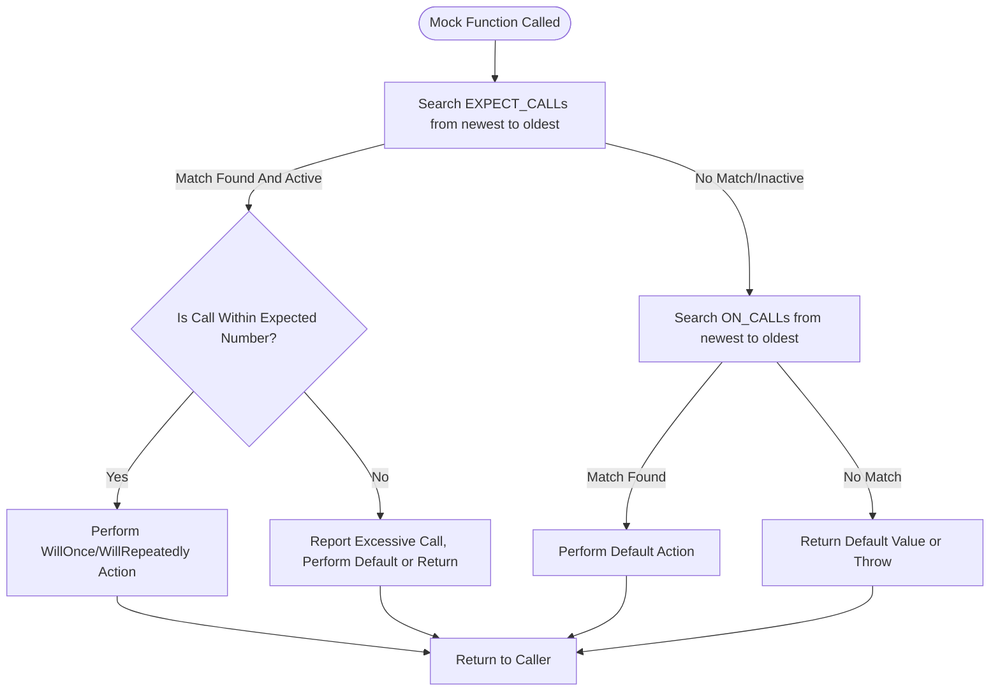

# Why does mocking not work as expected?

GoogleMock (gMock) is a powerful C++ framework for creating and managing mock objects in unit tests. However, sometimes users encounter issues where mocking does not behave as anticipated. This FAQ page covers common pitfalls and helps you debug problems related to mock method declarations, incorrect usage of `EXPECT_CALL` and `ON_CALL`, and mock object lifetime management.

---

## Common Causes of Mocking Issues

### 1. Mock Method Declarations Don't Match the Real Method Signature

To properly mock a method in GoogleMock, you must declare the mock method with the exact signature of the method you are overriding, including constness, noexcept, reference qualifiers, and argument types.

- **Virtual Methods Are Required:** Only virtual methods may be mocked directly. Non-virtual methods require alternative techniques such as interface extraction or dependency injection.
- **Qualifiers Must Match:** If the original method is `const`, `noexcept`, or has reference qualifiers (`&` or `&&`), the mock method declaration must include them too.
  
**Example:**
```cpp
class Foo {
 public:
  virtual int Bar(int x) const noexcept = 0;
};

class MockFoo : public Foo {
 public:
  // Correct mock method declaration.
  MOCK_METHOD(int, Bar, (int x), (const, noexcept, override));
};
```

If you omit or mismatch these qualifiers, your mock expectations might not trigger, or the real method might be called instead.

### 2. Incorrect Usage or Syntax of `EXPECT_CALL` and `ON_CALL`

#### `EXPECT_CALL` vs `ON_CALL`

- `EXPECT_CALL` sets an expectation that the mocked method **will be called** with specified arguments or matchers a certain number of times.
- `ON_CALL` sets *default* behavior for mocked methods but does **not** imply any expectation of calls.

Using `ON_CALL` when you expect a method to be called will **not** cause failures if the method isn't called, and using `EXPECT_CALL` incorrectly may cause expectations to be never satisfied.

#### Omitting Argument Matchers

When you omit the matcher list in `EXPECT_CALL` or `ON_CALL` for non-overloaded methods, all arguments are treated as wildcards matching anything.

```cpp
// Matches any arguments
EXPECT_CALL(mock, Foo());
// Equivalent to
EXPECT_CALL(mock, Foo(_));
```

However, for overloaded methods, you must specify exact argument matchers to disambiguate. Otherwise, you will get compilation errors or ambiguous calls.

#### Order of Modifiers in `EXPECT_CALL`

Ensure that chainable clauses for `EXPECT_CALL` are used in the correct order:

```cpp
EXPECT_CALL(mock, Method(matchers...))
    .With(multi_argument_matcher) // optional but at most once, and first clause
    .Times(cardinality)           // optional, at most once
    .InSequence(sequences...)     // can appear any number of times
    .After(expectations...)       // can appear any number of times
    .WillOnce(action)             // can appear any number of times
    .WillRepeatedly(action)       // at most once
    .RetiresOnSaturation();       // at most once, must be last
```

Violating this order results in errors or warnings.

### 3. Mock Object Lifetime and Verification

- **Expectations Are Verified on Destruction:** By default, GoogleMock verifies all expectations on a mock object when the mock object is destroyed. If the mock object does not get destroyed (e.g., leaked), expectations are never verified, which can cause false positives.

- **Allowing Leaks:** If you intentionally want to leak a mock object, use `Mock::AllowLeak(pointer)` to suppress errors.

- **Explicit Verification:** To ensure expectations are verified, especially for heap-allocated mocks, call

  ```cpp
  ASSERT_TRUE(Mock::VerifyAndClearExpectations(mock_pointer));
  ```

  before the mock is destroyed or at the end of the test.

### 4. Uninteresting Calls and Strictness

- Methods called without matching any `EXPECT_CALL` are considered **uninteresting calls**.
- By default, uninteresting calls cause warnings but do not fail tests.
- Use `NiceMock`, `NaggyMock`, or `StrictMock` wrappers to control behavior:
  - `NiceMock`: suppresses warnings for uninteresting calls.
  - `NaggyMock`: (default) prints warnings.
  - `StrictMock`: treats uninteresting calls as failures.

### 5. Overlapping or Overlapping Expectations

Newer expectations take precedence over older ones. If you experience unexpected behavior, review the order of your `EXPECT_CALL`s:

```cpp
EXPECT_CALL(mock, Foo(_)).WillRepeatedly(Return(0));
EXPECT_CALL(mock, Foo(5)).WillRepeatedly(Return(1));
```

Here, calls with argument 5 return 1; others return 0. Placing the more specific expectation last ensures it takes precedence.

### 6. Macro Expansion Pitfalls

If your method names are macros, such as Windows API functions, macro expansion may cause compilation errors or unexpected behavior. Use gMock facilities carefully to handle these cases.

```cpp
#define Method MethodW
ON_CALL(mock, Method());  // Works correctly with macro-expanded method name
#undef Method
```

### 7. Mocking Methods with Move-Only Types

Support was added recently for mocking methods with move-only types (e.g., `std::unique_ptr`). If you experience issues, ensure you use the newer `MOCK_METHOD` syntax properly and avoid older workarounds.


---

## Debugging Tips and Recommendations

### Use Verbose Mode for Tracing Mock Calls

Run your tests with the flag:

```
--gmock_verbose=info
```

This will print detailed traces for each mock call, including which `EXPECT_CALL` it matched or why it failed to match. This insight can reveal subtle mismatches in arguments or ordering.

### Verify Mock Method Signatures

Ensure all mock methods use the `MOCK_METHOD` macro with exact signatures, including the following:

- Return type
- Method name
- Parameter types (including const and reference qualifiers)
- Qualifiers such as `const`, `override`, `noexcept`, and `ref(&)` or `ref(&&)` if applicable

Example:
```cpp
MOCK_METHOD(void, Foo, (int x, const std::string& s), (const, override));
```

### Control Default Behavior with ON_CALL

Use `ON_CALL` to specify default actions for your mocked methods, so uninteresting calls behave as expected without causing warnings or failures.

### Avoid Over-Specification

Only set expectations that you need to verify. Overly strict tests make refactoring difficult and brittle.

### Check for Overlapping Expectations

Review if multiple `EXPECT_CALL`s match the same calls unintentionally, especially when using matchers like `_`.

### Use Sequences and `After()` for Call Ordering

If order matters, use `Sequence` and `InSequence` helpers or `.After()` clauses to specify the expected call order.

### Allow Mock Leaks Only When Intentional

Leaking mocks may hide failed expectations. Prefer explicit destruction or verification.

---

## Common Failure Scenarios and How to Fix

### Unexpected Call Failures

Symptom:

- Test fails saying "Unexpected mock function call".
- Call arguments do not match any `EXPECT_CALL`.

Fix:

- Verify that the call arguments match the argument matchers in `EXPECT_CALL`.
- Check if expectations cover all argument combinations expected.

### Unsatisfied Expectations

Symptom:

- Test fails during verification saying "Actual function call count doesn't match EXPECT_CALL".

Fix:

- Ensure the mocked method has been called the expected number of times.
- Check for mismatches in argument matchers or incomplete coverage.

### Too Many or Too Few Actions

Symptom:

- Warnings about "Too few actions specified" or "Actions ran out".

Fix:

- Provide a sufficient number of `.WillOnce()` actions matching `.Times()`.
- Add `.WillRepeatedly()` to cover extra calls.

### Retired Expectations

Symptom:

- Failure messages complaining about calls matching retired expectations.

Fix:

- Understand `.RetiresOnSaturation()` usage; ensure expectations are not used after retirement.

### Uninteresting Call Warnings

Symptom:

- Warnings about uninteresting calls when no `EXPECT_CALL` exists.

Fix:

- Add `EXPECT_CALL(...).Times(AnyNumber())` for methods that can be called without strict expectation.
- Use `NiceMock` to suppress warnings.

---

## Summary of Best Practices

- Always declare mock methods with the exact signature of the base method.
- Use `EXPECT_CALL` to specify expected calls with appropriate matchers.
- Use `ON_CALL` to define default behaviors without expectation enforcement.
- Use `NiceMock`, `NaggyMock`, or `StrictMock` to control warnings on uninteresting calls.
- Use sequences (`Sequence`, `InSequence`) or `.After()` to specify call order.
- Verify mock expectations explicitly when necessary using `Mock::VerifyAndClearExpectations()`.
- Avoid leaking mock objects; use `Mock::AllowLeak()` only when intentional.
- Run with `--gmock_verbose=info` to diagnose match failures with detailed logs.

---

## Quick Reference Links

- [Mocking Reference](reference/mocking.md): Detailed API definitions and usage.
- [gMock Cookbook](docs/gmock_cook_book.md): Recipes and best practices.
- [Mock Strictness Guide](guides/mocking-masterclass/mock-class-strictness.mdx): How to use NiceMock, NaggyMock, StrictMock.
- [Matchers and Expectations Concepts](concepts/core-building-blocks/matchers-and-expectations.mdx): Understanding matchers and calls.


---

## Additional Resources

For more details and guided examples on mocking, visit the following:

- [Using GoogleMock Strictness Wrappers](guides/mocking-masterclass/mock-class-strictness)
- [Best Practices for Writing Mock Expectations](guides/getting-started/mocking-basics)
- [Debugging Mock Failures](faq/troubleshooting-faq/mocking-does-not-work-as-expected)
- [Common GMock Macros Explained (`ON_CALL`, `EXPECT_CALL`)](reference/mocking.md#ON_CALL)

Timing issues or complex test interactions involving mocks are discussed in the [Concurrency Usage](guides/beyond-basics/death-tests-and-errors.md#concurrency-in-mocks) and [Advanced Matching Techniques](guides/writing-effective-tests/advanced-matchers.mdx).

Prepare your mock objects with a clear understanding of their lifecycle and expectations to make your tests robust, precise, and maintainable.

---

<Info>
If you encounter baffling behavior, first increase verbosity using `--gmock_verbose=info` to gain insights about which expectations matched or failed. Use this information to adjust your mocks accordingly.
</Info>


---

### Diagram: Mock Call Matching Flow


This flow captures the logic GoogleMock uses to match function calls to specifications and execute appropriate behaviors.


---

### Troubleshooting Example: Unexpected Call

Suppose you have this expectation:

```cpp
EXPECT_CALL(foo, Bar(5));
```

but the call:

```cpp
foo.Bar(6);
```

fails as an unexpected call. Using verbose mode, you may see:

```
Mock function call matches EXPECT_CALL(foo, Bar(5))...
Function call: Bar(6)

Google Mock tried the following 1 expectation, but it didn't match:

Expected arg #0: is equal to 5
Actual: 6
```

This message clarifies that the argument 6 does not match the expected 5.


---

### FAQ Recap
- Why are my expectations not triggered? Check mock method signature and qualifiers.
- Why do I see unexpected call failures? Review argument matchers and call ordering.
- Why do I get uninteresting call warnings? Use `EXPECT_CALL(...).Times(AnyNumber())` or wrap mocks with `NiceMock`.
- Why isn't my mock verified? Make sure mock objects are destroyed or explicitly verify them.


---

This page is part of the GoogleMock troubleshooting FAQ. For more help, visit [Getting Support & Community Resources](faq/support-and-community/getting-help-support.md).


---

<Check>
Always define your mock methods precisely and verify your expectations promptly to avoid confusing behaviors and test failures with GoogleMock.
</Check>


---