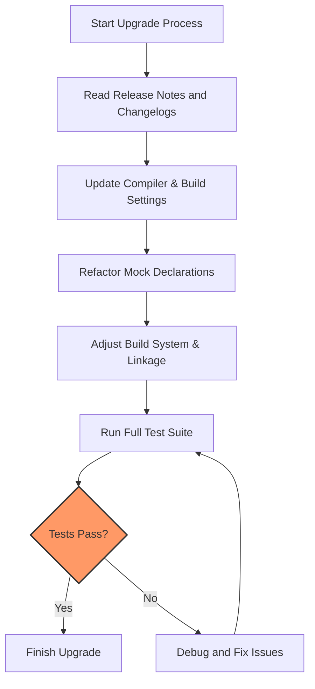

# Migration & Upgrades

Upgrading GoogleTest or GoogleMock to newer versions can introduce important changes that affect your existing tests and build environment. This guide helps you navigate common upgrade challenges, understand breaking changes, and maintain compatibility with evolving API requirements and platform standards.

---

## 1. Overview of Upgrade Challenges

When upgrading GoogleTest or GoogleMock, expect changes that may require code or build system adjustments. These can include:

- API modifications that alter macros, function signatures, or behaviors
- Minimum required C++ standard versions being increased
- Deprecations and removals of older features or flags
- Changes in library usage, such as linking requirements or artifact names

Understanding these facets ahead of time helps reduce migration effort and test disruptions.

---

## 2. API and Usage Changes

GoogleTest and GoogleMock evolve their APIs to improve usability, correct inconsistencies, or fix design issues. Key points to consider:

### MOCK_METHOD Macro Updates

- The `MOCK_METHOD` macro signature has been refined to better support qualifiers like `const`, `override`, `noexcept`, and `Calltype`. Ensure your mock definitions use the updated syntax. 
- If your code uses legacy mock method macros, migrate to the current `MOCK_METHOD` syntax to avoid deprecation warnings or incompatibilities.

### Expectation and Behavior Specification

- Clauses within `EXPECT_CALL` and `ON_CALL` macros, such as `.Times()`, `.WillOnce()`, `.WillRepeatedly()`, and `.RetiresOnSaturation()`, have been streamlined. Review your expectation clauses to confirm compatibility.
- The ordering of chained clauses is essential; upgrades may enforce stricter ordering rules.

### Default Actions and Default Values

- The `DefaultValue<T>` template supports setting global defaults for mocked return values. Verify any custom default values align with changes in behavior initialization.

### Flag Names and Usage

- Some flag names, like `--gmock_verbose` or `--gmock_catch_leaked_mocks`, may have updated accepted values or defaults. Confirm command-line flags and programmatic flag handling conform to current standards.

---

## 3. Minimum C++ Version Requirements

- Recent GoogleTest/GoogleMock releases require a minimum of C++11 or later, with some requiring C++14 or C++17 features.
- Upgrade your compiler and build configurations to support these standards.
- Adjust CMake or build script settings to reflect the new minimum standards, using `set(CMAKE_CXX_STANDARD 11)` or higher as appropriate.

---

## 4. Build System and Linking Considerations

- When using CMake for GoogleMock, the `gmock` and `gmock_main` libraries are provided separately. `gmock_main` includes the `main()` function for tests and should be linked accordingly.
- If switching versions, ensure your target link libraries and include directories are updated to match new installation paths or library names.
- The internal use of `gtest` libraries and threading libraries (`@CMAKE_THREAD_LIBS_INIT@`) are managed automatically in modern CMake scripts. Confirm your CMakeLists.txt is aligned with the current conventions.

---

## 5. Breaking Changes to Watch For

- Removal of old macros or deprecated flags.
- Changes to mock object lifecycle management including verification and leak detection.
- Adjustments to strictness behavior: handling of `NaggyMock`, `NiceMock`, and `StrictMock` wrappers.
- Modifications in behavior of asynchronous or multi-threaded testing support.

Review the full changelog and migration notes for detailed listings of breaking changes.

---

## 6. Recommendations for a Smooth Upgrade

<Steps>
<Step title="Review Release Notes and Changelog">
Always start by reading the release notes of the new version to identify any breaking API changes or platform requirements that affect your project.
</Step>
<Step title="Update Compiler and Build Environment">
Upgrade your compiler toolchain to support any new minimum C++ standards. Adjust build configuration files to set the proper standard and link updated libraries.
</Step>
<Step title="Refactor Mock and Test Code">
Modify mock class declarations to use the updated `MOCK_METHOD` syntax and update expectation clauses to match new patterns.
</Step>
<Step title="Test Thoroughly and Verify Behavior">
Run your full test suite and review test results carefully to catch any subtle changes in mock behavior, call order enforcement, or verification failures.
</Step>
<Step title="Use Verbose Flags for Diagnostics">
Set `--gmock_verbose=info` during test runs to get more detailed diagnostic output, aiding in tracking down unexpected failures or behavior.
</Step>
<Step title="Consult Migration Guides and FAQs">
Reference official migration guides, FAQs, and community forums for common issues and solutions encountered during upgrades.
</Step>
</Steps>

---

## 7. Common Pitfalls and How to Avoid Them

- **Outdated MOCK_METHOD usage:** Using legacy macros without updating can cause compile errors.
- **Mismatch in call qualifiers:** Ensure `const`, `override`, `noexcept`, and reference qualifiers exactly match the base class methods.
- **Failure to update build scripts:** Not adjusting library names or flags leads to linker errors.
- **Insufficient C++ standard level:** Older compiler settings cause feature unavailability.
- **Unmanaged flag changes:** Deprecated flag names or values can be silently ignored or cause unexpected behavior.

To prevent these, automate checks with continuous integration, enable compiler warnings, and incrementally test changes.

---

## 8. Troubleshooting Upgrade Issues

<AccordionGroup title="Troubleshooting Common Upgrade Problems">
<Accordion title="Linker Errors After Upgrade">
- Ensure you link to `gmock_main` if your tests need a main function.
- Confirm library paths and names match installed version outputs (use `gmock.pc.in` and `gmock_main.pc.in` as references).
- Check for threading libraries linkage, especially on POSIX platforms.
</Accordion>
<Accordion title="Compile Errors in MOCK_METHOD">
- Review the upgraded macro syntax requirements.
- Surround complex argument types with additional parentheses.
- Confirm all mocked methods have virtual qualifiers matching the interface.
</Accordion>
<Accordion title="Test Failures Due to Mock Expectations">
- Verify expectations clauses order and correctness.
- Utilize verbose logging (`--gmock_verbose=info`) to detect unmet or unexpected calls.
- Review lifetime and object ownership of mocks.
</Accordion>
<Accordion title="Build Fails Due to C++ Version">
- Verify `CMAKE_CXX_STANDARD` is set to at least 11 or higher.
- Update compiler to a supported version.
</Accordion>
</AccordionGroup>

---

## 9. References and Further Reading

- [GoogleTest Changelog and Release Notes](https://github.com/google/googletest/releases)
- [gMock for Dummies](https://google.github.io/googletest/gmock_for_dummies.html)
- [Mocking Reference](https://google.github.io/googletest/reference/mocking.html)
- [gMock Cheat Sheet](https://google.github.io/googletest/gmock_cheat_sheet.html)
- [Build System Integration FAQ](../../faq/troubleshooting-integration/build-system-integration-qa.md)
- [Writing Maintainable Tests](../../guides/best-practices-and-troubleshooting/writing-maintainable-tests.md)

---

## 10. Summary

Upgrading GoogleTest and GoogleMock requires awareness of API refinements, build system changes, and platform requirements. Carefully adapting mock declarations, build configuration, and test expectations ensures compatibility and leverages improvements in the latest releases. Combining thorough testing with diagnostic controls will smooth the transition and maintain robust test coverage.

---

<Check>
Helpful Tip: Always keep backup branches of your test code when performing major upgrades to easily revert and compare behavior.
</Check>


---

## 11. Example: Adjusting Mock Method Signature

Suppose you previously declared:

```cpp
MOCK_METHOD0(GetSize, int());
```

Upgrading may require the updated syntax with explicit empty parentheses for arguments and override qualifiers:

```cpp
MOCK_METHOD(int, GetSize, (), (const, override));
```

If your method is `const` and overrides a virtual function, adding `(const, override)` is now mandatory for compatibility and correctness.

---

## 12. Example: Correcting EXPECT_CALL Clause Order

Old style:

```cpp
EXPECT_CALL(mock_obj, Foo())
    .WillOnce(Return(1))
    .Times(3);  // Incorrect order
```

Updated correct order:

```cpp
EXPECT_CALL(mock_obj, Foo())
    .Times(3)
    .WillOnce(Return(1));
```

Reordering ensures proper parsing and test behavior.

---

## 13. Example: Updating CMakeLists.txt Snippet

```cmake
# Minimum C++ standard update
set(CMAKE_CXX_STANDARD 14)

# Link Google Mock libraries
find_package(GMock REQUIRED)

target_link_libraries(my_test_target PRIVATE GMock::gmock_main)
```

Ensure `CMakeLists.txt` aligns with new package and library targets to succeed in the upgrade.

---

## 14. Diagram: Upgrade Workflow



Follow this systematic flow to ensure your upgrade is successful and maintainable.
