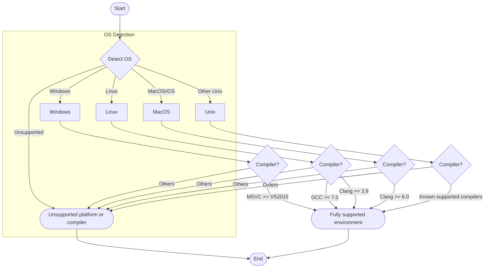

# What platforms and compilers are supported?

This document summarizes the officially supported platforms, compilers, and language standards for GoogleTest and GoogleMock, providing guidance to help you understand compatibility and troubleshoot unsupported or partially supported environments.

---

## Overview of Supported Platforms

GoogleTest (and GoogleMock) supports a broad range of operating systems aligned with Google's official C++ support policy. Support is maintained for environments where C++17 or later is available, reflecting the minimum language standard required.

### Supported Operating Systems

- **Windows** (including MSVC 2015 and newer)
- **Linux** (including Android variants)
- **macOS** and **iOS**
- **FreeBSD, OpenBSD, NetBSD**
- **Solaris**
- **AIX**
- **Haiku**
- **QNX**
- **Various embedded platforms** with partial support

This extensive support ensures that tests written with GoogleTest and GoogleMock will run consistently across a variety of real-world deployment environments.

## Compiler Support

GoogleTest requires a compiler with full support for C++17. Supported compilers include, but are not limited to:

- **MSVC** (Visual Studio 2015 or later)
- **GCC** (versions supporting C++17 features, generally 7.0+ recommended)
- **Clang/LLVM** (versions with C++17 support)
- **Intel C++ Compiler** with appropriate C++17 compatibility

### Compiler and Language Features Important for GoogleTest

- Full or partial RTTI support (Run-Time Type Information)
- Exception handling support (required for some features)
- Threading libraries (e.g., `pthreads` on POSIX platforms)

GoogleTest also detects platform features and compiler traits to adapt accordingly, but the above represent recommended environments.

## Language Standard Requirements

The minimum required C++ standard is **C++17**. This facilitates:

- Use of modern language constructs that simplify the test code
- Better compatibility with standard library features
- Improved compiler diagnostics and optimizations

Ensure your build environment sets the appropriate flags, such as `-std=c++17` for GCC/Clang or `/std:c++17` for MSVC.

## Supported Platforms Details from Internal Macros

Under the hood, GoogleTest uses internal macros to detect the OS and adapt accordingly. Some examples include:

- `GTEST_OS_WINDOWS` for Windows variants
- `GTEST_OS_LINUX`, `GTEST_OS_MAC`, `GTEST_OS_FREEBSD`, etc., for Unix-like systems

These macros govern how GoogleTest configures itself and how it manages platform-specific features like threading, file system access, and regex handling.

## Threading and Synchronization

Thread safety is an important aspect:

- GoogleTest is thread-safe on systems where `pthreads` or Windows threading APIs are available.
- Platform checks ensure the correct synchronization primitives are used.

If your platform does not support these features, GoogleTest will disable thread safety features accordingly.

## Troubleshooting Unsupported or Partially Supported Configurations

If your platform or toolchain is not officially supported or lacking full C++17 capabilities:

- You may encounter **build errors** or **linker issues**.
- GoogleTest may not run correctly or could lack some features like death tests, stream redirection, or typed tests.

### Recommendations

1. **Verify compiler and OS compatibility** with the supported list above.
2. **Ensure C++17 standard support** is enabled in your compiler settings.
3. **Check feature macros** such as `GTEST_HAS_PTHREAD` if multi-threaded test execution is desired.
4. If using a cross-compiler or embedded system, consider:
   - Setting specific feature macros manually to adjust GoogleTest’s behavior.
   - Consulting platform maintainers or community forums.
5. Use the [GoogleTest Primer](https://github.com/google/googletest/blob/main/docs/primer.md) and [Installation with CMake](https://github.com/google/googletest/blob/main/docs/installation-cmake.md) for practical tips.

## Summary Table of Key Configuration Macros

| Macro Name                 | Purpose                                          | Typical Assigned Value |
|----------------------------|-------------------------------------------------|------------------------|
| `GTEST_HAS_PTHREAD`         | Indicates pthreads availability                  | 1 (if pthread available), else 0 |
| `GTEST_HAS_RTTI`            | Enables RTTI support                             | 1 (if RTTI enabled) |
| `GTEST_HAS_EXCEPTIONS`      | Enables exception support                        | 1 (if exceptions enabled) |
| `GTEST_HAS_DEATH_TEST`      | Enables death test support                       | 1 (if supported) |
| `GTEST_IS_THREADSAFE`       | Enables thread safety                            | 1 (if platform supports) |
| `GTEST_HAS_STD_WSTRING`     | Indicates use of `std::wstring`                  | 1 (if available) |
| `GTEST_HAS_POSIX_RE`        | Enables POSIX regex support                       | 1 if platform supports POSIX regex |

## Practical Tips for Ensuring Compatibility

- Build GoogleTest with its **native CMake scripts**, which automatically detect supported features and set appropriate macros.
- Use updated compilers that fully respect the **C++17 standard**.
- Consult the [System Requirements](https://github.com/google/googletest/blob/main/docs/system-requirements.md) for comprehensive platform and compiler info.
- When targeting embedded or unusual platforms, consider using GoogleTest’s macros to conditionally compile only supported features.

## Related Topics

- [System Requirements](https://github.com/google/googletest/blob/main/docs/system-requirements.md)
- [Installation with CMake](https://github.com/google/googletest/blob/main/docs/installation-cmake.md)
- [GoogleTest Primer](https://github.com/google/googletest/blob/main/docs/primer.md)
- [GoogleMock for Dummies](https://google.github.io/googletest/gmock_for_dummies.html)

---

## Example: Compiler Flag Settings in CMake

Below snippet shows typical CMake configuration ensuring proper compiler flags on supported platforms:

```cmake
set(CMAKE_CXX_STANDARD 17)
set(CMAKE_CXX_STANDARD_REQUIRED ON)

# Example for MSVC static CRT
if(MSVC)
  foreach(flag_var
          CMAKE_C_FLAGS CMAKE_C_FLAGS_DEBUG CMAKE_C_FLAGS_RELEASE
          CMAKE_CXX_FLAGS CMAKE_CXX_FLAGS_DEBUG CMAKE_CXX_FLAGS_RELEASE)
    string(REPLACE "/MD" "-MT" ${flag_var} "${${flag_var}}")
  endforeach()
endif()
```

This ensures the compiler is set to C++17, and addresses runtime library inconsistencies in MSVC.

## Summary Diagram: Platform Detection Flow



This flow illustrates how GoogleTest determines support based on OS and compiler versions.

---

## Conclusion

GoogleTest and GoogleMock provide robust support for a wide variety of platforms and compilers underpinned by C++17 capabilities. By confirming that your build environment aligns with these requirements and leveraging provided macros and build scripts, you can ensure smooth setup and reliable testing workflows.

<Tip>
Ensure your compiler and environment support C++17 and threading facilities to fully leverage GoogleTest features.
</Tip>

<Tip>
Use the official CMake scripts provided to automatically detect platform features and set correct compiler flags.
</Tip>

<Tip>
Consult the related [System Requirements](https://github.com/google/googletest/blob/main/docs/system-requirements.md) and installation guides for detailed setup instructions.
</Tip>

---

## Getting Further Help

If you encounter challenges with unsupported platforms or compilers, reach out via the official GoogleTest mailing list or browse community forums. Participating in GitHub issues or reviewing the contribution guides can also provide guidance.

Related support resources:

- **GoogleTest GitHub Repository:** [https://github.com/google/googletest](https://github.com/google/googletest)
- **Mailing List:** googletestframework@googlegroups.com
- **Community Forums:** Available via Google and GitHub discussions

---