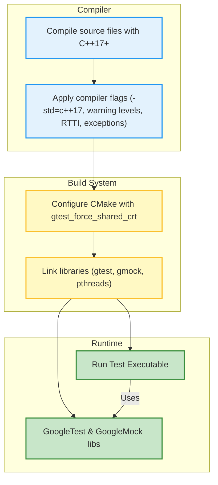

# Build, Linking, and Compiler Issues FAQ

This FAQ page provides focused guidance on frequently encountered build, linking, and compiler challenges when integrating GoogleTest and GoogleMock into C++ projects. It covers common pitfalls related to compiler compatibility—especially ensuring C++17 or later standards—linker errors, runtime issues, and platform-specific nuances. Users are helped to achieve reliable, smooth builds with curated remediation steps.

---

## 1. What are the minimum compiler and C++ standard requirements to build GoogleTest and GoogleMock?

GoogleTest and GoogleMock require **C++17 or later** to compile successfully. Your compiler must support this standard explicitly. For example:

- Use compiler flags such as `-std=c++17` or higher (e.g., `-std=c++20`).
- For CMake projects, specify in your top-level CMakeLists.txt:
  ```cmake
  set(CMAKE_CXX_STANDARD 17)
  set(CMAKE_CXX_STANDARD_REQUIRED ON)
  ```
- On older compilers or projects that cannot specify the C++ standard globally, add the C++17 flag directly via `CMAKE_CXX_FLAGS`.

Attempting to build with older standards will produce errors.

<Note>
Errors like `#error C++ versions less than C++17 are not supported.` explicitly indicate missing C++17 compliance.
</Note>

---

## 2. How do I resolve runtime linker errors related to conflicting or missing symbols?

### Common causes:
- Mixing **static** and **shared** runtime libraries or GoogleTest builds.
- Inconsistent compiler flags between your project and GoogleTest binaries.
- Missing or incorrect linkage of threading libraries (e.g., pthread).

### Recommended actions:
- Use the CMake option `gtest_force_shared_crt` to match runtimes on MSVC:
  ```bash
  cmake .. -Dgtest_force_shared_crt=ON
  ```
- Always link to GoogleTest and GoogleMock libraries correctly:
  - Link against `gtest` or `gtest_main` for testing.
  - Link against `gmock` or `gmock_main` when using mocking features.
- On POSIX systems, ensure threading support is linked by verifying `Threads::Threads` target usage.

---

## 3. What are the typical build flags and warnings to enable for safest builds?

GoogleTest applies conservative strict warning flags to ensure code quality:
- For MSVC: flags like `/W4`, with adjustments disabling warnings on exceptions and UTF-8 encoding.
- For GCC and Clang: flags such as `-Wall -Wshadow -Wundef` plus additional strict flags.

When building your own tests or integrating GoogleTest sources directly:
- Mirror these warning and exception handling flags.
- Use CMake’s `cxx_library_with_type` and `cxx_executable_with_flags` functions to propagate flags correctly.

---

## 4. How do I handle pthreads or threading-related link errors?

GoogleTest detects pthread availability and sets the `GTEST_HAS_PTHREAD` macro automatically during CMake configuration.

- On some Windows variants like MinGW, pthreads are *not* supported and Windows threading primitives are used instead.
- On Linux, macOS, and many UNIX platforms, pthreads is enabled by default.

### If you encounter unresolved pthread symbols:
- Verify that your build includes linking with `-lpthread` or links against `Threads::Threads` in CMake.
- If disabling pthread threading is needed, add `-DGTEST_HAS_PTHREAD=0` to compiler flags.

---

## 5. Why should I avoid mixing debug and release builds of GoogleTest and my project?

Mixing debug and release versions of libraries can cause:
- Linker errors due to differing runtime libraries.
- Runtime crashes caused by duplicated runtime state or incompatible behavior.

### Best Practices:
- Build GoogleTest with the exact same configuration as your project (debug vs release).
- If using precompiled GoogleTest binaries, ensure they match your compiler version and runtime choice.
- Using CMake’s subdirectory approach (`add_subdirectory`) for GoogleTest encourages consistent flags.

---

## 6. How to fix "mismatch detected for 'RuntimeLibrary'" errors on MSVC when using GoogleTest?

This error usually occurs if your project and GoogleTest use different runtime linkage:

- **MTd** (Multi-threaded, static, debug) vs **MDd** (Multi-threaded DLL, debug)

### Resolution:
- Set `gtest_force_shared_crt=ON` when configuring GoogleTest:
  ```bash
  cmake .. -Dgtest_force_shared_crt=ON
  ```
- Make sure your project uses the same runtime flag as GoogleTest.

---

## 7. How do I incorporate GoogleTest and GoogleMock into my CMake-based build system?

### Recommended approaches:
- Use `find_package(GTest REQUIRED)` after installing GoogleTest system-wide.
- More reliably, add GoogleTest as a subdirectory:
  ```cmake
  add_subdirectory(${googletest_SOURCE_DIR} ${googletest_BINARY_DIR})
  target_link_libraries(your_test_target gtest_main)  # or gtest + gmock
  ```
- For mocking support, link against `gmock` or `gmock_main`.

### Example:
```cmake
add_executable(my_test test_main.cpp)
target_link_libraries(my_test PRIVATE gmock_main)
add_test(NAME my_test COMMAND my_test)
```

---

## 8. What common platform-specific issues should I be aware of?

### Windows
- Ensure you use compatible runtimes and link flags.
- CMake scripts set UTF-8 encoding flags to prevent encoding issues.
- MinGW doesn’t fully support pthreads; GoogleTest uses Windows threading instead.

### Linux & macOS
- Pthread usually enabled; link properly.
- C++17 support required; ensure compiler flags are set.

### Embedded or less-common platforms
- May lack file system or threading support, disabling certain GoogleTest features.
- Provide overrides like `-DGTEST_HAS_PTHREAD=0` if needed.

---

## 9. How do I troubleshoot build errors related to missing mock `main()` function?

GoogleMock provides two variants of libraries:

- `gmock_main` includes a `main()` function to run all tests
- `gmock` excludes a `main()` function, letting the user define their own.

### Solution:
- Link to `gmock_main` if you want the default `main()`.
- If you define your own `main()` function, link to `gmock`.

---

## 10. Tips for smooth integration and avoiding common pitfalls

- Always keep the GoogleTest subproject or binaries up-to-date.
- Match compiler versions and flags between your project and GoogleTest.
- For visual studio users, use `-Dgtest_force_shared_crt=ON` consistently.
- Test builds with both static and shared configurations if you support both.
- Monitor warnings and errors during build to catch runtime library mismatches early.

---

## Additional Resources

- [GoogleTest Installation and Setup Guide](/getting-started/essentials/installation-platforms)
- [CMake Integration Guide](/guides/integration-advanced-optimization/build-systems-and-integration)
- [Troubleshooting Common Setup Issues](/getting-started/first-run-validation/troubleshooting-common-issues)
- [GoogleMock Mocking Basics](/guides/getting-started-workflows/mocking-basics)

---

<Tip>
Ensuring consistent C++17 compiler settings and runtime linkage alignment between your project and GoogleTest is the most critical step to avoid build and linking errors.
</Tip>

---

## Summary Diagram of Build and Linking Flow



---

For further questions or unresolved issues, please consult the community support channels and the dedicated troubleshooting documentation.
