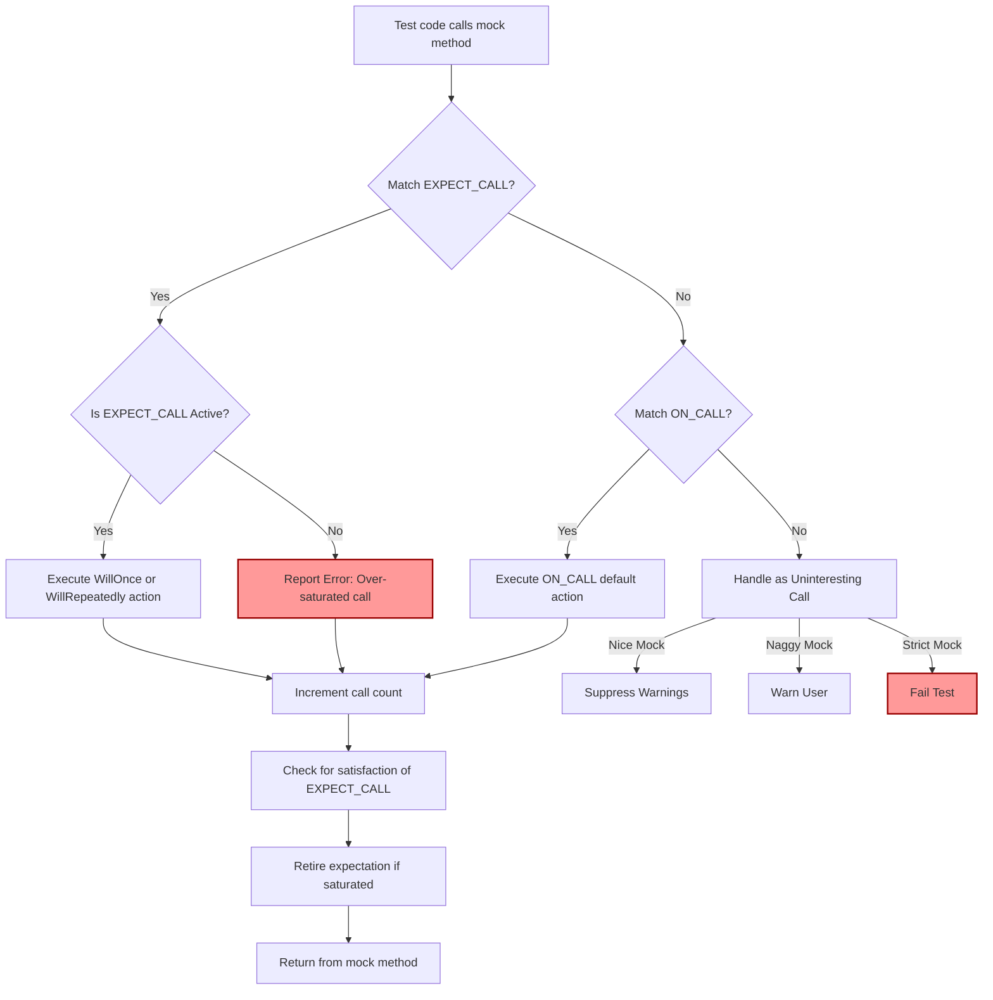

# Unexpected Test Behavior & Debugging

Understanding why your tests do not run or pass as expected is critical to maintaining reliable test suites using GoogleTest and GoogleMock. This page provides practical guidance for diagnosing such anomalies, focusing on mock expectations, assertion failures, uninteresting mock calls, and overall test suite debugging.

---

## 1. Diagnosing Why Tests Don't Run or Run Unexpectedly

### When Test Functions Are Not Invoked

- **Ensure EXPECT_CALL() is set before calls:** Mock expectations must be set prior to exercising the code under test. Setting expectations afterwards leads to undefined behavior.
- **Verify Test Registration:** Confirm your tests are properly registered and discoverable by the test runner.
- **Check Mocks for Uninteresting Calls:** Calls to mock methods without expectations may not trigger failures, but could indicate a problem if unexpected.

### Unexpected Test Passes or Fails

- **Mismatch Between Calls and Expectations:** Verify that the actual function calls with their arguments match your expectations.
- **Failing Assertion Details:** Look for detailed failure messages, including expected vs actual argument values.
- **Use Verbose Logging:** Running tests with `--gmock_verbose=info` gives detailed traces of calls and matched expectations to pinpoint issues.

<Tip>
Always set expectations with clear intent. Overly broad or missing expectations cause hard-to-debug tests.
</Tip>

## 2. Understanding Assertion Failures in Tests

### Common Causes of Assertion Failures

- **Expectation Not Met:** Function was not called the expected number of times.
- **Argument Mismatches:** Actual arguments to a mock function vary from what is expected.
- **Call Order Violations:** Calls occurred out of the declared order when sequences or `.After()` clauses are used.
- **Excessive Calls:** More calls occurred than allowed by `Times()`.

### Reading Failure Messages

- The failure message will often indicate the nature of the failure, including:
  - The mock method involved
  - Which argument(s) did not match and why
  - Whether the expectation was never satisfied or oversaturated
  - Call counts versus expectations

### Example Failure Message

```
Actual function call count doesn't match EXPECT_CALL(foo, Bar(5))...
         Expected: to be called twice
           Actual: called once - unsatisfied and active
```

This means `foo.Bar(5)` was expected twice but only called once.

<Note>
For a detailed explanation of expectations and matchers, refer to the [Mock Expectations](../concepts/modeling-and-behaviors/mock-expectations.md) and the [Matchers and Cardinalities](../api-reference/gmock-mocking-framework/matchers-and-cardinalities.md) pages.
</Note>

## 3. Handling Issues with Uninteresting Calls to Mock Objects

### Understanding Uninteresting Calls

An *uninteresting call* is a call to a mock method with no matching `EXPECT_CALL()`. By default, gMock:

- Treats them as non-fatal but outputs warnings unless handled.
- Executes the default action, usually returning a default value.

### Warning Messages for Uninteresting Calls

When uninteresting calls occur, you might see warnings like:

```
GMOCK WARNING:
Uninteresting mock function call - returning default value.
    Function call: Foo(0, 1)
NOTE: You can safely ignore the above warning unless this call should not happen.
```

This warns you of potentially missing or unintended calls.

### Controlling Uninteresting Calls

- Use **NiceMock<MockClass>** to suppress warnings about uninteresting calls.
- Use **StrictMock<MockClass>** to treat uninteresting calls as test failures.
- Use catch-all `EXPECT_CALL(mock, Method(_)).Times(AnyNumber())` to explicitly allow any call.

### Example:

```cpp
using ::testing::NiceMock;

NiceMock<MockFoo> mock_foo;
EXPECT_CALL(mock_foo, ExpectedMethod());
// Calls to other methods produce no warnings now.
```

<Tip>
Choose between NiceMock, NaggyMock, and StrictMock based on how strictly you want to enforce your test expectations.
</Tip>

## 4. Debugging Common Mocking Issues

### 4.1 Unexpected Calls

When a mock method call doesn't match any `EXPECT_CALL`, it's an unexpected call and causes failure.

- Check if the arguments passed fit any matcher defined.
- Use `--gmock_verbose=info` to trace which expectations exist and which calls happened.

### 4.2 Exhausted WillOnce Actions

If there are fewer `.WillOnce()` actions than calls made, gMock:

- Warns about running out of explicit actions.
- Uses default actions afterwards, which might be unexpected.

Use `.WillRepeatedly()` to specify behavior for calls beyond `.WillOnce()` clauses.

### 4.3 Retired Expectations

Expectations may retire after being *saturated* or due to call order sequences. If a call hits a retired expectation, gMock will report that it didn't match because it’s retired.

**Solution:** Review the usage of `.RetiresOnSaturation()` and sequence ordering for expectations.

### 4.4 Unsatisfied Prerequisites

If an expectation depends on other expectations that haven't been fulfilled yet, it will not match calls, causing failures.

Use sequences and the `.After()` clause carefully to enforce the intended call orders.

### 4.5 Verbosity Control for Debugging

Change verbosity levels to control logging:

- `--gmock_verbose=info`: Most detailed; prints every call and match attempt.
- `--gmock_verbose=warning`: Default; shows warnings, no full call trace.
- `--gmock_verbose=error`: Shows only errors.

This facilitates isolating issues during test failures.

## 5. Steps to Troubleshoot a Failing Test

<Steps>
<Step title="Enable Verbose Logging">
Run your tests with `--gmock_verbose=info` to see detailed invocation traces.
</Step>
<Step title="Check the Expectation Match Order">
Verify the order in which `EXPECT_CALL` statements are declared. Remember, gMock matches the most recent expectation first.
</Step>
<Step title="Review Matchers and Arguments">
Confirm that argument matchers in `EXPECT_CALL` accurately represent expected calls.
</Step>
<Step title="Inspect Call Counts and Cardinalities">
Check that `.Times()` clauses reflect how many times calls are expected.
</Step>
<Step title="Look for Retired or Unsatisfied Expectations">
Use sequences and `.After()` carefully; otherwise, you may get unexpected failures due to unsatisfied prerequisites.
</Step>
<Step title="Suppress or Enable Warnings Appropriately">
If uninteresting calls are expected, use NiceMock or explicit `EXPECT_CALL`s to prevent spurious warnings.
</Step>
</Steps>

## 6. Practical Tips and Best Practices

- **Set very specific expectations only where needed.** Use broad expectations sparingly to avoid brittle tests.
- **Use NiceMock for mocks with many uninteresting calls** to reduce warning noise and focus on key behaviors.
- **Use StrictMock when testing strict interaction contracts** where any unexpected call is an error.
- **Retire expectations explicitly** with `.RetiresOnSaturation()` if they represent finite-use calls.
- **Leverage sequences and `.After()`** to specify order where necessary, but avoid over-specifying.
- **Avoid modifying mocks after exercising the code** under test; set expectations upfront.
- **Use diagnostic flags and captured logs** to gain insights when tests fail.

## 7. Example Debugging Scenario

Imagine your test fails because an expectation is not met:

```plaintext
Actual function call count doesn't match EXPECT_CALL(mock, Foo(5))...
         Expected: to be called once
           Actual: never called - unsatisfied and active
```

To debug:

- Check if `EXPECT_CALL(mock, Foo(5))` was set before `Foo(5)` was called.
- Run with `--gmock_verbose=info` to see all calls to `Foo` and which expectations matched.
- Verify that the argument `5` is used correctly in the test code.
- If `Foo` is called with different parameters, adjust the expectation accordingly.

## 8. References and Further Reading

- [Mocking Reference](../docs/reference/mocking.md): Official API for creating mocks and expectations.
- [gMock Cookbook](../docs/gmock_cook_book.md): Recipes for common mocking scenarios and advanced usage.
- [gMock for Dummies](../docs/gmock_for_dummies.md): Beginner-friendly introduction to mocking.
- [Strictness Modes](../api-reference/gmock-mocking-framework/strictness-modes-and-behaviors.md): Detailed explanation of NiceMock, NaggyMock, and StrictMock.
- [Matchers and Cardinalities](../api-reference/gmock-mocking-framework/matchers-and-cardinalities.md): In-depth guide on argument matching and call frequency.
- [Mock Expectations and Ordering](../concepts/modeling-and-behaviors/mock-expectations.md): How to set ordering and dependencies in expectations.
- [Troubleshooting Installation and Setup](../getting_started/troubleshooting/common_install_issues.md): For issues that may cause tests not to run.

---

## Diagram: GoogleMock Call Matching Flow



This flow summarizes how GoogleMock processes calls to mock methods, determining which expectations or default actions to apply, handling over-saturation, uninteresting calls, and strictness modes.

---