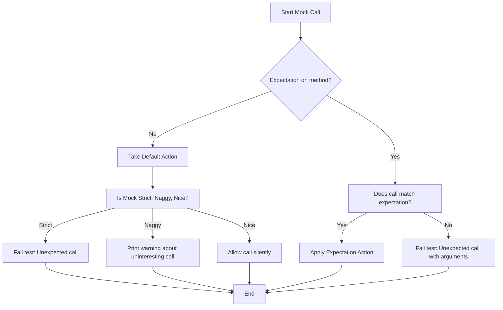

# Resolving Common Build and Runtime Errors in GoogleTest and GoogleMock

GoogleTest and GoogleMock provide a comprehensive C++ testing and mocking framework. However, when setting up tests or running them, you may encounter typical build or runtime errors. This documentation guides you through diagnosing and fixing these issues, enabling you to maintain smooth development and testing workflows.

---

## 1. Build Errors

### 1.1. Missing Symbols or Linkage Failures

- **Problem:** You get undefined reference errors or missing symbol errors during linking.
- **Cause:** Usually caused by missing GoogleTest or GoogleMock libraries during the link stage or incomplete inclusion of source files.
- **Solution:**
  - Ensure that your build system links against both GoogleTest and GoogleMock libraries.
  - If using CMake, make sure to link `gmock_main` or `gmock` and `gtest` libraries properly.
  - Confirm that you include the necessary header `#include <gmock/gmock.h>` in your test source files.
  - Make sure `gtest_main` or an equivalent main() implementation is linked or provided.

### 1.2. Compiler Compatibility Issues

- **Problem:** Compilation errors due to unsupported language features or compiler quirks.
- **Cause:** GoogleTest and GoogleMock require at least C++17 support. Some features may not compile properly under older or incompatible compilers.
- **Solution:**
  - Verify you are using a supported compiler version (e.g., GCC >= 7, Clang >= 5, MSVC 2017 or later).
  - Enable C++17 or later standard flags, for example, `-std=c++17`.
  - Check for specific compiler warnings or errors and search known issues upstream if applicable.

### 1.3. Excessive Memory Usage or Compiler Crashes

- **Problem:** Your compiler crashes or runs out of memory compiling large mock classes.
- **Cause:** Mock class constructors and destructors can cause heavy compiler load.
- **Solution:**
  - Move mock class constructor and destructor definitions from header files to `.cc` implementation files to reduce compilation overhead.
  - Avoid excessive template instantiations if possible.
  - Consider splitting complex mocks into smaller, more focused ones.

---

## 2. Runtime Issues

### 2.1. Unexpected Mock Function Calls or Uninteresting Calls Warnings

- **Problem:** During test execution, warnings appear such as:
  - "Uninteresting function call encountered - default action taken.."
  - "Unexpected mock function call"
- **Cause:** 
  - Uninteresting calls happen when a mock method without any `EXPECT_CALL` specification is called. By default, this prints a warning.
  - Unexpected calls occur when calls do not match any set expectations.
- **Solution:**
  - To suppress warnings on uninteresting calls you are sure are valid, use `NiceMock` wrapper around your mock class.

    ```cpp
    using ::testing::NiceMock;
    NiceMock<MockFoo> nice_mock_foo;
    ```

  - If you want to treat uninteresting calls as errors, use `StrictMock`.

  - Add explicit expectations with `EXPECT_CALL(mock_obj, Method(...)).Times(...)` to capture calls you expect.

  - Use the `--gmock_verbose` flag with `info` for detailed traces of mock calls to understand where unexpected calls originate.

### 2.2. Test Failures Showing Expected Call Count Mismatch

- **Problem:** Tests fail because the call count to mock functions doesn't match expectations.
- **Cause:** Calls to mock functions happen fewer or more times than specified.
- **Solution:**
  - Verify your expectations’ `Times()` clauses accurately reflect how many times the mock method should be called.
  - Use `.RetiresOnSaturation()` to allow expectations to be retired once saturated to avoid sticky expectations causing failures.
  - Use sequences (`InSequence`) or ordering constraints (`After`) if call order or prerequisites matter.

### 2.3. Mock Object Leaks

- **Problem:** At program exit, errors are printed about leaked mock objects, indicating expectations may not be verified.
- **Cause:** Mock objects created on the heap but not destroyed properly.
- **Solution:**
  - Always delete heap-allocated mocks or manage their lifecycle through smart pointers.
  - Alternatively, mark mocks as allowed leaks to suppress errors if deliberate using:

    ```cpp
    testing::Mock::AllowLeak(mock_pointer);
    ```

  - Use `--gmock_catch_leaked_mocks` flag to enable detection.

### 2.4. Actions Run Out

- **Problem:** When calling `EXPECT_CALL` with multiple `WillOnce()` actions, calls beyond those defined yield warnings or default actions.
- **Cause:** Number of calls exceed the explicitly defined actions.
- **Solution:**
  - Append a `WillRepeatedly()` action to specify behavior after `WillOnce()` actions are exhausted.
  - Or increase the number of `WillOnce()` clauses and ensure the `Times()` cardinality matches.

---

## 3. Tips for Debugging and Preventing Issues

### 3.1. Use Verbosity Flag for Insightful Output

Run tests with `--gmock_verbose=info` to see detailed traces of calls and expectations.

### 3.2. Avoid Mixing Expectations and Calls Improperly

Set all expectations (`EXPECT_CALL`) before exercising the mock. Do not set expectations after the mock methods have been called, as this leads to undefined behavior.

### 3.3. Distinguish Between `ON_CALL` and `EXPECT_CALL`

Use `ON_CALL` to specify default behaviors without enforcing calls, and `EXPECT_CALL` when you want to verify the call happens and matches expectations.

### 3.4. Use `NiceMock` and `StrictMock` Judiciously

- `NiceMock`: suppresses uninteresting call warnings.
- `NaggyMock` (default): warns on uninteresting calls.
- `StrictMock`: treats uninteresting calls as failures.

Choose the strictness that matches your test's needs, especially to balance test maintenance and robustness.

### 3.5. Verify Virtual Destructors for Mocked Interfaces

Ensure base classes have virtual destructors to avoid undefined behaviors and memory corruption when deleting mock objects polymorphically.

### 3.6. Move Complex Mocks to Separate Files

For large mock classes, separate implementation from declaration to reduce compilation times and mitigate compiler strain.

---

## 4. Practical Debugging Walkthrough Example

If you see a failure due to unexpected calls, follow these steps:

1.  Run your test with `--gmock_verbose=info` to get detailed logs.
2.  Identify the unexpected call and arguments.
3.  Check if you have set an `EXPECT_CALL` for that method with matching argument matchers.
4.  If missing, add an `EXPECT_CALL` or use `ON_CALL` for default action.
5.  If spurious calls are allowed, consider wrapping your mock in `NiceMock`.
6.  For strict enforcement, use `StrictMock`.
7.  Verify proper destruction of mocks to ensure expectations are checked.

---

## 5. Additional Resources

- [Legacy gMock FAQ](https://google.github.io/googletest/gmock_faq.html)
- [gMock Cookbook](https://google.github.io/googletest/gmock_cook_book.html)
- [gMock Cheat Sheet](https://google.github.io/googletest/gmock_cheat_sheet.html)
- [Mocking Reference](https://google.github.io/googletest/reference/mocking.html)
- [GoogleTest Primer](https://google.github.io/googletest/primer.html)

---

> _Note: For build system integration, check your toolchain documentation to ensure libraries are linked correctly and compiler flags are set._

---

## Summary

This guide focuses exclusively on diagnosing and fixing common build and runtime errors encountered when using GoogleTest and GoogleMock. It covers linkage problems, compiler compatibility, call expectation mismatches, uninteresting call warnings, mock leaks, and handling of action exhaustion. Following the practical advice and leveraging verbosity flags will help users maintain effective, stable test suites.

---

## Appendix: Common Compiler Flags for GoogleTest and GoogleMock

```sh
# Compile flags
-I/path/to/googletest/include -I/path/to/googlemock/include

# Link flags
-lgmock -lgtest -pthread

# C++ Standard
-std=c++17
```

---

## Troubleshooting Checklist

- [ ] Are all required GoogleTest and GoogleMock headers included?
- [ ] Are test executables linked against gmock and gtest libraries?
- [ ] Is the C++ standard set to at least C++17?
- [ ] Are all expectations (`EXPECT_CALL`) set before mock method calls occur?
- [ ] Is the mock class properly cleaned up to trigger expectation verification?
- [ ] Are you using `NiceMock`, `NaggyMock`, or `StrictMock` as intended?
- [ ] For large mocks, have constructor/destructor definitions been moved to implementation files?
- [ ] Have you run tests with increased verbosity to inspect call traces?
- [ ] Is the virtual destructor present in interfaces being mocked?

---

This guide is designed to close the gap between encountering cryptic errors and proceeding confidently with your testing using GoogleTest and GoogleMock.


<Check>
For detailed background on expectations, actions, and mocks, see the related documentation: [Mocking Reference](https://google.github.io/googletest/reference/mocking.html) and [gMock Cookbook](https://google.github.io/googletest/gmock_cook_book.html).
</Check>

<CardGroup cols={2}>
<Card title="Google Testing Docs">
- [gMock FAQ](https://google.github.io/googletest/gmock_faq.html)
- [gMock Cookbook](https://google.github.io/googletest/gmock_cook_book.html)
- [gMock Cheat Sheet](https://google.github.io/googletest/gmock_cheat_sheet.html)
- [Mocking Reference](https://google.github.io/googletest/reference/mocking.html)
</Card>
<Card title="Troubleshooting Tools">
- `--gmock_verbose` flag for debugging
- Heap checker for detecting leaks
- Testing with `NiceMock` and `StrictMock`
- Compiler flags support and compatibility checklist
</Card>
</CardGroup>


---

## Visualizing the Mocking Behavior for Uninteresting Calls



This illustrates how GoogleMock routes calls in terms of expectations and mock strictness.

---

*End of documentation for resolving common build and runtime errors.*