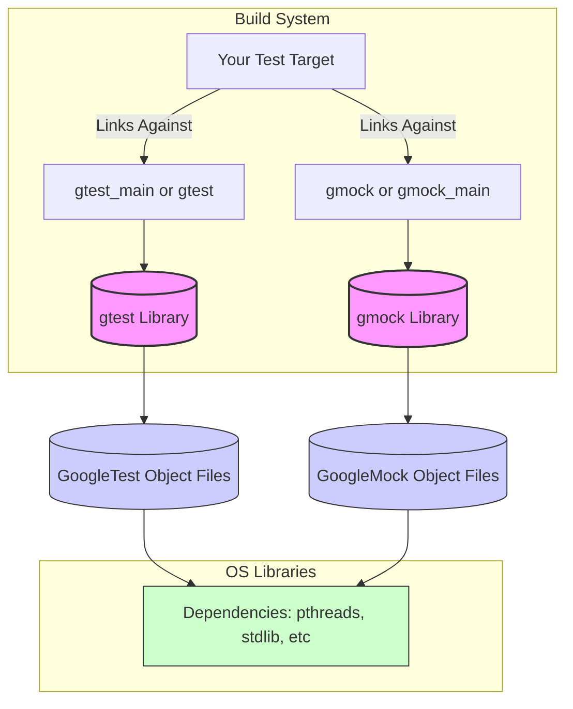

# Why do I encounter build or linker errors?

When working with GoogleTest and GoogleMock, build or linker errors can disrupt your development workflow. This FAQ focuses specifically on typical build and linker problems, such as missing symbols, version mismatches, or incorrect linkage, and provides clear guidance on diagnosing and resolving these errors.

---

## Common Build and Linker Errors

### 1. Missing Symbols During Link

**Problem:**
You might see error messages during linking like `undefined reference to '...'` or `unresolved external symbol`. This usually means some required GoogleTest or GoogleMock code isn’t linked properly.

**Causes:**
- Forgetting to link the GoogleTest and GoogleMock static or shared libraries.
- Incorrect target linkage order when linking against multiple libraries.
- Using symbols from GoogleMock without linking its library.

**Solution:**
- Ensure that your build system links with `gtest` and `gmock` libraries explicitly.
- For CMake, link targets with `${GTEST_LIBRARIES}` and `${GMOCK_LIBRARIES}` or the appropriate targets such as `gtest::gtest` and `gmock::gmock`.
- When using Bazel or other build systems, confirm that rules include `googletest` and `googlemock` dependencies.

### 2. Version Mismatches

**Problem:**
Linker errors or runtime crashes can arise if GoogleTest headers and libraries are from different releases or mismatched versions.

**Causes:**
- Updating headers without rebuilding libraries.
- Multiple GoogleTest versions installed (system and local copies).

**Solution:**
- Always rebuild GoogleTest and GoogleMock libraries after updating source or headers.
- Use consistent source for headers and libraries.
- Clean your build artifacts before rebuilding.
- Use CMake or Bazel build configuration that controls versioning explicitly.

### 3. Incorrect Linking with Shared vs Static Libraries

**Problem:**
Linker errors or runtime failures due to mixing shared and static libraries or incorrect compiler flags.

**Causes:**
- Linking GoogleTest and GoogleMock as shared libraries along with static runtime libs.
- Mismatched compiler runtime options (`/MD`, `/MT` flags in MSVC).

**Solution:**
- Adjust your build configuration to use consistent runtime library settings.
- If building shared libs, enable `BUILD_SHARED_LIBS=ON` in CMake.
- Prevent multiple runtime copies by harmonizing compiler flags.
- Refer to `internal_utils.cmake` which tweaks compiler/linker flags appropriately for Windows and other compilers.

### 4. Missing Threads Library

**Problem:**
Linker errors related to pthread or threading libraries.

**Causes:**
- GoogleTest requires threading support (pthread on Linux/macOS).
- Some environments do not support pthreads properly (especially MinGW).

**Solution:**
- Ensure pthreads is found and linked. CMake’s `find_package(Threads)` is used.
- On Windows, pthread is not used; Windows threading primitives are automatically used.
- Check build system messages for threads detection.

### 5. Linker Warning or Error about Multiple Definitions

**Problem:**
Conflicts like multiple symbols defined for the same entity during linkage.

**Causes:**
- Mixing object files and static libraries compiled with different compiler options.
- Including GoogleTest or GoogleMock sources multiple times without proper guards.

**Solution:**
- Avoid compiling GoogleTest and GoogleMock sources multiple times manually.
- Use provided library targets (`gtest_main`, `gmock_main`) instead of compiling sources directly.
- Ensure that static and shared libraries are properly separated.

---

## Diagnosing and Fixing Build and Linker Issues

Follow this workflow to methodically resolve build/linker problems:

<Steps>
<Step title="Verify Build Dependencies">
Check that your build system declares and links the GoogleTest and GoogleMock libraries correctly.
</Step>
<Step title="Check Compiler and Linker Flags">
Ensure consistent compiler flags, especially for runtime libraries and threading support, matching GoogleTest’s recommendations.
</Step>
<Step title="Clean and Rebuild">
Perform a full clean of build artifacts and rebuild all related targets to avoid stale object file conflicts.
</Step>
<Step title="Use Official Build Targets">
Instead of compiling GoogleTest and GoogleMock sources individually, use the standard targets (`gtest`, `gtest_main`, `gmock`, `gmock_main`) exposed by the GoogleTest CMake project.
</Step>
<Step title="Check for Multiple Installations">
Make sure there are no conflicting GoogleTest installations on your system that your build might accidentally pick up.
</Step>
<Step title="Enable Verbose Build Logs">
Increase build system verbosity to track library paths and linking commands to verify correct linkage.
</Step>
</Steps>

---

## Best Practices for Avoiding Build and Linker Errors

- Use CMake or Bazel build integration as described in the [Build System Integration guide](/guides/integration-and-best-practices/build-system-integration) to manage library discovery and linkage automatically.
- Link test binaries with `gmock_main` if you want an automatic main function that initializes GoogleMock and GoogleTest.
- Consistently use the same compiler and ABI settings throughout your project and dependencies.
- Prefer static linkage for GoogleTest and GoogleMock if portability is a concern or to avoid runtime DLL dependencies.
- Avoid mixing GoogleTest or GoogleMock sources directly in your build targets.
- Read the `internal_utils.cmake` file to understand the compiler flag tweaks GoogleTest applies for correctness and compatibility.

---

## Troubleshooting Tips

<AccordionGroup title="Linker Error Troubleshooting">
<Accordion title="Undefined Symbols for GoogleTest or GoogleMock">
Check if you linked both `gtest` and `gmock` libraries along with their dependencies.
</Accordion>
<Accordion title="Conflicting Runtime Library Flags on Windows">
For MSVC, verify that `/MD` vs `/MT` flags are consistent in your build and GoogleTest configuration.
</Accordion>
<Accordion title="pthread Not Found or Linker Failure on Linux/macOS">
Make sure your environment supports pthreads and your build links it correctly by using CMake's Threads package.
</Accordion>
</AccordionGroup>

---

## Additional Resources

- [Configuring Your Project with CMake](/getting-started/first-steps/configure-project) for integration details.
- [Build System Integration Guide](/guides/integration-and-best-practices/build-system-integration) for CMake and Bazel setups.
- [Troubleshooting Common Issues](/getting-started/first-steps/troubleshooting) for other typical errors.
- `internal_utils.cmake` involved in managing compiler and linker flags.

---

## Summary Diagram of Build and Link Dependencies

This diagram illustrates how your test binary depends on GoogleTest and GoogleMock libraries and underlying platform dependencies.

---

## Key Flags Affecting Build and Runtime Behavior

- `--gmock_verbose=[info|warning|error]` controls message verbosity for mock functions; may help when debugging unexpected behavior.
- CMake options like `BUILD_SHARED_LIBS` dictate static vs dynamic linkage.

---

## Final Checklist Before Asking for Help

- Did you link against `gmock_main` or `gtest_main`?
- Are compile and link options consistent across your project?
- Have you cleaned your build directory and rebuilt all components?
- Are GoogleMock and GoogleTest versions consistent?
- Does your environment support the required threading libraries?

If problems persist, please consult the [Troubleshooting Common Issues guide](/getting-started/first-steps/troubleshooting) or seek community support.

---

# Related Documentation

- [Configuring Your Project to Use GoogleTest](/getting-started/first-steps/configure-project)
- [Build System Integration with CMake and Bazel](/guides/integration-and-best-practices/build-system-integration)
- [Understanding Mocking Macro Usage and Setups](/api-reference/mocking-api/mock-method-macro)
- [Core Architecture Overview](/overview/architecture-and-core-concepts/system-architecture)

---

For full source reference, see: [GoogleTest GitHub](https://github.com/google/googletest)

---

<Tip>
To prevent or fix build and linker errors:
- Prefer official build targets (`gtest`, `gmock`, `gtest_main`, `gmock_main`) rather than compiling sources manually.
- Maintain consistent compiler and linker flags across your codebase.
- Use CMake or Bazel integration layer for robust dependency management.
</Tip>

<Note>
Linker errors almost always indicate missing or mismatched libraries. Confirm correct linkage order and the presence of all required libraries to resolve these errors.
</Note>

<Warning>
Do NOT ignore uninteresting linker warnings. They can lead to runtime failures or undefined behavior.
</Warning>
