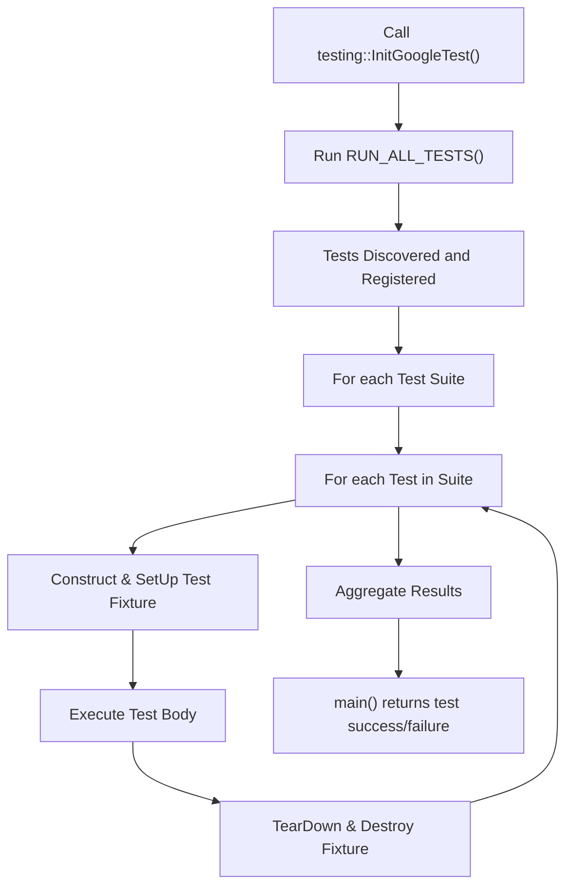

# Test Discovery & Execution Issues

GoogleTest delivers robust test discovery and execution capabilities, yet integrating tests seamlessly into your build system (such as Bazel, CMake, or custom solutions) may sometimes lead to challenges. This page addresses diagnosing and resolving problems when tests are not discovered, do not run as expected, or exhibit integration difficulties—especially common issues related to missing `main()` routines and linker errors.

---

## Frequently Asked Questions (FAQ)

### Why are my tests not discovered or run when I execute the test binary?

- Make sure your test source files are linked properly into the test executable. GoogleTest registers tests only from object files linked into the binary.
- Verify that your tests use the correct macros (`TEST()`, `TEST_F()`) and follow naming conventions.
- Ensure the `RUN_ALL_TESTS()` function is called in your `main()` function (or that you link with `gtest_main` to provide one).

### What happens if I do not provide a `main()` function?

- If you link against the `gtest_main` library, GoogleTest supplies a generic `main()` that initializes the framework and runs all tests.
- If you link only against `gtest` without `gtest_main`, you must provide your own `main()` which calls `testing::InitGoogleTest()` and then `RUN_ALL_TESTS()`.

### Why do I get "undefined reference" linker errors related to GoogleTest symbols?

- Common causes include missing linkage to GoogleTest libraries or incorrect order of libraries during linking.
- Verify your linker flags include `-lgtest` or `-lgtest_main` as appropriate.
- On some platforms, also ensure threading libraries (`-pthread`) are linked.

### How can I integrate GoogleTest with Bazel or CMake properly?

- For Bazel, ensure your `BUILD` files define `cc_test` targets that depend correctly on the `@com_google_googletest` repository.
- For CMake, use `find_package(GTest REQUIRED)` and link `GTest::gtest` and optionally `GTest::gtest_main`.
- Improperly configured build rules often cause tests not to register or run.

### How do I know if my `main()` function is correct?

Your `main()` function should roughly look like this:

```c++
int main(int argc, char** argv) {
  testing::InitGoogleTest(&argc, argv);
  return RUN_ALL_TESTS();
}
```

- Omit calling `RUN_ALL_TESTS()` more than once.
- Always return its result; failing to do so causes silent test failures.
- Call `InitGoogleTest()` before `RUN_ALL_TESTS()` to initialize flags.

## Diagnosing Common Problems

### Test Not Discovered

- **Cause:** Test code not linked into executable.
  - **Solution:** Verify that all test source files are part of the build and linked.

- **Cause:** Using old `TEST_CASE` API instead of current `TEST_SUITE` or `TEST`.
  - **Solution:** Update to current GoogleTest APIs.

- **Cause:** Misspelling test macros or not following naming conventions.
  - **Solution:** Use `TEST()` or `TEST_F()` correctly with valid identifier names (avoid underscores at start or end).

### Tests Fail to Run or Appear to Skip

- **Cause:** Missing or incorrectly implemented `main()` function.
  - **Solution:** Provide a single `main()` that initializes GoogleTest and calls `RUN_ALL_TESTS()`.

- **Cause:** Calling `RUN_ALL_TESTS()` multiple times or ignoring its return value.
  - **Solution:** Ensure `RUN_ALL_TESTS()` is called once and its return value is returned in `main()`.

- **Cause:** GoogleTest flags not initialized properly.
  - **Solution:** Always invoke `testing::InitGoogleTest()` before running tests.

### Linking Errors: Undefined Symbols

- **Typical problem:** Missing linkage against gtest or gtest_main libraries.
  - **Solution:** Check build scripts to add `-lgtest` and/or `-lgtest_main`.

- **On Windows:** Pay attention to CRT linkage mismatches (static vs dynamic).
  - Use CMake option `gtest_force_shared_crt` to align runtime linkage.

- **Multi-threading:** Link with `-pthread` or corresponding flag on your platform.

### Build System-Specific Integration Tips

- **Bazel**
  - Declare test targets with `cc_test` properly referencing GoogleTest.
  - Use `testonly = 1` where appropriate.

- **CMake**
  - Use `FetchContent` or `find_package(GTest)`.
  - Link test executable with `GTest::gtest_main` for convenience.
  - Ensure consistent compiler flags for GoogleTest and your tests.

- **Custom Build**
  - Confirm test object files are included in the linked test executable.
  - Check that `main()` is properly defined or link against `gtest_main`.

---

## Practical Troubleshooting Steps

<Steps>
<Step title="Verify Test File Compilation">
Ensure that the source files containing your test cases are successfully compiled and linked into the test executable.
</Step>
<Step title="Check Test Macros and Naming">
Make sure all tests use the correct macros (`TEST()`, `TEST_F()`), and test names do not start or end with underscores.
</Step>
<Step title="Review main() Function">
Confirm that your `main()` calls `testing::InitGoogleTest()` with command-line arguments, and returns the result of `RUN_ALL_TESTS()`.
</Step>
<Step title="Link Dependencies">
Verify linking against `gtest` or `gtest_main` and necessary threading libraries (`-pthread`) is correctly set in your build system.
</Step>
<Step title="Run Test Binary with Flags">
Execute your test binary with `--gtest_list_tests` to confirm that tests are registered and discovered.
</Step>
</Steps>

---

## Example: Minimal main() for GoogleTest

```c++
#include <gtest/gtest.h>

int main(int argc, char **argv) {
  testing::InitGoogleTest(&argc, argv);
  return RUN_ALL_TESTS();
}
```

Link this with your test object files and GoogleTest libraries.

---

## Tips and Best Practices

- Use `gtest_main` if you don't need a custom main to reduce boilerplate.
- Always return the result of `RUN_ALL_TESTS()`; it enables test status propagation.
- Avoid multiple definitions of `main()` in your test binaries.
- Confirm consistent C++ standard and compiler settings across your build.
- Link GoogleTest libraries before your own code in link order to resolve dependencies correctly.

---

## Related Error Messages

### "undefined reference to `testing::InitGoogleTest`"

- Indicates missing linkage to GoogleTest library.

### "undefined reference to `RUN_ALL_TESTS()`"

- Indicates either missing GoogleTest linkage or missing definition of `main()`.

### "duplicate symbol main"

- You may be linking multiple `main()`s; ensure only one definition exists.

### "no tests were found" or no tests run

- Often linked binaries lack test registration due to missing sources or wrong test macros.

---

## Additional Resources

- [GoogleTest Primer](primer.md) - Learn fundamental test writing and execution
- [Integrating GoogleTest with Your Build System (CMake & Bazel)](guides/advanced-usage-and-integration/integrating-into-builds.md)
- [Resolving Build & Integration Issues](getting-started/common-issues-and-troubleshooting/build-issues.md)
- [Test Structure and Lifecycle](api-reference/core-api/test-structure.md) - Understanding how GoogleTest discovers and runs tests
- [FAQ: Test Discovery & Execution](faq/troubleshooting/faq-test-integration.md) - Related questions

---

## Summary Diagram of Test Execution Flow



---

<Tip>
If tests are not discovered, start by running your test executable with `--gtest_list_tests`. If no tests appear, recheck your test macro usage and linkage.
</Tip>

<Warning>
Ignoring the return value of `RUN_ALL_TESTS()` causes test failures to go unnoticed and produces unreliable results. Always return its value from `main()`.
</Warning>