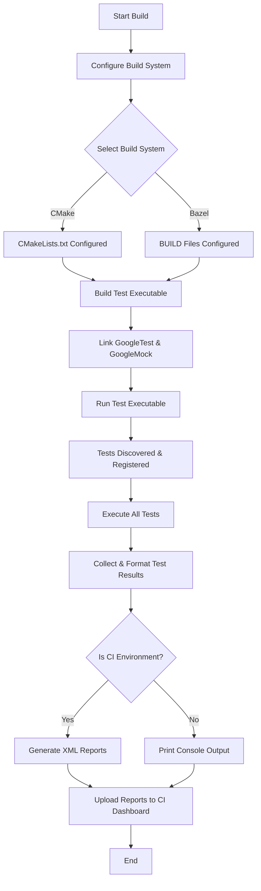

# Integration with Build Systems and CI

Integrating GoogleTest and GoogleMock into your build system and continuous integration (CI) workflow is key to efficient automated testing, streamlined development, and robust code validation. This document guides you through solutions to common configuration challenges, techniques for running tests in various environments, and strategies for capturing and reporting clear test results.

---

## 1. Build System Integration

Modern C++ projects use build systems like CMake and Bazel to compile and link GoogleTest and GoogleMock along with their codebases. Proper setup enables easy test compilation, linking, and execution without redundant work.

### Supported Build Systems

- **CMake**: Widely adopted, GoogleTest offers official CMake support with targets such as `gtest`, `gtest_main`, `gmock`, and `gmock_main`.
- **Bazel**: Official `cc_test`, `cc_library`, and `cc_binary` rules facilitate seamless integration.

### Linking GoogleTest and GoogleMock

- Link your test executable against `gtest` and `gmock` as needed.
- Use `gtest_main` or `gmock_main` if you want to use the default provided `main()` function, avoiding duplication.
- For custom `main()` functions, exclude linking those and use `InitGoogleTest()` and `InitGoogleMock()` manually.

### Typical CMake Setup Example

```cmake
find_package(GTest REQUIRED)

add_executable(my_tests my_tests.cc)
target_link_libraries(my_tests PRIVATE
    GTest::gtest
    GTest::gmock
    GTest::gtest_main
    GTest::gmock_main
    pthread)  # For POSIX threading
```

### Common Pitfalls

- Do **not** link both `gtest_main` and your own `main()`; this causes linker conflicts.
- Ensure `gmock` is linked **after** your code that references it.
- On Windows, address Unicode and CRT linking issues by following platform-specific notes.

### Tips

- Use imported CMake targets for cleaner and safer dependency management.
- Separate production libraries and tests logically to improve build times and clarity.

---

## 2. Running Tests in CI/CD Environments

Running tests in continuous integration requires special attention to reliably execute tests, handle flaky tests, and produce informative output.

### Running Tests

- Use `RUN_ALL_TESTS()` to execute all registered tests.
- Use command-line flags to filter tests, control output verbosity, and enable parallel execution.

### Key Command-Line Flags

- `--gtest_filter=<pattern>`: Run only tests matching pattern.
- `--gtest_output=xml[:path]`: Output results in XML format, suitable for CI report processors.
- `--gtest_repeat=<N>`: Repeat tests multiple times for flaky test detection.
- `--gmock_verbose=<level>`: Control GoogleMock output (`info`, `warning`, or `error`).

### Best Practices

- Run tests in parallel if build and environment support it.
- Collect and upload XML test reports for detailed failures.
- Use environment isolation techniques to prevent interference between tests.
- Set reasonable timeouts for tests to avoid blocking CI pipelines.

### Debugging CI Failures

- Enable `--gmock_verbose=info` to get detailed logs of mock calls and expectations.
- Use the `--gtest_break_on_failure` flag to pause test execution at the first failure for debugging.
- Use logging and stack traces for failing tests to pinpoint issues quickly.

---

## 3. Test Result Reporting and Analysis

CI systems rely on clear, structured test results to perform dashboards, alerts, and historical tracking.

### XML Test Results

- GoogleTest can generate JUnit-compatible XML reports using the `--gtest_output=xml` flag.
- Place these files in known locations for CI systems like Jenkins, GitLab CI, or CircleCI to parse and visualize.

### Integration with Coverage Tools

- Combine test runs with code coverage tools (e.g., `lcov`, `gcov`, or platform-specific tools).
- Ensure coverage reports are uploaded alongside test results.

### Logging and Verbosity Levels

- Control GoogleMock's verbosity using `--gmock_verbose=error` to minimize noise or `info` for detailed inspection.
- Reduce output clutter in CI logs for better readability.

### Handling Flaky Tests

- Use test repetition and flaky test detection strategies.
- Isolate flaky tests for focused investigation.

---

## 4. Troubleshooting Build and Integration Issues

Integration errors are common when starting out but can be effectively handled with the following guidance.

### Linking Errors

- Verify that you are linking the correct GoogleTest and GoogleMock libraries.
- Avoid linking multiple `main()` implementations.
- Match your compiler toolchain settings (e.g., debug vs release).

### Missing Tests or No Tests Run

- Confirm that test files are compiled and linked.
- Ensure that GoogleTest initialization functions are correctly called (`InitGoogleTest`, `InitGoogleMock`).

### Runtime Failures

- Look for unresolved symbols related to threading or platform specifics.
- Confirm that your environment supports necessary libraries (pthreads on Linux/macOS).

### Test Failures Due To Mock Misconfiguration

- Check that your mocks are correctly set up before test execution.
- Use `--gmock_verbose=info` to understand mock call matches and failures.

---

## 5. Advanced Tips and Recommendations

### Using Provided Main Functions

- Utilize `gmock_main` or `gtest_main` to reduce boilerplate.
- When special setup is needed, provide your own main calling `testing::InitGoogleMock(&argc, argv)`.

### Managing Mock Object Lifetime

- Use `Mock::VerifyAndClearExpectations()` explicitly if mock objects are heap-allocated and destroyed by tested code to verify expectations early and avoid false positives.

### Handling Multi-threaded Tests

- Run the test code on a single thread where possible.
- Set expectations before concurrent calls.
- Protect mock setup and teardown from concurrent access.

### Build System Performance

- Move mock class constructor and destructor definitions out of headers into `.cc` files to speed up compilation.

---

## 6. Related Resources

- [GoogleTest Primer](https://github.com/google/googletest/blob/main/docs/primer.md)
- [Using GoogleMock](https://github.com/google/googletest/blob/main/docs/gmock_for_dummies.md)
- [gMock Cookbook](https://github.com/google/googletest/blob/main/docs/gmock_cook_book.md)
- [Mocking API Reference](https://github.com/google/googletest/blob/main/docs/reference/mocking.md)
- [Build System Integration Guide](https://github.com/google/googletest/blob/main/docs/guides/integration_real_world_use/build_system_integration.md)
- [CI/CD Best Practices](https://github.com/google/googletest/blob/main/docs/guides/integration_real_world_use/ci_cd_best_practices.md)


---

### Diagram: Test Execution and Integration Flow



---

<Tip>
When integrating GoogleTest and GoogleMock into your project, always keep your test infrastructure modular. Use dedicated targets or rules for tests, separate dependencies cleanly, and leverage provided main functions whenever possible to reduce maintenance.
</Tip>

<Warning>
Ensure that the versions of GoogleTest and GoogleMock you use match your project's C++ standard and platform requirements to avoid compatibility issues.
</Warning>

<Check>
Before running tests in CI, confirm that tests work locally with the same parameters and flags (e.g., XML output, verbosity) to avoid surprises.
</Check>

---