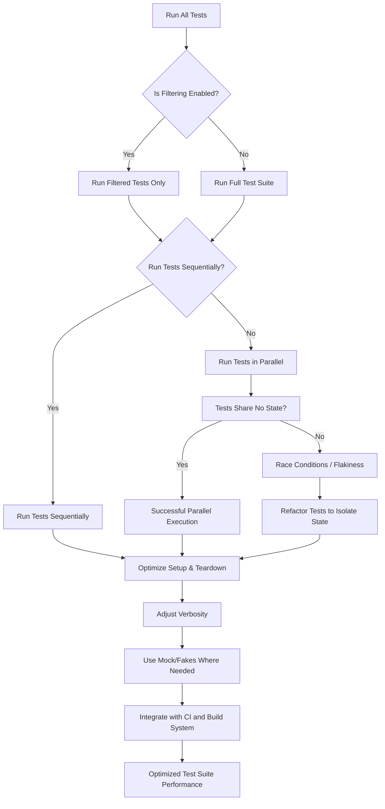

# How can I optimize my test suite's performance?

GoogleTest and GoogleMock provide powerful tools for writing and running C++ tests, but when dealing with large codebases and extensive test suites, test execution time can become a bottleneck. This guide offers practical strategies and best practices to help you speed up your tests while maintaining high quality and reliability.

---

## 1. Selective Test Execution with Filtering

Running only the tests you need to can drastically reduce test time during development and debugging.

### Using Test Filters

GoogleTest supports filtering tests to run using the `--gtest_filter` flag:

```bash
./my_test_binary --gtest_filter=MyTestSuite.MyTest
```

You can use wildcards (`*`) to match multiple tests, for example:

```bash
./my_test_binary --gtest_filter=MyTestSuite.*   # all tests in MyTestSuite
./my_test_binary --gtest_filter=*CriticalTest* # all tests with "CriticalTest" in the name
```

### Running a Single Test or Parameterized Instantiation

Filtering enables running specific tests repeatedly without incurring the overhead of the entire suite.

### Excluding Tests

You can exclude specific tests with the `-` prefix:

```bash
./my_test_binary --gtest_filter=-MyTestSuite.SlowTests
```

### Best Practices

- Combine filters to pinpoint tests during development.
- Use filters in Continuous Integration (CI) to split tests and run subsets in parallel.

## 2. Parallelizing Test Execution

Running tests concurrently can greatly improve overall test suite throughput.

### Native Parallelism Support

- GoogleTest itself does **not** provide built-in parallel test execution.
- Use external tools or build systems that support parallel test execution.

### Strategies for Parallelization

- **Split test binaries:** If your tests are organized into multiple executables, run them in parallel.
- **Sharding tests:** Use filters to run non-overlapping subsets of tests concurrently.
- **Test harnesses and runners:** Tools like CTest (with CMake), Bazel, or third-party test runners can schedule tests in parallel.

### Best Practices

- Ensure tests are independent and do not share or mutate global state.
- Use fixtures that properly isolate state for each test.
- Beware of race conditions caused by parallel execution.

## 3. Reduce Test Overhead

### Minimize Expensive Setup

* Use `SetUpTestSuite()` and `TearDownTestSuite()` to share heavy setup across multiple tests inside a suite instead of per-test `SetUp()`.
* Use mocks and fakes in place of expensive real resources (databases, files, network).

### Use Mocking Judiciously

Mocking dependencies can speed tests by avoiding external calls and enabling precise control, but excessive mocking or intricate mock setups may slow down tests. Balance complexity and performance.

### Avoid Large Test Binaries

Split large test binaries to allow parallel execution and reduce load times.

## 4. Control Verbosity and Logging

Verbose output slows down test runs:

- Use less verbose logging levels (e.g., `--gtest_brief=1`) in regular runs.
- Disable gMock’s verbose flag `--gmock_verbose=info` unless diagnosing.

## 5. Understand Which Features Impact Test Performance

### Parameterized Tests

- Can increase the number of tests exponentially; be mindful of test counts.

### Mock Object Creation

- Mocks with complex expectations or many actions can introduce overhead.

### Test Ordering and Sequences

- Sequences and ordering constraints add checking but generally have a small impact.

## 6. External Tools and Continuous Integration

### Build System and Test Runner Integration

- Use tools like Bazel or CMake + CTest to parallelize test execution.
- Configure your CI pipeline to shard tests, cache builds, and run tests effectively.

### Heap Checkers and Sanitizers

- Running tests with sanitizers or heap checkers slows tests; run them selectively.

## 7. Summary and Recommendations

| Strategy               | Description                           | Benefit             |
|------------------------|-------------------------------------|---------------------|
| Test Filtering         | Run subsets of tests by name         | Faster feedback     |
| Parallel Execution     | Run tests concurrently                | Reduced total time  |
| Minimize Setup & Mocks | Share setup and use mocks smartly    | Less overhead       |
| Control Logging        | Reduce verbose output                 | Avoid debug overhead|

By combining these methods, you can tailor your test executions for speed during development and reliability in full runs.

---

## Additional Resources

- [GoogleTest Filtering](https://github.com/google/googletest/blob/main/docs/primer.md#running-a-subset-of-the-tests)
- [Parallel Test Execution with Bazel](https://docs.bazel.build/versions/main/user-manual.html#running-tests)
- [Mock Objects and Methods](./api-reference/mocking-actions-matchers/mock-objects-and-methods)
- [Organizing and Scaling Large Test Suites](./guides/writing-and-structuring-tests/organizing-large-test-suites)
- [Integration with Build Systems & CI Pipelines](./guides/real-world-usage-patterns/integration-with-build-systems)

---

## Troubleshooting Common Performance Issues

<AccordionGroup title="Common Performance Challenges">
<Accordion title="Why are some tests running slowly despite filtering?">
- Ensure your test binary includes only necessary tests (avoid large monolithic binaries).
- Confirm filters are correctly specified.
- Check if tests have heavy setup per individual test.
- Review logging levels and reduce verbosity.
</Accordion>
<Accordion title="How to deal with flaky tests in parallel runs?">
- Flakiness often arises from shared mutable global state or race conditions.
- Isolate test fixtures.
- Avoid static or singleton dependencies when possible.
- Use synchronization primitives if needed.
</Accordion>
<Accordion title="Is it safe to mock everything to speed up tests?">
- Not always. Over-mocking can make tests brittle and less meaningful.
- Mock only external dependencies or expensive resources.
- Prefer lightweight fakes when suitable.
</Accordion>
</AccordionGroup>

## Step-by-Step: Speeding Up Your Test Suite

<Steps>
<Step title="Step 1: Identify Bottlenecks">
Run tests with timing info to find slow ones:
```bash
time ./my_test_binary
``` 
Review slow tests for heavy setup or expensive operations.
</Step>
<Step title="Step 2: Use Test Filters">
Run only tests you are actively working on with `--gtest_filter`.
</Step>
<Step title="Step 3: Parallelize Runs">
Divide tests into multiple executables or filters, run in parallel.
Use your build system's parallel test support.
</Step>
<Step title="Step 4: Optimize Setup & Teardown">
Use shared fixture setup.
Mock or fake expensive dependencies.
</Step>
<Step title="Step 5: Adjust Logging/Verbosity">
Set gTest/gMock verbosity to minimal during normal runs.
Enable verbose output only when debugging.
</Step>
<Step title="Step 6: Integrate with CI & Build System">
Leverage tools that shard tests.
Cache build artifacts.
Run sanitizers selectively.
</Step>
</Steps>

---

## Troubleshooting

### Tests Not Running as Expected?
- Check `--gtest_filter` syntax.
- Verify test names exactly.

### Parallel Runs Cause Failures?
- Confirm no shared state between tests.
- Use `InSequence` or other explicit ordering only when needed.

### Unexpectedly Long Test Times?
- Profile individual tests.
- Look into IO, network, or heavy computation.

---

## Frequently Asked Questions

- **Can I run tests in parallel inside one binary?**

  GoogleTest itself does not support this; split tests into multiple executables or use external runners.

- **How do I suppress gMock uninteresting call warnings during performance testing?**

  Use `NiceMock<T>` or set `--gmock_verbose=error` to silence warnings.

- **What if my tests depend on external resources?**

  Use mock or fake objects to decouple and speed tests.

- **How to quickly verify all expectations?**

  Use `Mock::VerifyAndClearExpectations(&mock_object)` to verify explicitly.

---

## Summary Diagram



---