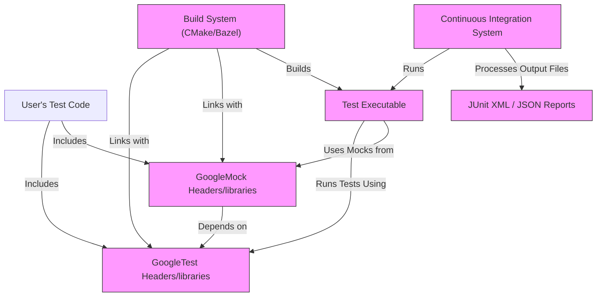

# Integration Troubleshooting

This page provides frequently asked questions and their solutions for integrating GoogleTest and GoogleMock with various build systems (such as CMake and Bazel), continuous integration (CI) environments, and other testing frameworks. It focuses on common issues related to linking, packaging, and execution in diverse workflows.

---

## Frequently Asked Questions

### 1. How do I properly link GoogleTest and GoogleMock with my project?

To link GoogleTest and GoogleMock correctly:

- When using **CMake**, prefer using the provided targets `GTest::gtest` and `GTest::gmock`.
- Link your test executable with GoogleTest and GoogleMock libraries, for example:

```cmake
find_package(GTest REQUIRED)
add_executable(my_test my_test.cpp)
target_link_libraries(my_test GTest::gtest GTest::gmock GTest::gtest_main)
```

- For **GoogleMock**, ensure it is enabled in your build. When building GoogleTest standalone, enable GoogleMock by default or use `-DBUILD_GMOCK=ON`.
- On **Bazel**, use `@com_google_googletest//:gmock` and `@com_google_googletest//:gtest` dependencies in your `BUILD` files.

<Tip>
Always place GoogleMock and GoogleTest first in your link line to avoid symbol conflicts.
</Tip>

### 2. Why am I getting undefined symbol errors when linking GoogleTest?

Undefined symbols usually indicate:

- You forgot to link `gtest_main` or your own main function to call `RUN_ALL_TESTS()`.
- Missing linking of GoogleMock when you are using mocks.
- Mismatch between the GoogleTest library and your compiler or standard library.

To fix:

- Add `GTest::gtest_main` to your link libraries or implement your own `main()` invoking `RUN_ALL_TESTS()`.
- Confirm you are linking GoogleMock (`GTest::gmock`) if mocks are used.
- Make sure you compiled GoogleTest and GoogleMock with the same compiler and standard library as your project.

### 3. How do I integrate GoogleTest with CMake in existing projects?

- Import GoogleTest with `find_package(GTest REQUIRED)`.
- Link your test targets against `GTest::gtest`, `GTest::gmock`, and optionally `GTest::gtest_main`.
- Optionally, use `enable_testing()` and add tests with `add_test()` for CTest integration.

Example:

```cmake
find_package(GTest REQUIRED)

add_executable(my_tests my_tests.cpp)
target_link_libraries(my_tests GTest::gtest GTest::gmock GTest::gtest_main)

enable_testing()
add_test(NAME MyTests COMMAND my_tests)
```

<Tip>
Check GoogleTest's CMakeLists.txt for modern recommended usage patterns.
</Tip>

### 4. Why might my GoogleMock expectations generate warnings about "uninteresting calls"?

This is usually because:

- You have not set an `EXPECT_CALL()` for methods that are called.
- GoogleMock treats calls to mock methods without expectations as "uninteresting" calls and issues warnings.

To resolve:

- Use `EXPECT_CALL()` to specify expected calls explicitly.
- Use `ON_CALL()` to set default behaviors without expectation.
- Suppress uninteresting call warnings with `NiceMock` wrapper:

```cpp
NiceMock<MockClass> mock;
```

- For strict enforcement of no unexpected calls, use `StrictMock`.

### 5. How to ensure tests run properly when using GoogleTest and GoogleMock in CI?

- Make sure the build environment has compatible compiler versions and C++17 support.
- CMake integration should enable test targets and run tests with `ctest` or equivalent.
- Ensure all dependencies and include paths for GoogleTest/Mock are correctly configured.
- Use `--gtest_output` flag to generate XML or JSON reports for CI feedback.

---

## Common Issues & Solutions

### Linking and Compilation Errors
- **Missing symbols:** Confirm linking against correct GoogleTest/GoogleMock libs.
- **Duplicate symbols:** Avoid linking multiple conflicting versions.

### Build System Specific Issues
- **CMake:** Use targets `GTest::gtest` and `GTest::gmock` for modern CMake.
- **Bazel:** Use `@com_google_googletest` external repository correctly.

### Runtime Issues
- **Tests not running:** Verify `RUN_ALL_TESTS()` is called.
- **Tests silently passing despite failures:** Ensure return value of `RUN_ALL_TESTS()` is propagated.

### Mocking Runtime Warnings
- **Uninteresting calls:** Use `EXPECT_CALL` or wrap mocks with `NiceMock`.
- **Unexpected calls:** Set precise expectations to catch unintended calls.

### Environment Setup
- **Inconsistent C++ standards:** Ensure GoogleTest and your project use the same C++ standard (C++17 required).
- **Threading support:** Validate pthread or platform threading configuration.

---

## Best Practices & Tips

- Always initialize GoogleTest with `InitGoogleTest(&argc, argv)` before running tests.
- Use `RUN_ALL_TESTS()` as the return value in your `main()` to convey success/failure.
- Define all mock methods in the public section, even if the original declares them private or protected.
- Use `EXPECT_CALL` sparingly; prefer `ON_CALL` for default behavior and only expect calls you verify.
- Leverage `NiceMock` to reduce noise from uninteresting calls during test development.
- Prefer modern CMake usage with imported targets rather than manually specifying libraries.

---

## Further Help and Support

- Consult the [GoogleTest Primer](https://github.com/google/googletest/blob/main/docs/primer.md) for getting started.
- Review [Mocking Reference](docs/reference/mocking.md) and [gMock Cookbook](docs/gmock_cook_book.md) for advanced mocking scenarios.
- Use GoogleTest's `--help` flag to see all runtime options for output, filtering, repetition, and more.
- Browse community forums or the GitHub issues on the [googletest GitHub repository](https://github.com/google/googletest) for help.

---

## Example: Typical CMake Integration

```cmake
cmake_minimum_required(VERSION 3.14)
project(MyProject)

# Add GoogleTest as a subdirectory or find_package if installed
add_subdirectory(googletest)

enable_testing()

# Your test executable
add_executable(my_tests test_main.cpp test_foo.cpp)

# Link to gtest and gmock
target_link_libraries(my_tests GTest::gtest GTest::gmock GTest::gtest_main)

# Register the tests to be run by CTest
add_test(NAME MyTestSuite COMMAND my_tests)
```

This setup ensures your tests are built and discoverable in typical CI workflows.

---

## Troubleshooting Checklist

- Did you `#include <gtest/gtest.h>` and/or `<gmock/gmock.h>`?
- Is `RUN_ALL_TESTS()` called inside your `main()`?
- Have you linked your test binary to `gtest`, `gmock`, and optionally `gtest_main`?
- Are all mock methods declared public?
- If you use expectations, are they set before exercising the mocks?
- If running in CI, are output reports generated and processed correctly?

---

By following this troubleshooting guide and applying the best practices, you can smoothly integrate GoogleTest and GoogleMock into your build, test, and CI environments.


---

# Diagram: Key Integration Components


