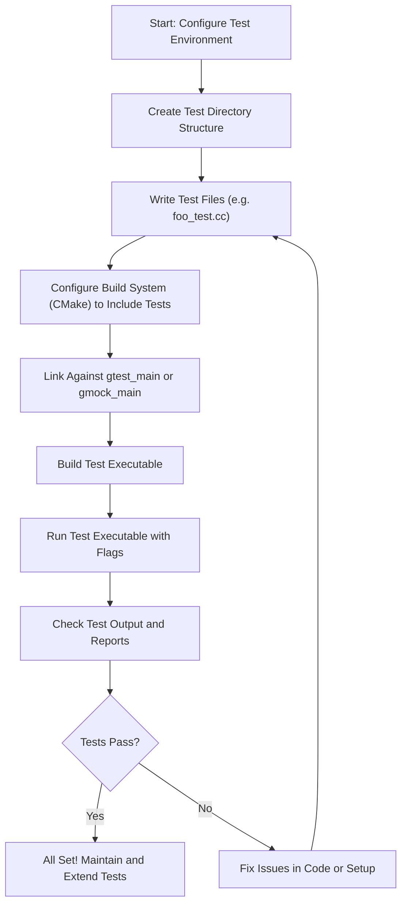

# Configuring Your Test Environment with GoogleTest

Setting up a robust and scalable test environment is crucial to harness the full power of GoogleTest. This guide covers how to organize your test files, integrate tests into your project, and configure essential options to ensure your tests run smoothly and efficiently.

---

## 1. Project Directory Structure for Tests

A clear directory structure lays the foundation for scalable test development. Follow these conventions to keep your tests organized and maintainable:

- **Create a `tests/` or `test/` directory** at your project's root dedicated to all test-related code.
- Inside this directory, organize tests by feature or component. For example:
  ```
  /tests/
    ├── foo_test.cc
    ├── bar_test.cc
    └── mocks/
        └── mock_foo.cc
  ```
- Place mock classes generated or written for GoogleMock (if used) into a separate `mocks/` subdirectory.
- Keep test utilities (helpers, fixtures, custom matchers) nearby in your test hierarchy.

This structure supports expanding tests without cluttering your source directories or confusing test roles.

<Check>
Keeping test code separate helps manage complexity and improves build times by isolating tests.
</Check>

---

## 2. Integrating Test Files into Your Build

GoogleTest requires compiling your test files and linking them with the GoogleTest libraries. Follow these steps to integrate tests:

### Using CMake

GoogleTest provides straightforward CMake integration. In your `CMakeLists.txt`, add your test files and link against `gtest_main` or `gtest`:

```cmake
add_executable(my_tests test/foo_test.cc test/bar_test.cc)
target_link_libraries(my_tests PRIVATE gtest_main)
add_test(NAME all_tests COMMAND my_tests)
```

- Linking to `gtest_main` supplies a `main()` function that initializes and runs your tests. Use this unless you need a custom `main()`.
- Use `add_test()` to register the executable with CTest for test discovery.
- For GoogleMock tests, link with `gmock_main` instead.

### Custom `main()` Function

If you require processing or setup before running tests, write your own `main`:

```c++
#include <gtest/gtest.h>

int main(int argc, char** argv) {
  testing::InitGoogleTest(&argc, argv);
  return RUN_ALL_TESTS();
}
```

This function initializes GoogleTest by parsing its flags and runs *all* discovered tests.

<Note>
Always return the result of `RUN_ALL_TESTS()` to signal success or failure of your test suite.
</Note>

---

## 3. Key Configuration Options and Environment Settings

GoogleTest offers configuration flags accessible via command-line or programmatically, allowing you to customize test execution:

### Common Flags

- `--gtest_filter=POSITIVE_PATTERNS[-NEGATIVE_PATTERNS]`  
  Run only tests that match the specified pattern(s).

- `--gtest_color=(yes|no|auto)`  
  Control color output.

- `--gtest_output=xml[:PATH]`  
  Generate XML report to the optionally specified `PATH`.

- `--gtest_repeat=N`  
  Repeat tests N times.

### GoogleMock Specific Flags

If using GoogleMock, additional flags exist such as:

- `--gmock_verbose=(info|warning|error|...)`  
  Adjust verbosity of mocking framework logs.

- `--gmock_catch_leaked_mocks=(true|false)`  
  Enable leak detection of mock objects.

You can set these flags directly on the command line or pass them through `InitGoogleMock()` if you use GoogleMock.

### Setting Flags Programmatically

Using GoogleMock's flag macros, you can get or set flag values inside your code (if needed):

```c++
GMOCK_FLAG_SET(verbose, "info");
std::string verbose = GMOCK_FLAG_GET(verbose);
```

---

## 4. Writing and Connecting Your First Test File

To get started, write your simple test in a file like `foo_test.cc` inside your test directory:

```c++
#include <gtest/gtest.h>

// A sample test suite and test.
TEST(MathTest, Addition) {
  EXPECT_EQ(2 + 2, 4);
}
```

Integrate this file as described in the build step and build your test executable.

---

## 5. Running Your Tests

Once built, run your test executable from the command line:

```bash
./my_tests
```

You should see output indicating each test run and a summary of failures or success. Use the flags mentioned above to control execution and reporting.

---

## 6. Troubleshooting and Best Practices

<AccordionGroup title="Common Issues and Solutions">
<Accordion title="Test Not Running or Recognized">
Ensure your test functions are defined with `TEST()` or `TEST_F()` macros and the test files are compiled and linked correctly.
</Accordion>
<Accordion title="Command-line Flags Not Recognized">
Make sure you call `testing::InitGoogleTest(&argc, argv);` before `RUN_ALL_TESTS()`. Define your own `main` only if necessary.
</Accordion>
<Accordion title="Linker Errors Related to GoogleTest or GoogleMock">
Confirm you link the test executable against the correct libraries (`gtest_main`, `gmock_main`), and symbols match your platform (some platforms differ).
</Accordion>
<Accordion title="Flags Not Taking Effect">
Remember flags are parsed and removed by `InitGoogleTest()` or `InitGoogleMock()`. Pass `argc` and `argv` properly into initialization.
</Accordion>
</AccordionGroup>

<Tip>
Use the default `gtest_main` or `gmock_main` libraries unless you have specific setup needs to avoid writing boilerplate `main()` functions.
</Tip>

---

## 7. Summary

By following this guide, you will establish a well-structured and configurable testing environment using GoogleTest:

- Organize your test files logically in dedicated directories.
- Integrate test files properly using build tools like CMake,
- Use the provided `gtest_main` or `gmock_main` libraries to simplify main function usage.
- Configure test execution using powerful command-line flags.

The next natural step is to write and run your first detailed tests, expanding on this configuration foundation.

---

## Additional Resources

For deeper integration and advanced setup scenarios, please see:

- [Integrating GoogleTest into Your Workflow](/overview/integration-and-getting-started/integration-with-build-systems-and-tools)
- [Writing and Running Your First Test](/getting-started/configuration-and-validation/writing-your-first-test)
- [GoogleTest Primer](https://github.com/google/googletest/blob/main/docs/primer.md)
- [GoogleMock README](https://github.com/google/googletest/blob/main/googlemock/README.md)

These resources provide insight into usage patterns, customization, and extending your testing infrastructure effectively.


---

# Illustrative Diagram: Test Environment Setup Flow


