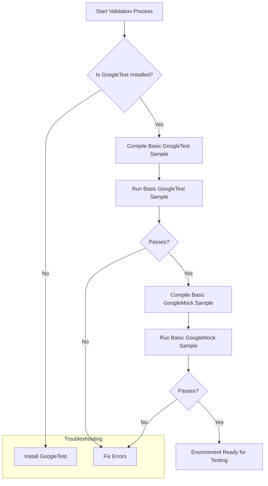

# Quick Validation & Sample Tests

Use this guide to quickly validate your GoogleTest and GoogleMock setup with minimal configuration and ready-to-run tests. These simple tests help confirm that your environment and installation are correctly configured before you write your own tests.

---

## 1. Prerequisites

Before running these validations, ensure that:

- You have installed GoogleTest and GoogleMock correctly.
- Your compiler supports C++17 or newer.
- Your build system includes the necessary headers and links the GoogleTest and GoogleMock libraries.

Refer to the [System Requirements & Supported Platforms](../getting-started/prerequisites-installation/system-requirements) page for detailed prerequisites.


## 2. Running Basic GoogleTest Validation

The simplest way to validate GoogleTest is to build and run the sample tests provided with the distribution.

### Step 1: Create a basic test file

Create a file `sample_basic_test.cc` with the following content:

```cpp
#include <gtest/gtest.h>

TEST(SampleTest, AlwaysPasses) {
  EXPECT_TRUE(true);
}

int main(int argc, char **argv) {
  ::testing::InitGoogleTest(&argc, argv);
  return RUN_ALL_TESTS();
}
```

### Step 2: Build the test

For example, compile using g++:

```bash
g++ -std=c++17 -I /path/to/googletest/include -L /path/to/googletest/lib \
  sample_basic_test.cc -lgtest -lgtest_main -pthread -o sample_basic_test
```

**Note:** Adjust the `-I` and `-L` flags based on where GoogleTest is installed on your system.

### Step 3: Run the test

```bash
./sample_basic_test
```

A successful run outputs:

```
[==========] Running 1 test from 1 test case.
[----------] Global test environment set-up.
[----------] 1 test from SampleTest
[ RUN      ] SampleTest.AlwaysPasses
[       OK ] SampleTest.AlwaysPasses (0 ms)
[----------] 1 test from SampleTest (0 ms total)

[----------] Global test environment tear-down
[==========] 1 test from 1 test case ran. (0 ms total)
[  PASSED  ] 1 test.
```

---

## 3. Running Simple GoogleMock Validation Tests

To validate GoogleMock, you can use minimal tests that mock interfaces and verify expectations.

### Step 1: Create a simple mock test file

Create a file `sample_mock_test.cc` with the following content:

```cpp
#include <gmock/gmock.h>

using ::testing::_;
using ::testing::Return;

// A sample interface.
class Foo {
 public:
  virtual ~Foo() = default;
  virtual int GetValue(int x) = 0;
};

// Mock class derived from Foo.
class MockFoo : public Foo {
 public:
  MOCK_METHOD(int, GetValue, (int x), (override));
};

TEST(MockTest, ReturnsSpecifiedValue) {
  MockFoo mock_foo;

  EXPECT_CALL(mock_foo, GetValue(_))
      .WillOnce(Return(42))
      .WillRepeatedly(Return(0));

  EXPECT_EQ(mock_foo.GetValue(5), 42);
  EXPECT_EQ(mock_foo.GetValue(10), 0);
}

int main(int argc, char** argv) {
  ::testing::InitGoogleMock(&argc, argv);
  return RUN_ALL_TESTS();
}
```

### Step 2: Build the mock test

Compile and link against GoogleTest and GoogleMock, for example:

```bash
g++ -std=c++17 -I /path/to/googletest/include -L /path/to/googletest/lib \
  sample_mock_test.cc -lgmock -lgtest -pthread -o sample_mock_test
```

### Step 3: Run the mock test

```bash
./sample_mock_test
```

Expected output confirms the test passes, checking the mocked methods behave as expected.

---

## 4. Interpreting the Output and Checking for Issues

- Tests should run without failures.
- If tests fail, verify your include and link paths.
- Ensure you are using the right compiler and flags (C++17 support needed).
- Check for missing dependencies like pthreads on Linux.

If warnings about uninteresting calls appear, refer to the [gMock Cookbook: Knowing When to Expect](../guides/core-workflows/using-mocks#useoncall) for explanations and how to control verbosity.

---

## 5. Expanding Tests

Once basic validation succeeds, proceed to:

- Write and run your first production unit test ([Your First Unit Test](../getting-started/configuration-initial-run/first-test)).
- Create mock classes for your interfaces and write expectations ([Mocking Dependencies with GoogleMock](../guides/core-workflows/using-mocks)).
- Explore cookbook recipes for common scenarios ([gMock Cookbook](../docs/gmock_cook_book.md)).

---

## 6. Troubleshooting Common Failures

<AccordionGroup title="Common Validation Issues & Fixes">
<Accordion title="Compilation Errors">
Ensure all GoogleTest and GoogleMock headers are included and linked. Verify that you use a compiler with C++17 support. Check that gtest and gmock libraries are properly built and available to the linker.
</Accordion>
<Accordion title="Test Run Failures">
If tests fail to pass, review the error messages for unmet expectations or missing symbols. Confirm at least one test is detected and run. If you get linker errors for pthread, add `-pthread` on Linux/macOS.
</Accordion>
<Accordion title="Warnings About Uninteresting Calls">
Warnings about uninteresting calls mean methods were called without expectations set. This is usually harmless but may indicate missing `EXPECT_CALL` declarations or need to use nice mocks to suppress warnings.
</Accordion>
</AccordionGroup>

---

## 7. Sample Tests Included in GoogleTest

GoogleTest ships with several sample tests in its `test/` directory, such as:

- `gmock_spec_builders_test.cc`: Tests the spec builder syntax (`ON_CALL` and `EXPECT_CALL`).
- `gmock_output_test_.cc`: Ensures meaningful and user-friendly output for various mock call situations.

Studying these can deepen understanding of mock usage and expected behaviors.

---

## 8. Additional Resources

- [GoogleTest Primer](../getting-started/tutorial.md): Comprehensive tutorial for new users.
- [gMock Cookbook](../docs/gmock_cook_book.md): Recipes and patterns for common mocking scenarios.
- [Mocking Reference](../docs/reference/mocking.md): Detailed API reference, including macros and classes for mocking.
- [Troubleshooting Installation & Configuration](../getting-started/troubleshooting-common-issues/common-setup-issues): Helps resolve setup problems.

---

## Summary

This page guides you through basic validation of GoogleTest and GoogleMock setups, demonstrating how to build and run minimal sanity checks. It introduces a typical flow to ensure your environment is ready for writing and running unit tests with mocks.

---

### Understanding Flow



---

<CardGroup cols={2}>
<Card title="GoogleTest Primer">
A beginner-friendly tutorial covering test case writing, assertions, and test execution basics.
</Card>
<Card title="gMock Cookbook">
Provides in-depth recipes on mock object creation, expectations, actions, and matchers.
</Card>
</CardGroup>


<Check>
For setup questions, see the [System Requirements & Supported Platforms](../getting-started/prerequisites-installation/system-requirements) and [Installation Instructions](../getting-started/prerequisites-installation/installation-instructions).
</Check>

<Note>
Always compile with `-std=c++17` or newer and link with both `-lgtest` and `-lgmock`. For POSIX, add `-pthread`.
</Note>

---

## Next Steps

- Explore writing your first unit test ([Your First Unit Test](../getting-started/configuration-initial-run/first-test)).
- Learn mocking basics ([Mocking Dependencies with GoogleMock](../guides/core-workflows/using-mocks)).
- Get familiar with assertion macros ([Assertions API](../api_reference/test_framework_api/assertions)).

---

## Getting Help

- Join the community on GitHub or mailing lists.
- File bugs or feature requests at GoogleTest's [GitHub repository](https://github.com/google/googletest).
- Consult the FAQ for common issues ([Legacy gMock FAQ](../docs/gmock_faq.md)).


---