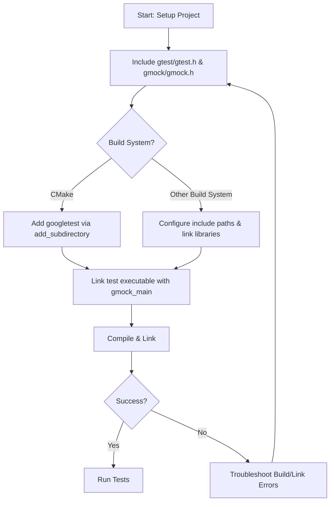

# Configuring Your Project

Learn how to set up your project to use GoogleTest and GoogleMock headers and libraries. This guide focuses on including the necessary headers, configuring your build scripts, and ensuring correct linkage so you can start writing and running tests seamlessly across supported platforms.

---

## 1. Include GoogleTest and GoogleMock Headers

To use GoogleTest and GoogleMock in your project, you must include their main header files in your test source files:

```cpp
#include <gtest/gtest.h>
#include <gmock/gmock.h>
```

- `<gtest/gtest.h>` provides the testing framework and assertion macros.
- `<gmock/gmock.h>` enables mock class utilities and mocking features.

**Tip:** Typically you only include these headers in your test code, not in your production code.


## 2. Configure Your Build System to Find GoogleTest and GoogleMock

### Using CMake (Recommended)

GoogleTest and GoogleMock come with built-in CMake support, making integration straightforward.

#### Two Main Ways to Add GoogleTest / GoogleMock:

1. **Standalone Build** - Build GoogleTest/GoogleMock as separate libraries and link your test executable against them.
2. **Embedded in Your Project** - Add GoogleTest/GoogleMock as a subdirectory with `add_subdirectory()`.

#### Example: Embed GoogleTest and GoogleMock in your `CMakeLists.txt`

```cmake
cmake_minimum_required(VERSION 3.13)
project(MyProject LANGUAGES CXX)

# Add googletest and googlemock subdirectory (adjust the path accordingly)
add_subdirectory(path/to/googletest)

# Your test executable
add_executable(my_tests my_tests.cc)

# Link the test executable with gtest, gmock, and pthread if needed
target_link_libraries(my_tests
    gmock_main    # GoogleMock and GoogleTest main
    pthread       # Required for POSIX systems
)

# Include directories are set automatically by the targets
```

**Note:** Replace `path/to/googletest` with the actual path where GoogleTest and GoogleMock sources reside.

#### Important CMake Variables and Options

- `BUILD_GMOCK` - Controls building GoogleMock.
- `BUILD_SHARED_LIBS` - Controls whether to build shared or static libraries.
- `gtest_force_shared_crt` - For Windows, aligns C runtime linkage with your project.

---

### Using Other Build Systems

If you use other build systems (like Bazel, Makefiles, or Visual Studio projects), ensure:

- The include paths contain the GoogleTest and GoogleMock `include/` directories.
- The libraries (`gtest`, `gmock`, or combined `gmock_main`) are linked.

Consult your build system's documentation to add these paths and libraries accordingly.

---

## 3. Linking Your Tests

You can link against:

- `gtest`: GoogleTest only.
- `gmock`: GoogleMock (calls into gtest internally).
- `gmock_main`: GoogleMock and GoogleTest, includes `main()` function.

For most users, linking `gmock_main` is easiest as it provides a `main()` for running tests.

### Example with GCC/Clang:

```bash
g++ -std=c++17 -isystem path/to/googletest/include \
    -pthread my_tests.cc \
    path/to/libgmock_main.a path/to/libgmock.a path/to/libgtest.a \
    -o my_tests
```

On Windows, link with the appropriate `.lib` files and ensure runtime library compatibility.

---

## 4. Verify Correct Linkage and Compilation

Build and run your test executable. If the setup is successful, running your test binary should output something like:

```
Running main() from gmock_main.cc
[==========] Running 1 test from 1 test suite.
[----------] Global test environment set-up.
[----------] 1 test from ExampleTest
[ RUN      ] ExampleTest.SimpleTest
[       OK ] ExampleTest.SimpleTest (0 ms)
[----------] 1 test from ExampleTest (0 ms total)

[----------] Global test environment tear-down
[==========] 1 test from 1 test suite ran. (0 ms total)
[  PASSED  ] 1 test.
```

If you see linker errors about missing `main()`, confirm you linked against `gmock_main` or supplied your own `main()` calling `RUN_ALL_TESTS()`.

---

## 5. Platform-Specific Considerations

- **Linux/macOS:** Ensure `-pthread` is set in both compilation and linking.
- **Windows:** Verify CRT linkage consistency (`/MD` vs `/MT`), use `gtest_force_shared_crt` option in CMake if needed.
- **Static vs Shared:** Decide between static linking or shared libraries (`BUILD_SHARED_LIBS`) based on your project.

---

## 6. Example CMakeLists.txt for a Simple Project Using GoogleTest & GoogleMock

```cmake
cmake_minimum_required(VERSION 3.13)
project(MyTestProject CXX)

# Enable testing
enable_testing()

# Add GoogleTest and GoogleMock
add_subdirectory(external/googletest)

# Your test executable
add_executable(tests test_main.cc test_foo.cc)

target_link_libraries(tests
    gmock_main
    pthread  # Always needed for threading support
)

# Register the test with CTest
add_test(NAME MyTests COMMAND tests)
```

---

## 7. Tips and Best Practices

- Always use `gmock_main` for tests unless you need a custom `main()`.
- Use `target_link_libraries()` to link against `gmock` or `gmock_main`; no need to manually specify include paths if using official CMake targets.
- Keep your test code and production code separated.
- Use C++17 or later as required by GoogleTest.
- For large projects, consider embedding GoogleTest as a git submodule or using CMake's FetchContent.
- Confirm your compiler and platform are supported (see System Requirements).

---

## 8. Troubleshooting Common Configuration Issues

<AccordionGroup title="Troubleshooting Build and Link Errors">
<Accordion title="Missing main() Function">
Ensure your test binary links with `gmock_main` or that you provide your own `main()` function that calls `RUN_ALL_TESTS()`.

```cpp
int main(int argc, char **argv) {
  ::testing::InitGoogleMock(&argc, argv);
  return RUN_ALL_TESTS();
}
```

</Accordion>
<Accordion title="Compiler or Linker Cannot Find Headers or Libraries">
Verify include paths contain `googletest/include` and `googlemock/include`.
Check that library paths and linked libraries (`gmock`, `gmock_main`, `gtest`) are correct.

</Accordion>
<Accordion title="Runtime Errors or Missing Thread Support">
On POSIX systems, make sure to compile and link with `-pthread`.

</Accordion>
</AccordionGroup>

---

## 9. Next Steps

- Write your first test following [Your First Test and Mock](../configuration-quickstart/your-first-test).
- Explore integration with your build system in [Integration Options](../../quickstart-integration/integration-options).
- Learn about mocking in the [Mocking Cookbook](../../docs/gmock_cook_book.md).

---

## References

- [GoogleTest Primer](../../docs/primer)
- [GoogleMock CMakeLists.txt](../../googlemock/CMakeLists.txt)
- [Installation & Integration Options](../../getting-started/prerequisites-installation/install-integration-options)
- [Your First Test and Mock](../../getting-started/configuration-quickstart/your-first-test)
- [Mocking Reference](../../docs/reference/mocking.md)


---

## Summary Diagram of Configuration Flow


