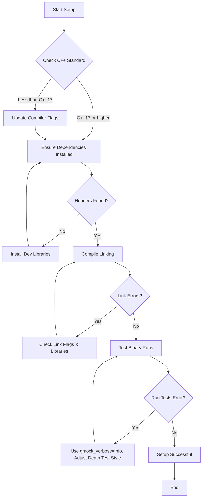

# Troubleshooting Common Setup Issues

This page addresses some of the most frequent errors encountered during the installation and configuration of GoogleTest. By following the guidance below, you can quickly resolve common problems related to missing dependencies, C++ standard mismatches, linker errors, and environment-specific quirks.

---

## 1. Missing or Incorrect C++ Standard

GoogleTest requires **C++17** or later for successful compilation.

### Symptoms
- Compilation errors related to language features such as `std::string_view`.
- Preprocessor errors indicating unsupported C++ versions.

### How to Fix
1. Confirm your compiler supports C++17.
2. Add the appropriate compiler flag:
   - For GCC and Clang: `-std=c++17`
   - For MSVC: Use `/std:c++17` or later.
3. If building with CMake, set `CMAKE_CXX_STANDARD` to `17` and enforce it:

```cmake
set(CMAKE_CXX_STANDARD 17)
set(CMAKE_CXX_STANDARD_REQUIRED ON)
```

4. Rebuild GoogleTest and dependent targets.

### Further Reading
- [System Requirements](/getting-started/prerequisites-installation/system-requirements)
- [Generic Build Instructions](googletest/README.md)

---

## 2. Missing Dependencies or Header Files

GoogleTest headers depend on standard C++ system headers and sometimes on POSIX or platform-specific headers.

### Symptoms
- Errors such as "file not found" for standard headers like `<string>`, `<mutex>`, or platform headers like `<pthread.h>`.

### How to Fix
1. Verify your development environment includes standard C++ development libraries.
2. If using POSIX threads, ensure pthread development headers are installed:
   - On Debian/Ubuntu: `sudo apt-get install libpthread-stubs0-dev` (usually included in libc development)
   - On RedHat/CentOS/Fedora: `sudo yum install glibc-headers` and `glibc-devel`
3. For Windows, ensure your toolchain supports or simulates pthreads as GoogleTest may detect the feature.
4. On embedded or specialized platforms, verify feature macros in `gtest-port.h` are correctly set.

---

## 3. Linker Errors During Compilation

### Common Linker Issues
- Undefined symbols for GoogleTest functions.
- Multiple definition or symbol clashes.

### Causes and Solutions
1. **Not linking with GoogleTest libraries**
   - Include the proper GoogleTest library (e.g., `gtest` or `gtest_main`) in your link command.
   - Example link flags:

     ```sh
     -lgtest -lpthread
     ```

2. **Missing pthread library on Unix-like systems**
   - Add `-pthread` flag both at compile and link time.

3. **Conflicts between static and shared GoogleTest libraries**
   - Ensure consistent build modes.
   - Define `GTEST_LINKED_AS_SHARED_LIBRARY=1` when building tests against shared GoogleTest.

4. **Using conflicting runtime library settings on Windows with MSVC**
   - Make sure the GoogleTest library and your project use the same runtime.
   - Set `gtest_force_shared_crt=ON` when building with CMake if using dynamic runtimes.

---

## 4. Test Binary Fails to Run or Crashes Immediately

### Possible Reasons
- Incompatible compiler or standard library versions.
- Mixing incompatible debug and release builds.
- Issues with death tests in multithreaded environments.

### Solutions
1. Verify the compiler and standard library versions used to build GoogleTest and your tests match.
2. Avoid mixing debug and release mode builds.
3. For death tests, prefer using the "threadsafe" death test style:

   ```cpp
   GTEST_FLAG_SET(death_test_style, "threadsafe");
   ```

4. Run your tests with the `--gmock_verbose=info` flag to get detailed output.

---

## 5. GoogleMock-Specific Setup Issues

### Uninteresting Call Warning
- Warning: "Uninteresting mock function call encountered - default action taken..."

**Why?**
- A mocked method is called without any explicit expectation (`EXPECT_CALL`).

**How to Fix:**
- Add an appropriate `EXPECT_CALL` or
- Use `ON_CALL` to set a default behavior.
- Or, wrap your mock in `NiceMock<>` to suppress warnings.

### Mocking Virtual Methods
- Ensure methods you mock with `MOCK_METHOD` are declared `virtual` in the base class.

### Mocking Move-Only Types
- Use lambdas or custom actions to return or accept move-only types such as `std::unique_ptr`.
- See [Mocking Methods That Use Move-Only Types](docs/gmock_cook_book.md#mocking-move-only-types).

---

## 6. Environment Variables and Flags

Verify environment variables and command-line flags are set correctly:

- Use `--gtest_filter` to run specific tests.
- Use `--gtest_repeat=N` to repeat tests and catch flaky failures.
- `--gtest_color=auto|yes|no` for output coloring.
- Control logging verbosity with `--gmock_verbose=info|warning|error`.

Incorrect or conflicting flags can cause test runs to behave unexpectedly.

---

## 7. General Tips and Best Practices

- Always call `testing::InitGoogleTest(&argc, argv);` before `RUN_ALL_TESTS()`.
- Return `RUN_ALL_TESTS()` from your `main()` function to get correct exit codes.
- Avoid underscore characters `_` in test suite and test names to prevent naming collisions and portability issues. See [FAQ on Underscores in Test Names](docs/faq.md#why-should-test-suite-names-and-test-names-not-contain-underscore).
- When using `MOCK_METHOD`, place macros in the `public:` section of your mock class regardless of the original method's access.

---

## 8. Need More Help?

- **Official GoogleTest GitHub:** [https://github.com/google/googletest](https://github.com/google/googletest)
- **GoogleTest FAQ:** /faq/core-usage-faq/setup-errors
- **gMock Cookbook:** /docs/gmock_cook_book.md
- **GoogleTest Primer:** /docs/primer.md
- **Integration with Build Systems:** /overview/integration-and-ecosystem/integration-with-cpp-systems

If your issue persists, consider filing an issue on GitHub or seeking assistance on developer forums.

---

## Summary Diagram of Common Setup Flow and Issues


