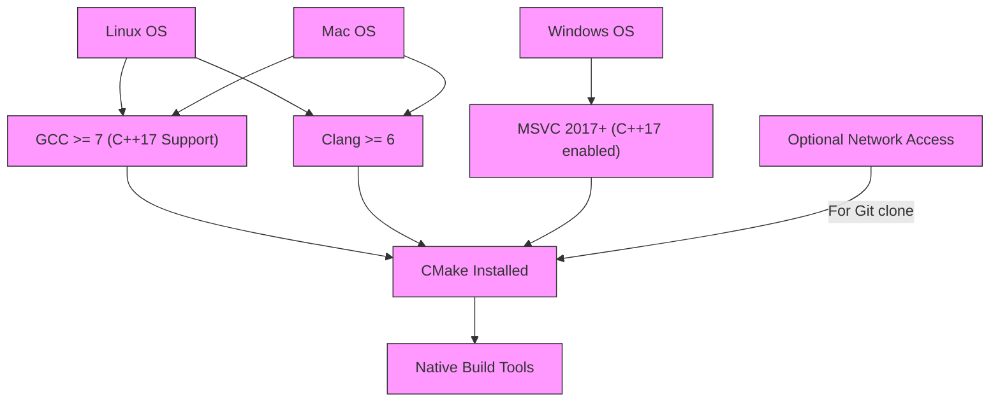

# Prerequisites and System Requirements for GoogleTest

This page outlines the minimum necessary software and hardware requirements to install and run GoogleTest, including supported compilers, C++ language standards, and operating systems. It helps you understand what your development environment must look like before installation, ensuring compatibility and a smooth setup.

---

## 1. Supported Operating Systems

GoogleTest is designed for broad compatibility across popular development platforms:

- **Linux**: Most modern Linux distributions with standard toolchains.
- **Windows**: Supported with Visual Studio and other compatible toolchains.
- **Mac OS X**: Fully supported with Apple's development environments.

**Tip:** Verify your current OS version is supported by your compiler of choice, as GoogleTest depends on the compiler compatibility.

## 2. Supported Compilers and C++ Standards

GoogleTest requires a C++ environment that supports **C++17** or later. Ensure your compiler meets the following:

- **GCC**: Version 7 or newer (GCC 7+ fully supports C++17).
- **Clang**: Version 6 or newer.
- **MSVC**: Visual Studio 2017 or newer with C++17 enabled.

**Note:** Support for older compilers or pre-C++17 standards is not provided.

To enable C++17 support, set your compiler or build system flags appropriately, for example:

```bash
# In CMakeLists.txt
set(CMAKE_CXX_STANDARD 17)
set(CMAKE_CXX_STANDARD_REQUIRED ON)
```

or

```bash
# For GCC or Clang
g++ -std=c++17
```

## 3. Hardware and System Requirements

GoogleTest itself is lightweight but relies on your development environment:

- **CPU Architecture**: x86_64, ARM (depending on OS and compiler support).
- **Memory**: Minimal memory is required; standard development environments are sufficient.
- **Disk Space**: Minimal; expect a few megabytes for source and build artifacts.

No specialized hardware is needed.

## 4. Dependencies

- **C++ Standard Library**: Must support C++17 features.
- **Build tools**:
  - [**CMake**](https://cmake.org/) for generating build files and managing the build process.
  - Native build tools such as `make`, `ninja`, Visual Studio solution builds, or Xcode projects.

> Tip: GoogleTest's primary build method uses CMake, which simplifies cross-platform builds.

## 5. Network and Access Requirements

No special network connectivity or accounts are required to install or use GoogleTest.

However, if you plan to fetch GoogleTest source code or dependencies from a remote repository (e.g., via `git clone`), ensure your machine has internet access.

## 6. Additional Compatibility Notes

- GoogleTest integrates well with modern development ecosystems, including IDEs and CI/CD pipelines.

- When using GoogleMock (the mocking framework bundled with GoogleTest), the same prerequisites apply.

- The C++ runtime environment must match between GoogleTest and your tests.

## 7. Summary Checklist

Before you proceed to install GoogleTest, make sure you have:

- A supported operating system: Linux, Windows, or Mac OS.
- A compatible C++ compiler with C++17 support enabled.
- CMake installed and configured.
- Standard developer tools installed (compiler, linker, build tools).
- Network access if cloning GoogleTest's source from GitHub.

---

## Troubleshooting Compatibility Issues

### Compiler Does Not Support C++17

If your compiler does not support C++17, you will encounter build errors. Upgrade your compiler or switch to a compatible version as listed above.

### CMake Not Installed or Outdated

Install the latest [CMake](https://cmake.org/download/) version. Older versions may not support `FetchContent` used by GoogleTest.

### Build Failures Due to Platform or Architecture

Ensure your platform's compiler toolchain supports the required standards. Consult your OS or compiler documentation for updates.

### Linker or Runtime Errors with Mismatched Libraries

Make sure GoogleTest and your test binaries are built with consistent compiler and runtime options, especially on Windows.

---

## Where to Go From Here

With your system ready, proceed to the [Installation (All Supported Platforms)](/getting-started/core-setup/installation-platforms) guide to build and install GoogleTest in your environment.

Once installed, configure your test projects as described in [Basic Configuration & Project Setup](/getting-started/core-setup/configuration-basics).

For those new to GoogleTest, the [GoogleTest Primer](overview/product-intro/what-is-googletest) is a helpful next step to learn testing fundamentals.

---

## Additional Resources

- [GoogleTest Official GitHub Repository](https://github.com/google/googletest)
- [Supported Platforms & Build Systems](overview/integration-ecosystem/supported-platforms)
- [Integration with Development Tools and Ecosystem](overview/integration-ecosystem/integration-tooling)
- [Installing and Configuring GoogleTest and GoogleMock](faq/getting-started-faq/install-configure-faq)


---

**Summary Diagram of Requirements:**


