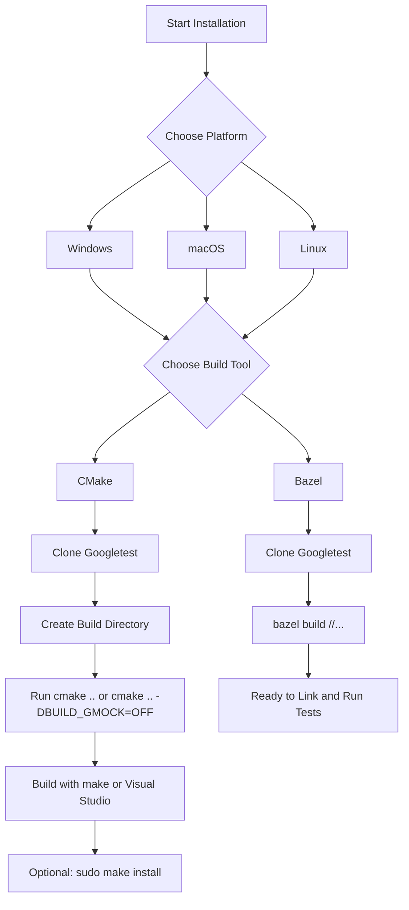

# Installation (All Platforms)

This guide provides reliable, step-by-step instructions to install GoogleTest and GoogleMock on Windows, macOS, and Linux using both CMake and Bazel build systems. The instructions cover the most common scenarios to get these testing frameworks up and running efficiently.

---

## 1. Prerequisites

Before beginning installation, ensure your environment meets these requirements:

- **C++ Compiler:** Must support C++17 standard or later. Compatible compilers include GCC, Clang, and MSVC (Visual Studio 2015 or newer).
- **Build Tools:**
  - CMake version 3.14 or newer is required to build GoogleTest/GoogleMock with the recommended workflows.
  - For Bazel users, ensure Bazel is installed and updated.
- **Operating System:** Supported on Windows, macOS, and Linux.
- **Network:** Internet access to clone the repository or download release archives.

<Tip>
If you plan to build GoogleTest and GoogleMock as shared libraries (DLLs on Windows), additional compiler flags are required. Refer to the GoogleTest CMake build notes for shared library support.
</Tip>

---

## 2. Installation Using CMake

GoogleTest includes GoogleMock by default when building with CMake. Follow these steps to clone, build, and install:

### 2.1 Clone the Repository

Open your terminal or command prompt and run:

```bash
git clone https://github.com/google/googletest.git -b v1.17.0
download_folder/googletest # your chosen folder
```

### 2.2 Create and Enter Build Directory

```bash
cd googletest
mkdir build
cd build
```

### 2.3 Configure the Build

By default, GoogleMock builds with GoogleTest. To build both the frameworks:

```bash
cmake ..
```

To build only GoogleTest without GoogleMock:

```bash
cmake .. -DBUILD_GMOCK=OFF
```

### 2.4 Build the Libraries

- On Linux/macOS, build using `make`:

```bash
make
```

- On Windows with Visual Studio, open the generated solution (`gtest.sln`) and build the projects.

### 2.5 Install (Optional)

System-wide installation places headers and libraries in standard locations (usually `/usr/local/` on Unix systems):

```bash
sudo make install
```

### 2.6 Verify Installation

Verify the libraries `libgtest.a`, `libgmock.a`, or their shared equivalents are available under your install path.

---

## 3. Installation Using Bazel

If you prefer Bazel, clone the repository and build targets directly:

```bash
git clone https://github.com/google/googletest.git -b v1.17.0
cd googletest
bazel build //...
```

Bazel automatically detects dependencies. Use the Bazel build outputs to link in your tests.

---

## 4. Key Installation Variants

### 4.1 Using GoogleMock Main

GoogleMock provides a `gmock_main` library that includes a main() function to run tests easily without requiring you to define your own main.

- Link against `gmock_main` (instead of `gmock` or `gtest_main`) in your build for a ready-to-use entry point.

### 4.2 Using GoogleTest Main Only

If only GoogleTest is needed, link against `gtest_main` which provides a main function for tests.

---

## 5. Configuring Your Build

If integrating GoogleTest/GoogleMock with your own projects built in CMake:

- Use `find_package(GTest CONFIG REQUIRED)` if installed.
- Alternatively, add GoogleTest source as a subdirectory to your project build with:

```cmake
add_subdirectory(googletest)
```

- Link libraries as `gtest`, `gtest_main`, `gmock`, or `gmock_main`.

- Ensure your compiler flags include `-DGTEST_HAS_PTHREAD=1` if multithreading is supported.

<Tip>
When using Visual Studio, set the C runtime to dynamic or static consistently across your project and GoogleTest to avoid runtime conflicts. Use the CMake option `gtest_force_shared_crt` for this purpose.
</Tip>

---

## 6. Running Your First Test

Once installed and linked, write a minimal test like:

```cpp
#include <gtest/gtest.h>

TEST(SampleTest, BasicAssertions) {
  EXPECT_EQ(1, 1);
}

int main(int argc, char **argv) {
  ::testing::InitGoogleTest(&argc, argv);
  return RUN_ALL_TESTS();
}
```

- Compile your testing code linking with `gtest_main` or `gmock_main` as appropriate.
- Run your test executable. You should see output confirming test results.

---

## 7. Troubleshooting Common Installation Issues

<AccordionGroup title="Troubleshooting Installation Issues">
<Accordion title="Build Errors Related to Compiler Flags or C++ Standard">
Check your compiler supports C++17 or newer. Explicitly add `-std=c++17` or equivalent in your build commands or CMake configurations.
</Accordion>
<Accordion title="Linker Errors on Windows Related to Runtime Libraries">
Use the CMake option `-Dgtest_force_shared_crt=ON` to align GoogleTest runtime linkage with your project settings.
</Accordion>
<Accordion title="Multithreading Support Errors or Missing pthreads">
On POSIX systems, ensure pthread is installed and detected. Pass `-DGTEST_HAS_PTHREAD=1` manually if necessary.
</Accordion>
<Accordion title="Missing Main Function Errors">
Link your test executables to the `gtest_main` or `gmock_main` libraries to get the main() function automatically provided.
</Accordion>
</AccordionGroup>

---

## 8. Additional Resources and Next Steps

- Detailed usage and writing tests: [Your First Test: Quickstart Sample](https://docs.example.com/getting-started/quickstart-and-troubleshooting/quickstart-example)
- Configuration and verification for environment setup: [Configuration and Verification](https://docs.example.com/getting-started/essential-setup/configuration-verification)
- Deep dive into build integration: [Integration & Extensibility](https://docs.example.com/overview/architecture-concepts/integration-points)

---

## 9. Summary Diagram



This visual workflow guides the user from choosing platform through build method to completion.

---