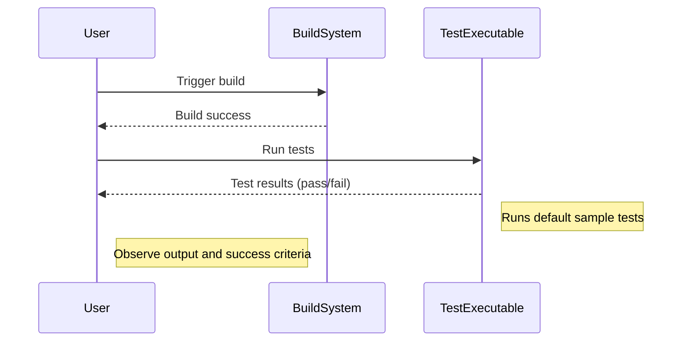

# Validating Your Installation

This guide helps you confirm that your GoogleTest and GoogleMock setup is working correctly. Through sample tests and demonstration outputs, you will quickly verify that your build and run steps have succeeded, ensuring your environment is ready for further development.

---

## 1. Running the Sample Tests

To validate your installation, the quickest way is to run the provided sample tests included in the GoogleTest/GoogleMock source code.

### Steps:

1. Ensure you have correctly built the GoogleTest and GoogleMock libraries, following your chosen installation method (CMake, Bazel, or manual build).

2. Locate the `gmock` test executable, usually named `gmock_test` or `gmock_main`.

3. Run the test binary from your command line:

   ```bash
   ./gmock_test
   ```

   or if using the main test runner with GoogleMock initialized:

   ```bash
   ./gmock_main
   ```

4. Observe the output. A successful setup will show numerous tests passing without failures or errors, concluding with a message similar to:

   ```
   [==========] Running X tests from Y test cases.
   [  PASSED  ] All tests passed (X tests).
   ```

5. If you see any failures or linking errors, review your build and linkage configuration.

<Tip>
If you are on Windows, ensure the executable uses the proper runtime libraries and that all required DLLs are accessible.
</Tip>

---

## 2. Understanding Test Output Examples

GoogleMock tests use various macros such as `EXPECT_CALL`, `ON_CALL`, and carefully crafted mock classes to verify behavior. Here are some expected outputs and what they mean.

### Expected Call

When a mock method call matches an expectation, verbose output (if enabled) shows:

```
Mock function call matches EXPECT_CALL(mock_object, Method(args))...
    Function call: Method(actual_args)
Stack trace:
...
```

This confirms your mocks are active and expectations are correctly set.

### Unexpected Call

If the test calls a mock method with arguments or order that wasn't expected, GoogleMock reports:

```
Unexpected mock function call - returning [default value/directly].
    Function call: Method(args)
Google Mock tried the following expectations, but none matched:
...
```

This indicates either missing expectations or mismatching arguments.

### Excessive Call

If a mock method is called more times than specified:

```
Mock function called more times than expected - returning [default value/directly].
    Function call: Method(args)
Expected call count doesn't match...
```

### Uninteresting Call

Calls with no expectation generate warnings by default:

```
GMOCK WARNING:
Uninteresting mock function call - returning [default value/directly].
    Function call: Method(args)
```

You can suppress or escalate these warnings by adjusting the mock's strictness mode.

---

## 3. Adjusting Output Verbosity

The environment variable or command-line flag `--gmock_verbose` controls messaging:

- `info`: Shows all info, warnings, errors, and stack traces.
- `warning`: Shows warnings and errors (default).
- `error`: Shows only errors, silence most messages.

Example to run tests with info verbosity:

```bash
./gmock_test --gmock_verbose=info
```

---

## 4. Verifying Mock Behavior Programmatically

You can write a simple test yourself to verify the mock framework works as expected.

### Example test code snippet:

```cpp
#include <gtest/gtest.h>
#include <gmock/gmock.h>

class Interface {
 public:
  virtual ~Interface() = default;
  virtual int Foo(int x) = 0;
};

class MockInterface : public Interface {
 public:
  MOCK_METHOD(int, Foo, (int), (override));
};

TEST(MockTest, BasicExpectation) {
  MockInterface mock;
  EXPECT_CALL(mock, Foo(42)).WillOnce(::testing::Return(100));

  int result = mock.Foo(42);
  EXPECT_EQ(result, 100);
}
```

Compile and run this test; success indicates your mocking infrastructure is sound.

---

## 5. Trouble Indicators and Quick Tips

| Symptom                     | Action                                                                                                                                             |
|-----------------------------|-----------------------------------------------------------------------------------------------------------------------------------------------------|
| Build/link errors           | Verify compiler compatibility, library paths, and linkage against GoogleTest/GoogleMock libraries.                                                   |
| Tests do not run or no output| Check that `main()` calls `testing::InitGoogleMock()` and `RUN_ALL_TESTS()`. For embedded platforms, verify `setup()` and `loop()` are correct.     |
| Unmatched expectations      | Review `EXPECT_CALL` argument matchers and call order, enable verbose logging for details.                                                            |
| Excessive calls errors      | Make expectations less strict or use `.RetiresOnSaturation()` for sequential calls.                                                                  |

<Tip>
Run tests with `--gmock_verbose=info` to see detailed diagnostics that can illuminate mismatches and call sequences.
</Tip>

---

## 6. Next Steps

- After validating your setup, explore writing your first test ([Writing and Running Your First Test](/getting-started/first-experience/writing-first-test)).
- Learn how to add mocks and expectations effectively ([Adding Mocks to Your Tests](/gtest-guides/getting-started/adding_mocks)).
- See common setup issues and troubleshooting approaches ([Troubleshooting Common Setup Issues](/getting-started/first-experience/common-setup-issues)).


---

## References

- [GoogleTest Primer](overview/getting-started/introduction)
- [gMock Cookbook](docs/gmock_cook_book.md)
- [Mocking Reference](docs/reference/mocking.md)
- [Assertions Reference](docs/reference/assertions.md)

---

## Summary Diagram: Validating Installation Process



---

<Tip>
Remember, GoogleMock verifies expectations automatically when mocks are destructed. Avoid deleting mocks improperly to ensure verification runs.
</Tip>