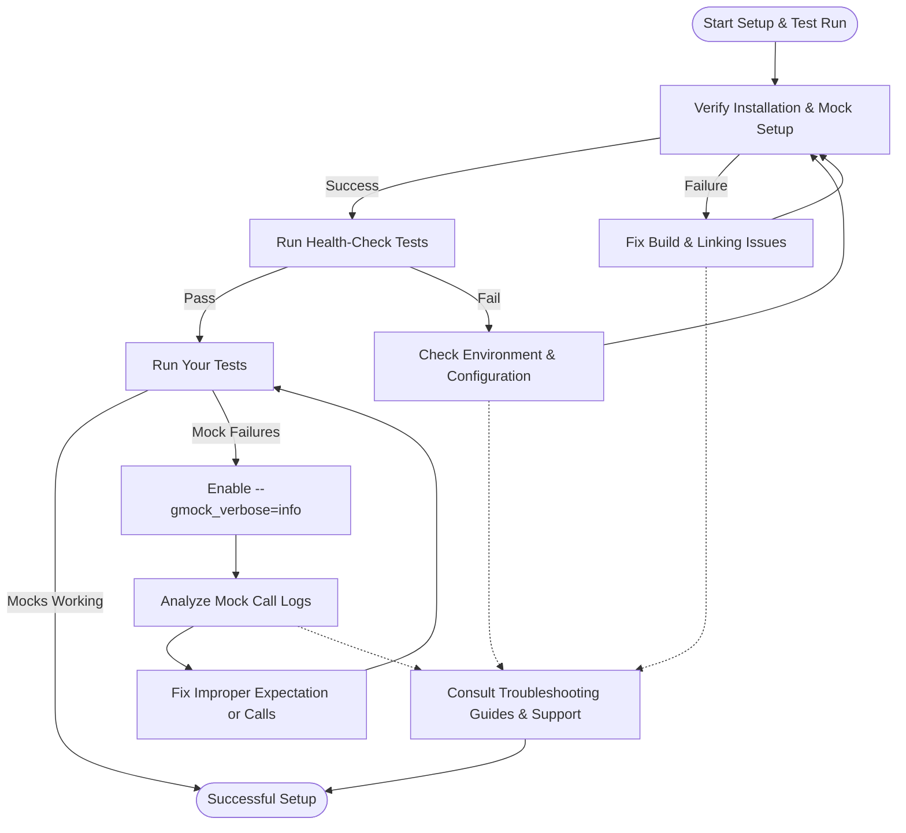

# Troubleshooting & Quick Validation

Navigating initial setup hiccups and ensuring your GoogleTest and GoogleMock environment is correctly configured is crucial for a smooth testing experience. This guide equips you with practical solutions to common setup and integration issues, alongside actionable health-check procedures to validate your environment.

---

## 1. Common Setup and Integration Issues

### 1.1 Installation Verification
Ensure GoogleTest and GoogleMock are correctly installed by compiling and running basic test and mock examples. If failures occur during compilation or linking, verify:

- Build system configurations include the correct include paths and link libraries.
- Dependencies are resolved, especially C++ standard library compatibility.
- No conflicting versions exist within your project.

### 1.2 Header and Linking Issues
Failure to find gMock or gTest headers or failure to link usually stems from misconfigured include directories or linking options.

**Action Steps:**

- Confirm your build system includes `-I<path-to-googlemock>/include` and `-I<path-to-googletest>/include`.
- Link against both `gmock` and `gtest` libraries (and their dependencies).

### 1.3 Runtime Errors and Failures
Common runtime problems include missing symbols, test crashes, or unexpected failures due to improper setup.

**Action Steps:**

- Check that mock objects have virtual destructors to avoid undefined behavior.
- Verify that mock expectations (`EXPECT_CALL`) are set before calling mock methods.
- Use the `--gmock_verbose=info` flag to obtain detailed mock call traces that help identify mismatches or unexpected calls.

### 1.4 Compiler-Specific Warnings
Some compilers, notably MSVC, may issue warnings related to const qualifiers or macro expansions affecting mock methods.

**Action Steps:**

- Remove meaningless `const` modifiers from method parameter declarations to address MSVC warnings.
- Avoid conflicting macro defines for method names, or manage them cautiously.

### 1.5 Mocking Challenges
If your mocks behave unexpectedly:

- Use `ON_CALL` to set default actions for methods without expected calls.
- Use `NiceMock`, `NaggyMock`, or `StrictMock` to control how uninteresting calls are handled (ignored, warnings, or errors).
- Delegate complex mock behavior to fake or real objects to reduce test brittleness.

<Note>
Always ensure expectations are set **before** exercising mock methods to avoid undefined behavior.
</Note>

## 2. Running Health-Check Tests

### 2.1 Verify Installation with a Simple Test
Run a minimal test that exercises both GoogleTest and GoogleMock to ensure basic operation:

```cpp
#include <gtest/gtest.h>
#include <gmock/gmock.h>

class MockExample {
 public:
  MOCK_METHOD(int, Foo, (int x), ());
};

TEST(BasicTest, SimpleAssertion) {
  EXPECT_EQ(1 + 1, 2);
}

TEST(MockTest, ExpectationCheck) {
  MockExample mock;
  EXPECT_CALL(mock, Foo(42)).WillOnce(testing::Return(100));
  EXPECT_EQ(mock.Foo(42), 100);
}

int main(int argc, char** argv) {
  testing::InitGoogleMock(&argc, argv);
  return RUN_ALL_TESTS();
}
```

- Successful compilation and run confirms correct setup.

### 2.2 Use Command Line Flags for Diagnostic Output
Launch tests with increased verbosity and debug options:

- `--gmock_verbose=info` to trace all mock calls and their matching expectations.
- `--gtest_output=xml:<file>` to export test results for review.

Example:

```bash
./your_test_binary --gmock_verbose=info --gtest_output=xml:report.xml
```

### 2.3 Check for Leaked Mocks and Unmet Expectations

GoogleMock automatically detects leaked mock objects and unmet expectations during teardown.

Use `Mock::VerifyAndClearExpectations(&mock_obj);` or `Mock::VerifyAndClear(&mock_obj);` in tests where mock lifetime is complex or dynamically controlled to explicitly verify expectations and clear mock state.

### 2.4 Use Assertion Macros to Validate Test Behavior

Assert expected behaviors in your tests using GoogleTest macros:

- `EXPECT_CALL` sets the expected interactions with mocks.
- Use `EXPECT_TRUE`, `ASSERT_EQ`, or `EXPECT_THAT` for verifying conditions and matchers.

<AccordionGroup title="Troubleshooting Quick Tips">
<Accordion title="Handling Uninteresting Mock Calls">
By default, uninteresting calls generate warnings. To suppress these:

- Use `NiceMock<YourMock>` for objects where uninteresting calls are not a concern.
- Or add `EXPECT_CALL(mock_obj, Method(_)).Times(testing::AnyNumber());` to explicitly allow any calls.
</Accordion>
<Accordion title="Fixing Unexpected Call Errors">
If your test fails due to unexpected mock calls:

- Verify that every expected mock call has an `EXPECT_CALL`.
- Use matchers (`_`, `Eq`, etc.) carefully to match actual call arguments.
- Consider the order of `EXPECT_CALL`s; the last matching expectation wins.
- Use sequences (`InSequence`) or dependencies (`After`) to control call order.
</Accordion>
<Accordion title="Resolving Compiler Errors with MOCK_METHOD">
Common errors arise when mocking methods with types containing commas.

- Wrap return and parameter types containing commas in additional parentheses.
- Alternatively, use `using` type aliases for complex types before mocking.
</Accordion>
</AccordionGroup>

## 3. Validating Environment and Configuration

### 3.1 Confirm Environment Compatibility

Ensure your development environment meets GoogleTest requirements:

- Supported compilers: GCC, Clang, MSVC with C++11 or newer.
- Compatible C++ standard library version.
- Network/firewall settings generally irrelevant unless remote debugging.

### 3.2 Validate Build System Settings

Check your build files for:

- Proper inclusion of `gtest` and `gmock` source files or linking with their libraries.
- Correct compiler flags for C++ standard support (`-std=c++11` or higher).

### 3.3 Check for Source File Location Issues

Mock failures referencing unknown source lines may indicate:

- Stripping debug symbols.
- Mismatch between source and compiled binaries.

Ensure debug symbols are present for meaningful stack traces and error messages.

## 4. Troubleshooting Tools and Techniques

### 4.1 Enable Verbose Output

Enable detailed logging to understand mock behavior and test failures:

```bash
--gmock_verbose=info
```

This outputs:

- When an expected call is matched.
- When uninteresting calls occur.
- Reasoning about why a match failed.

### 4.2 Use Stack Traces in Failures

By default, GoogleMock includes stack traces in warnings and errors to help identify where incorrect calls happen.

### 4.3 Use Explicit Verification

Manually call:

```cpp
ASSERT_TRUE(Mock::VerifyAndClearExpectations(&mock));
```

when you need to:

- Check expectations before mock destruction.
- Prevent silent test passes due to mock leaks or missing calls.

### 4.4 Address Over-Saturation and Under-Saturation Failures

- If an expected call occurs more than specified `Times()` upper bound, GoogleMock reports over-saturation.
- If fewer calls than specified, failure occurs at destruction or verification.

Use `RetiresOnSaturation()` to make expectations retire after saturation, avoiding sticky failures.

## 5. Summary of Best Practices

- Always set expectations (`EXPECT_CALL`) before exercising mocks.
- Use `ON_CALL` to set default behaviors without expectations.
- Prefer `NiceMock` for cleaner tests, `StrictMock` to enforce strict call checking.
- Control call ordering explicitly via `InSequence` or `After` to avoid flaky tests.
- Wrap complex types in type aliases or parentheses to mock correctly.
- Use verbose logging and test idle warnings to detect unintentional mock calls.

<Callout>
If you encounter unexplained errors or warnings, consider running your tests with `--gmock_verbose=info` and review the detailed call traces carefully. This is the most powerful way to diagnose matching and ordering issues.
</Callout>

---

## 6. Additional Resources

- [Writing Your First Test & Mock](https://google.github.io/googletest/getting-started/first-run-usage/writing-first-test)
- [Mocking Reference](https://google.github.io/googletest/reference/mocking.html)
- [gMock Cookbook](https://google.github.io/googletest/gmock_cook_book.html)
- [gMock Cheat Sheet](https://google.github.io/googletest/gmock_cheat_sheet.html)
- [Understanding Uninteresting vs Unexpected Calls](https://google.github.io/googletest/gmock_cook_book.html#uninteresting-vs-unexpected)

---

# Troubleshooting Flow Overview



---